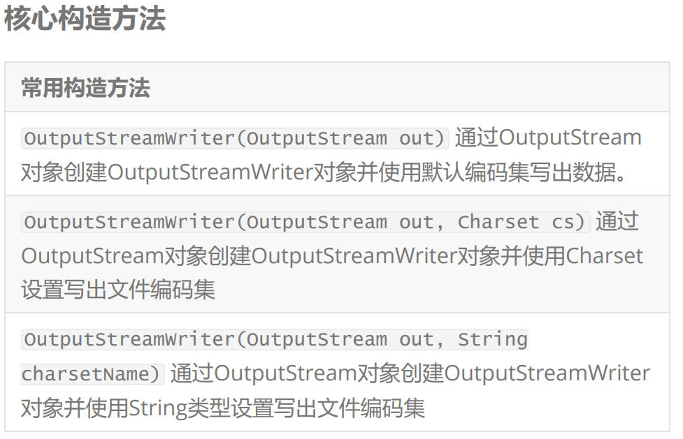
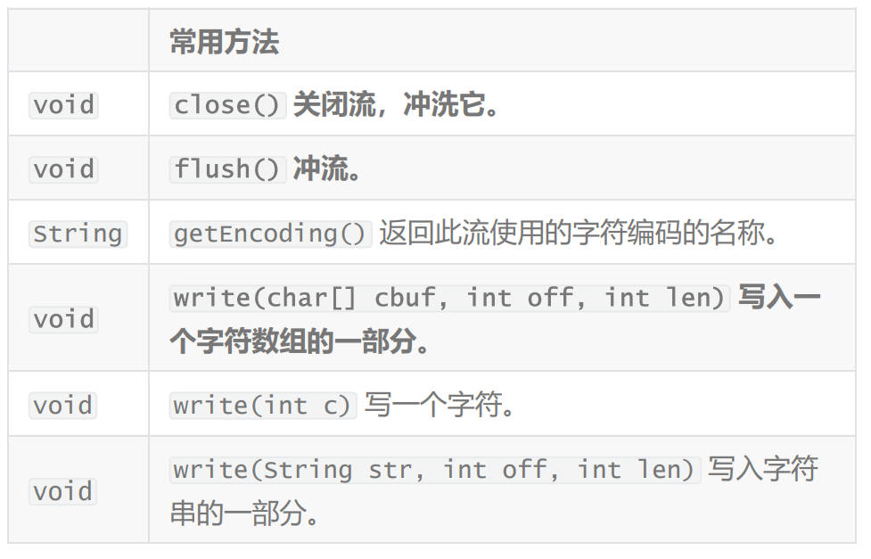

# 字符编码集发展过程（字节字符转换）

## 阶段一

> 所以规定使用的字节的最高位是0.每一个字节都以【0~127之间的数字来表示】,比如A对应65,a对应97.
> 这就是美国标准信息交换码【ASCII】.
> 'A'~‘Z’ ‘a’~‘z’ ‘0’~‘9’

## 阶段二

> 随着计算机在全球的普及,很多国家和地区都把自己的字符引入了计算机,比如汉字.
> 此时发现一个字节能表示数字范围太小,不能包含所有的中文汉字那么就规定使用两个字节来表示一个汉字.
> 规定:原有的ASCII字符的编码保持不变,仍然使用一个字节表示,为了区别一个中文字符和ASCII码字符中文字符的每个字节最高位规定为1(中文的二进制是负数).这个规范就是【GB2312】编码
> 后来在GB2312的基础上增加了更多的中文字符,比如汉字,也就出现了【GBK】.

## 阶段三

> 新的问题,在中国是认识汉字的,但是如果把汉字传递给其他国家,该国家的码表中没有收录汉字,其实就显示另一个符号或者乱码.
> 为了解决各个国家因为本地化字符编码带来的影响,咱们就把全世界所有的符号统一进行编码-【Unicode万国码】编码.此时某一个字符在全世界任何地方都是固定的,比如【哥】,在任何地方都是以十六进制的【54E5】来表示.Unicode的编码字符都占有【2个字节大小】.
> 常用字符编码集
> ASCII码： 占一个字节，只能包含128个符号，不能表示汉字ISO-8859-1【latin-1】占一个字节，收录的是西欧语言，不能表示汉字 ---》properties
> ANSI【GB2312】占两个字节，在简体中文操作系统中ANSI就是值的GB2312(淘汰了)
> GB18030/GBK 占两个字节，支持中文
> UTF-8：是一种针对Unicode的可变长字符编码，又称万国码，UTF-8是Unicode的实现方式之一，这个编码兼容ASCII码 UTF-8表示汉字'\u0000'~'\uffff'
> ps：在UTF家族中提供了其他编码 UTF-8E ，UTF-16 ,UTF-32， 这里有一个特殊编码集千万不要使用，这个编码集是MS公司搞出来UTF-8 BOM，默认3个字节一个汉字【不要使用】

## InputStreamReader 字节字符转换输入流

> 字节字符转换输入流的作用：将字节流转换为字符流，并且可以设置文件编码集
> “特别说明：InputStreamReader的父类是Reader类，所以这个流中数据是char类型”
> “InputStreamReader是FileReader的直接父类”
>

核心构造方法

| 常用的构造方法                                                                                                                        |
| ------------------------------------------------------------------------------------------------------------------------------------- |
| InputStreamReader(InputStream in) 通过参数InputStream流的对象构建InputStreamReader流对象并使用的是默认编码集                          |
| InputStreamReader(InputStream in, Charset cs) 通过参数InputStream流的对象构建InputStreamReader流对象并用过Charset设置读取文件编码集   |
| InputStreamReader(InputStream in, String charsetName)通过参数InputStream流的对象构建InputStreamReader流并用过字符串设置读取文件编码集 |

> PS： 转换输入流，所以构建InputStreamReader对象时，需要提供一个字节输入流作为转换对象
> 通过InputStreamReader可以设置编码集，设置编码集方式是通过InputStreamReader构造方法中第二参数进行设置，这里设置有两种方式
> 第一种方式：使用Charset类型进行设置 ---》 Charset.forName("编码集名字")
> 第二种方式：使用String类型进行设置 ---》 "编码集名字"
>
核心API方法

| 返回值 | 方法                                                                        |
| ------ | --------------------------------------------------------------------------- |
| void   | close() 关闭流并释放与它相关联的任何系统资源。                              |
| String | getEncoding() 返回此流使用的字符编码的名称。(在读取文件的同时读取文件编码集 |
| int    | read() 读取单个字符。                                                       |
| int    | read(char[] cbuf, int offset, int length) 将字符读入一个数组的一部分。      |
| int    | read(char[] cbuf) 将读取的数据存储到字符数组中                              |

## OutputStreamWriter 字节字符转换输出流

> 字节字符转换输出流作用:将字符流转换为字节流输出，并可以设置编码集
> 特别注意:"OutputStreamWriter的父类是Writer,所以这个流中数据是char类型
 "OutputStreamWriter是FileWriter的父类"

常见的构造方法


> PS： 转换输出流，所以构建OutputStreamWriter对象时，需要提供一个字节输出流作为转换对象
> 通过OutputStreamWriter可以设置编码集，设置编码集方式是通过
> OutputStreamWriter构造方法中第二参数进行设置，这里设置有两种方式
> 第一种方式：使用Charset类型进行设置 ---》 Charset.forName("编码集名字")
> 第二种方式：使用String类型进行设置 ---》 "编码集名字"

核心的API方法


> PS： 因为OutputStreamWriter是父类Writer方法，所以也会继承到Writer方法中参数为String类方法，所以提供直接输出字符串的方法这两流的操作可以完全操作FileRader和FileWriter进行操作

## 需求：使用转换流在设置编码集的前提下进行文件的赋值与粘贴

```java

```

## 转换流总结

> 转换流的目的在于提供了字节与字符流之间的一种转换效果，我们可以通过转换流将字符流和字节流进行转化，除此之外还可以设置文件的编码集进行文件的读取和写出操作，这样可以完成文件的编码集转换操作【文件编码集的转换操作原则是：只有读取文件时编码集设置正确，才可在写出文件时将编码集设置正确】
>