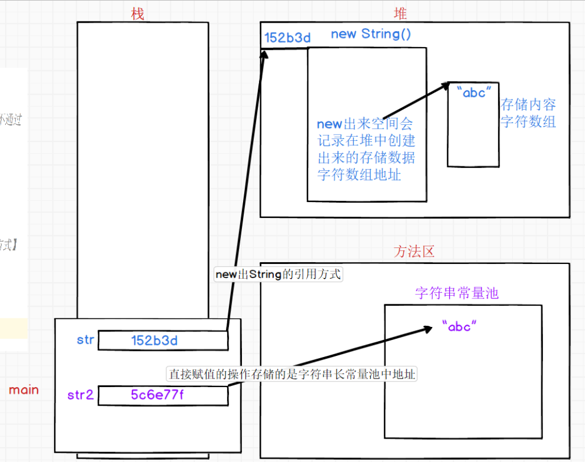
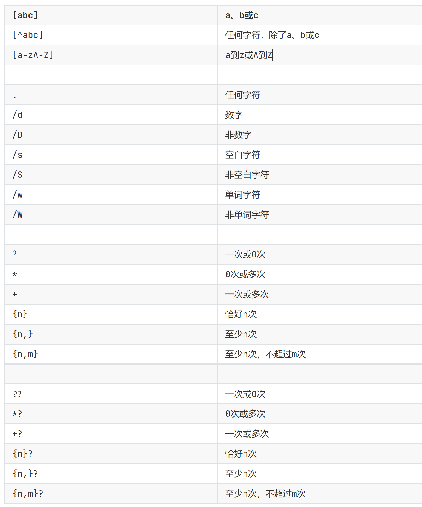

# string类

>在系统的API文件里给出了string的层级结构
>public final class String
    implements java.io.Serializable, Comparable<String>, CharSequence
> final修饰 证明不可被继承
> 直接继承Object 所以-->提供了toString、equals、hashcode方法的重写
> String类是实现三个接口
> Serializable ---》 序列化接口【将某对象进行序列化二进制】
> Comparable<String> ---》 比较接口【提供字符串的比较操作者】
> CharSequence ---》 字符序列接口【提供String类的实现方式】

在API文档中对String字符串进行说明： String类代表字符串。Java 程序中的所有字符串字面值（如 "abc" ）都作为此类的实例实现，字符串是常量；它们的值在创建之后不能更改。
**字符串缓冲区支持可变的字符串。因为 String 对象是不可变的，所以可以共享。String也是java.lang包下。**

## 什么是字符串

> 由多个字符组合成的串，称为字符串，理论上最多“无限”，最少为“null”。
> 在java程序中只要是被""阔起来的都叫字符串。都是String的实例对象，都可以调用String提供的方法。

**字符串分为两大类：**

1. 不可变字符串【String】：当字符串被创建后，是不能改变内容的，只要对字符串操作就会得到一个全新的字符串引用地址。
2. 可变字符串【StringBuffer|StringBuilder】：当一个字符串创建后，对字符串修改不会得到新的引用地址。

## String的创建

```java
package com.qf.day04;

/**
 * @author zxq
 * @version V1.0
 * @Date 2023/2/7 9:24
 * @Description: ${描述}
 */
//提供String类的对象常见创建方式
public class StringDemo1 {
    public static void main(String[] args) {
//提供String类常用构造方法
/*
1.创建一个空的字符串【在字符串中是允许字符串内容为空（空串）】
空串不是null，空串是可以开辟空间，只不过字符串中没有内容
PS:直接打印String类型对象，因为重写toString方法，所以可以进行对象输出，打印字符串
中存储的数据
*/
        String str = new String();
        System.out.println("str = "+str);
//2.创建字符串同时指定字符串中存储的数据内容
        String str1 = new String("abc");
        System.out.println("str1 = "+str1);
//3.将一个byte类型数组作为数据参数传递到字符串中进行存储
//ps:将byte数组中数据转换成对应ASCII码---》如果ASCII码范围就会转换为Unicode【万国码】
//Unicode对应中国文字编码 ---》 UTF-8
        String str2 = new String(new byte[]{97,98,99});
        System.out.println("str2 = "+str2);
//4.将一个char类型数组作为数据参数传递到字符串中进行存储
        String str3 = new String(new char[]{'a','b','c'});
        System.out.println("str3 = "+str3);
        /*
        *   This object (which is already a string!) is itself returned.
        *   此对象（已经是字符串！）本身被返回。
        * */
        System.out.println(str3.toString());
    }
}
```

## 字符串根据创建方式的不同，在内存中呈现不同的存储方式。

```JAVA
//1.使用构造方法来进行字符串创建与内容存储
String str = new String("abc");
//2.使用直接赋值的方式进行字符串创建与内容存储【常用方式】
String str2 = "abc";
```

储存方式



> 当使用new关键字创建String，JVM首先会在堆中创建一个字符数组进行数据存储，然后每一次使用new关键字创建的时候得到都一个新的内存地址，哪怕字符串中存储的内容是一样的，使用new创建地址一定是不一样
>当使用直接赋值的方法创建String，JVM就会建立一个String对象放置在【字符串常量池】中，并将常量池的地址赋值给String对象进行存储

```java 
//        构造方法创建字符串
        String str1 = new String("abc");
        String str2 = new String("abc");

        System.out.println(str1 == str2);//比较地址->这里的地址一定不同
        System.out.println(str1.equals(str2));//比较值

        String str3 = "abc";
        String str4 = "abc";

        System.out.println(str3==str4);//在方法区字符串常量池中
        System.out.println(str3.equals(str4));
```

>直接赋值方式是在字符串常量池中进行存储，如果每一次赋值就创建一个字符串，就会造成大量空间浪费，所以Java为字符串常量池也提供优化机制【字符串池机制】，每次向字符串常量池中创建字符串对象时，首先会先扫描字符串池中是否存在相同字符串内容，如果字符串内容已经存在，此时就不在字符串常量池中在开辟地址存储，而是直接返回已经创建好字符串地址，否则就会在字符串常量池中开辟空间存储字符串
> **PS:字符串是引用类型，所以比较时候依旧使用equals进行比较内容，不要因为有池机制在就是用 == 进行比较，受众面比较小**

## javaApi

### 1.获取字符串指定位置的字符

因为String类型的底层实现是一个char数组因此可以用字符串的下标去调用charAt()，从而达到获取字符串中某一个字符的效果。

```java
String str = "abc";
        //1.获取字符串中指定为位置字符
/*
因为String类型的底层实现是一个字符数组，所以字符数组是存在下标的，间接等于字符串是存在下标的
可以利用字符串的下标在charAt方法中进行赋值，获取指定位置的字符
字符串下标 从0开始【第一位】 ~ 字符串长度-1结束【最后一位】 --》不要越界
*/
        char c = str.charAt(1);
        System.out.println(c);//b
//StringIndexOutOfBoundsException 字符串下标越界异常
// char c1 = str.charAt(4);
// System.out.println(c1);

    }
```

### 2.获取字符串的长度

```JAVA
String str = "abc";
        System.out.println(str.length());//4
//因为字符串存在长度所以可以像遍历数组一样对字符串进行遍历操作
        for (int i = 0; i < str.length(); i++) {
//这里的i变量就是字符串中下标，利用charAt方法获取出字符串中每一个字符
        }
```

### 3.比较字符串的大小

用字符串的每一个字符做差值，出现大小就返回差值，然后结束。
ps:compareTo的返回值是int

```jaca
 /*
逐一对比两个字符串中对应位置的字符，并进行差值计算
得到结果就是一个整数
结果 > 0 当前字符串就大于传入字符串
结果 == 0 当前字符串就等于传入字符串
结果 < 0 当前字符串就小于传入字符串
调用方法字符串是 当前字符串 参数赋值字符串是 传入字符
只要有任何一对字符比较结果出现 >0 或 <0 的时候就返回结果值，否则就继续比较所有字符，
直到一个字符为止
*/
        String str1 = "abc";
        String str1_1 = "ABC";
        int i = str1.compareTo(str1_1);//97-65=32
        System.out.println(i);//结果是32大于0 就证明str1 大于str1_1
/* String str2 = "你";
String str2_1 = "您";
int i1 = str2.compareTo(str2_1);
System.out.println(i1);*/
```

### 4.比较字符串的内容是否相等

```java
        //4.比较两个字符串中内容是否相等即比较字符串是否相等
// 方法的返回值true就证明相等 false就证明不相等
        String str2 = "abc";
        String str2_1 = "abc";
        System.out.println(str2.equals(str2_1));//true
//Java8中提供一个新的equals方法，这方法在JavaSE阶段作用不大，但是在JavaEE阶段就有使用价值
//不区分大小写进行相等比较
        System.out.println(str2.equalsIgnoreCase(str2_1));//true
```

### 5.字符串拼接

1. 直接拼接
2. 使用concat方法拼接

```java
        //5.字符串拼接方法
//5.1 使用+进行拼接
        String str3 = "hello ";
        String str3_1 = "world";
//得到一个全新的字符串
        String str = str3 + "world";
        System.out.println(str);
        String s = str3 + str3_1;
        System.out.println(s);
//5.2 concat 方法参数是要字符串,返回一个全新字符串
//因为方法返回的是一个全新字符串对象，所以可以继续的进行调用拼接
        String concat = str3.concat(str3_1).concat(" Java is ").concat("NO.1");
        System.out.println(concat);
```

### 6.判断空串（不是null）

isPpt()--->栈空

```java
String str4 = "";
System.out.println(str4.isEmpty());//true 证明空 false 不是空的
```

### 自定义数据存进字符串时的格式

> static format
> %d 代表整数 %f 代表小数 %s代表字符串 %c代表字符

```java
 //7.自定义拼接字符串方式【格式化字符串】 ---》 静态方法
/*
第一个参数是格式控制符 --》 %d 代表整数 %f 代表小数 %s代表字符串 %c代表字符
第二个参数是与格式化控制符与之对应的数据【一一对应】
*/
        String format = String.format("%f%s%c", 12.345, "字符串", 'c');
        System.out.println(format);
//Java中如何让小数保留小数点后几位 --》 使用使用%f 进行 %.几f ---》.几就是保留几位
//保留小数点后两位【支持四舍五入】
        String format1 = String.format("%.2f", 12.345);
        System.out.println(format1);
//打印整数时候进行补位操作 ---》使用%d 进行 %0几d --》 不足几位就补几个0
//不足2位补0
        String format2 = String.format("%02d", 1);
        System.out.println(format2);
```

### 查找

indexOf 索引

```java
//8.查找字符串中出现【指定字符】的位置并返回
// 只会返回第一次遇到该字符的位置 ，如果找不到就负数
        String str5 = "abcdeffg";
        char ch = 'f';
        System.out.println(str5.indexOf(ch));
//提供一个重载方法，可以查找字符串中出现【指定字符串】的位置并返回【只要字符串中第一个字符对应上就返回下标】
// 只会返回第一次遇到该字符的位置 ，如果找不到就负数
        String str5_1 = "ff";
        System.out.println(str5.indexOf(str5_1));
//提供一个重载方法，在指定下标位置开始向后查找 ，包含指定位置
// 只会返回第一次遇到该字符的位置 ，如果找不到就负数
        int f = str5.indexOf('f', 6);
        System.out.println(f);
//提供一个重载方法，参数是字符串与上面操作是一样
```

### String常用API 

* lastIndexOf 寻找第一次出现字符的位置
* toCharArray 将字符串转换我字符数组
* replace 替换内容
* substring 截取内容
* toUpperCase 转大写
* toLowerCase 转小写
* startsWith 判断是否以“**”开头
* endsWith 判断是否以“***”结尾

```java
        String str6 = "abcdefghijk";
        char[] chars = str6.toCharArray();
        System.out.println(Arrays.toString(chars));
/*
lastIndexOf 从后向前遍历字符串查找
存在多个重载，所以可以参考indexOf方法使用
*/
//返回第一次遇到字符的下标 找不到返回负数
        String str = "Are you ok?";
        System.out.println(str.lastIndexOf('o'));
//替换字符字符串中内容
//替换字符串中的指定字符
        String str1 = "沈阳欢迎你";
        String replace = str1.replace('你', '您');
        System.out.println(replace);
//替换字符串中的指定字符串
        String replace1 = str1.replace("沈阳", "中国");
        System.out.println(replace1);
//截取字符串中某段内容
        String str2 = "你好北京，天安门!";
/*
通过下标截取字符串中指定范围内容
第一个参数是从什么位置开始截取【包含】
第二个参数是到什么位置结束【不包含】
*/
        String substring = str2.substring(2, 8);
        System.out.println(substring);
//通过传入的参数从指定位置开始截取【包含指定位置】
        String str3 = "你好呗！";
        String substring1 = str3.substring(2);
        System.out.println(substring1);
//将字符串转换为对应全大写字符【针对是字母】
        System.out.println("abcdefg".toUpperCase());
//将字符串转换为对应全小写字符【针对是字母】
        System.out.println("ABCDEFG".toLowerCase());
/*
外界用户输入验证码之后，在后台判断思路
第一种方式：
提供约定，对于用户而言【提示大小写输入都可以】
对于开发而言，将用输入的数据要么转换为全小写，要么就转换为全大写
这样用户的输入就统一了， 可以进行内容比较操作
第二个方式：
提供约定，对于用户而言【提示大小写输入都可以】,所以使用equalsIgnoreCase
就可以尽心比较操作
*/
//判断字符串以XXX开头 --> true 证明是以XXX开头 false 就不是
        System.out.println("www.qfedu.com".startsWith("www"));
//判断字符串以XXX结尾 --> true 证明是以XXX结尾 false 就不是
        System.out.println("www.qfedu.com".endsWith("com"));
//包装类与字符串之间的互相转换
```

## 正则表达式



```java
        String str1 = "abc123ABC";
        System.out.println(str1.matches("[a-z]{3}[0-9]{3}[A-Z]{3}"));//true
        System.out.println(str1.matches("[a-z0-9A-Z]{9}"));//true

        String str = "258";
        System.out.println(str.matches("[0-9]{3}"));//true
        System.out.println(str.matches("\\d{3}"));//true
        System.out.println("a58".matches("\\d{3}"));//false
        System.out.println(str.matches("\\d+")); //true
        System.out.println(str.matches("\\d?")); //false
        System.out.println(str.matches("\\d*")); //true
        System.out.println(str.matches("\\d{3,}"));//true
        System.out.println(str.matches("\\d{3,13}"));//true
```
