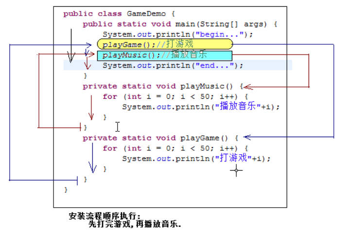
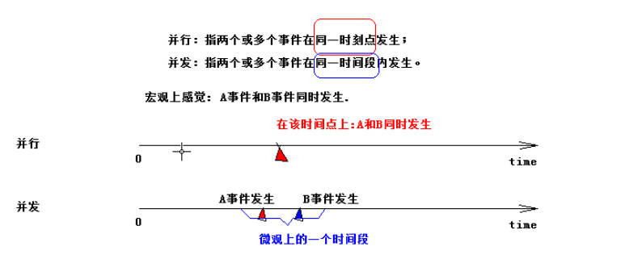
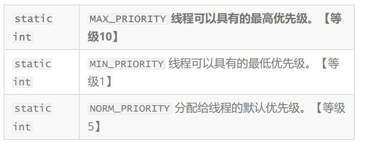

# Tread线程基础

> 有一个场景：在一个程序中即可以玩游戏又可以播放音乐？
> 以现在编程手段而言 ---》 提供编程结构【顺序、分支、循环】代码是要遵守顺序执行，代码需要遵守从上至下逐行执行，利用分支和循环修改循环执行一些操作，选择性执行某代码或者是让某些代码重复执行，无论如何操作代码依旧要顺序执行，没有办法让两段代交替执行
> 
> 此时Java为了解决这样的问题，提供一个操作，这个操作就叫做线程，可以在代码中使用多线程形式来完成这个操作
> PS:现在电脑基本上都是多核CPU，所以每个人电脑上运行线程程序结果可能都不一样，这是一个非常正常现象，多线程运行时是一个不可预知状态，程序猿可以通过代码干预线程运行，以达到我们运行效果

## 并行和并发

> 其实在宏观角度看，这两个词是相同的，都是相同时间完成事情。
> 微观差距在于：
> 并行：两个小车同时走，速度路程时间都相同。
> 并发：在规定时间内，两个小车交替出发
> 
> **并行就是同时执行，并发就是在交替执行**
> 在操作系统中，安装了很多程序，并发指的是在一段时间内宏观上多个程序同时执行，这个在单个CPU系统中，每一个时刻只有一个程序执行，即微观上这些程序是分时交替的执行，只不过给人感觉是在同时运行，因为分时交替运行时间非常短暂
> 现在而言都是多核CPU，则这些并发执行程序可以分配到不同的处理器上（CPU），实现多个任务并行执行，即利用每个处理器来处理一个可以并发执行的程序，这样多个程序就可以同时执行了，你的电脑CPU核心越多你电脑的性能就相对更加强悍
> PS:单核处理的计算机肯定是不能并行处理多个任务，只能是多个任务在单个CPU上并发需要运行，同理线程也是一样的从宏观的角度而言线程并行运行从微观角度看就是串行运行，即线程是一个一个去执行的，当系统只有一个CPU是，线程会以某种顺序执行多个线程，这个情况称之线程调度【线程提供CPU时间争抢】

## 线程和进程

> 进程是程序的一次执行过程，是系统运行程序的基本单元，系统运行一个程序即在运行一个进程【**从创建、运行、消亡的一个过程**】，每一个进程都有自己一个独立的空间【内存空间】，一个应用程序(进程)可以同时运行多个线程
>
> 进程是可以完成多个任务交替执行的，可以开发一个音乐软件（QQ音乐、网易云音乐、酷狗音乐），也可以开发一个打游戏软件（L0L、吃鸡战场、Dota2），只要运行这两个进程程序就可以完成一边听音乐，一边打游戏，这样做开发成本高，**进行是独立的进程与进程之间是无法进行“通信”的**
>
> **线程**
> 线程是进程中一个内部执行单元，负责当前进程中的程序执行，一个进程中至少有一个线程，一个进程可以有多个线程，这些线程在进程中被称之为“多线程”，进程就可以利用这些多线程，去完成不同操作
> 特点:
> 1.线程是在进程的内部执行，并且可以存在多个，彼此之间共享进程的内存区域
> 2.线程与线程之间彼此独立，但是可以进行“通信”
> 可以利用这个轻量级的开发完成一个进程内部程序交替执行效果（线程并发执行)
总结进程与线程的区别:
> 进程： 有独立的内存空间，进程中数据存放的空间是独立的并且至少有一个线程
> 线程：堆空间是共享的，栈空间是独立的，线程消耗的资源要比进程小，并且可以多个线程存在同一个进程中

PS:需要知道了解的知识点：

1. 因为一个程序中有多个线程并发运行，那么从微观的角度而言是有先后顺序的，那么线程执行的顺序是取决于CPU的调度【线程争抢CPU时间片】，程序猿只能进行干涉，在不加干涉前提下线程执行就会出现很多随机性
2. Java程序进程中最少包含两个线程，一个是主线程就是main()方法【它在执行方法是或者执行程序时它的优先级永远最高】，另外一个垃圾回收机制线程(GC)【守护线程】，每当Java执行一个类的时候，实际上都会启动一个JVM，每一个JVM实际上就是在操作系统中启动了一个线程，Java本身就被垃圾回收机制所守护，所以Java运行时至少启动了两个线程
3. 由于创建一个线程开销远比创建一个进程开销要小很多，那么我们在开发多任务运行时，通常会优先考虑创建多线程，而不是多进程
4. 所有的线程轮流使用CPU，每一个线程都会得到CPU分配的时间片，这个分配“尽量”平均分配CPU资源，但是这个效果不一定能达到，所以同优先级的线程对CPU时间的争抢是存在随机性的，可以对线程进行优先级设置来概念获取CPU时间片的几率，优先级越高几率越大，优先级越低几率越小.

## 开放线程

> java中实现线程的方式
> 在 java中实现线程的方式主要有四种：
> 1.继承Thread类，此时子类就是线程类
> 2.实现Runnable接口，此时实现类不是线程类，使用Thread类才可成为线程
> 无论是上述两种方式中那种方式都需必须重写run方法实现线程逻辑
> 3.实现Callable接口， 此实现方方式并不是线程类，主要针对的是线程池提供
> 4.线程池可以帮组我们创建线程并进行管理操作
> 这个run方法是提供线程实现的核心逻辑，需要线程什么样需求代码，就将将代码写入到这个线程中

| void | run() 使用实现接口 Runnable 的对象创建一个线程时，启动该线程将导致在独立执行的线程中调用对象的 run方法。 |
| ---- | -------------------------------------------------------------------------------------------------------- |
> PS：通过观察可以发现这个run方法是没有参数和返回值类型，所以这个run不能通过方法接收参数和返回数据值

### 1.线程创建方式之继承Thread类

1. 定义一个普通类**继承**'ajva.lang.Thread'类
2. 在子类中**重写**父类Thread中**run方法**并**提供线程实现逻辑**
3. 在测试类的main方法中，通过线程子类或Thread这个父类创建线程对象**并执行线程启动**start完成调用run方法中的执行逻辑。

> PS：因为Thread本身就是线程类，所以继承Thread类子类也是线程类，具备父类中Thread所提供的所有操作者线程方法

```java
/**
 * @author zxq
 * @version V1.0
 * @Date 2023/2/21 9:40
 * @Description: ${描述}
 * 线程创建第一种方式：继承Thread 实现run
 * 同时完成打游戏和听音乐
 */
public class ThreadDemo1 {
    public static void main(String[] args) {
        Thread music = new ThreadMusic();
        Thread game = new TheadGame();

        music.start();
        game.start();
    }
}

/**
 * 听音乐类
 */
class ThreadMusic extends Thread{
    @Override
    public void run() {
        for (int i = 0; i < 50; i++) {
            System.out.println("Listen to the music..."+i);
        }
    }
}

/**
 * 打游戏类
 */
class TheadGame extends Thread{
    @Override
    public void run() {
        for (int i = 0; i < 50; i++) {
            System.out.println("Piay to the Game..."+i);
        }
    }
}
```

### 2.线程创建方式之实现Runnable接口

> PS：实现Runnable接口的类并不是线程类，只是实现Runnable接口并提供run方法的重写，需要配合使用Thread类创建线程对象，此时线程才可以操作。因为Runnable接口中提供run方法的实现【实现Runnable接口的类】，传入到Thread类中时，就会覆盖Thread类中run方法，所以Thread提供创建线程对象就会执行重写Runnable接口中run方法，就会得到线程的效果

步骤：

1. 定义一个普通类实现Runnable接口
2. 实现Runnable接口的类必须重写run方法提供线程需要执行的逻辑
3. 在测试类中main方法中，使用Thread创建线程对象完成线程操作

需求：使用继承Thread类方法是完成边打游戏和边听音乐

```java
/**
 * @author zxq
 * @version V1.0
 * @Date 2023/2/21 10:56
 * @Description: ${描述}
 * 线程创建的第二种方式 实现接口runnable
 * 使实现类实现runnable接口这个接口会提供run的重写，但线程的创建需要Thread的子类或对象（线程类），因此需要创建线程类去执行run方法（start）
 */
public class ThreadDemo2{
    public static void main(String[] args) {
        new Thread(new ThreadGame2()).start();
        new Thread(new ThreadMusic2()).start();
    }
}

class ThreadMusic2 implements Runnable{

    @Override
    public void run() {
        for (int i = 0; i < 50; i++) {
            System.out.println("听音乐"+i);
        }

    }
}

class ThreadGame2 implements Runnable{

    @Override
    public void run() {
        for (int i = 0; i < 50; i++) {
            System.out.println("玩游戏"+i);
        }
    }
}
```

Thread类创建线程和Runnable接口创建线程

> 两种方式皆可，因为都要实现run方法，但是从类的扩展角度而言，建议使用实现Runnable接口方式来完成操作，因为Java中类是单一继承，所以如果继承Thread类就无法在继承其他类，所以就会影响类的扩展，但是如果实现接口方式完成，不仅可以继承一个类还可以实现多个接口
> 所以就比较推荐实现Runnable接口
> 继承效果
> class A extends Thread{} //没有办法让A在继承
> class B extends XXXX implements Runnable{} // 不仅可以作为线程类操作而且还可以进行继承其他类

start方法和run方法
> PS：创建完毕线程对象之后，线程执行需要调用的是start方法而不是run方法
> start方法： 用start方法来启动线程，真正的实现了线程运行，通过Thread类中给提供start来启动一个线程，此时线程会进入到“准备就绪”状态，但是真正运行，一旦线程获取到CPU时间片，此时线程才会真正的执行，执行调用提供run方法完成线程逻辑
> run方法：run方法只是一个普通方法，只是在run方法中实现线程执行逻辑，如果外界直接调用run方法，线程是没有启动，只不过是在main方法调用了run方法执行，执行出run方法提供操作，和线程一点关系都没有

使用匿名内部类或Lambda表达式便捷的创建线程对象并执行（了解）

```java
/**
 * @author zxq
 * @version V1.0
 * @Date 2023/2/21 14:24
 * @Description: ${描述}
 * 创建线程中使用匿名类和lambda表达式的方式创建。
 */
public class TheadDem3 {
    public static void main(String[] args) {
        new Thread(new Runnable() {
            @Override
            public void run() {
                for (int i = 1; i <= 100; i++) {
                    System.out.println("火车票A"+i);
                }
            }
        }).start();

        new Thread(){
            @Override
            public void run() {
                for (int i = 1; i <= 100; i++) {
                    System.out.println("火车票B"+i);
                }
            }
        }.start();

        new Thread(()->{
            for (int i = 1; i <=100 ; i++) {
                System.out.println("票c"+i);
            }
        }).start();
    }
}

```

## 线程中常用方法

### getState

> 获取当前线程的状态

```java
/**
 * @author zxq
 * @version V1.0
 * @Date 2023/2/21 14:47
 * @Description: ${描述}
 */
public class GetStateDemo {
    public static void main(String[] args) {
        StateDemo stateDemo = new StateDemo();
        System.out.println("start启动前的状态"+stateDemo.getState());
        stateDemo.start();
        System.out.println("start启动后的状态"+stateDemo.getState());
    }

}

class StateDemo extends Thread{
    @Override
    public void run() {
        System.out.println("此时的状态"+this.getState());
        int sum=0;
        for (int i = 0; i < 100; i++) {
            sum+=i;
        }
        System.out.println("sum的值是"+sum);
    }
}
```

```java
    /**
     * 出生、新生
     * 至今尚未启动的线程就是这种状态
     */
    NEW,

    /**
     * 准备就绪和执行
     *PS：Java中提供Thread类并没有提供准备就绪的状态描述，所以RUNNABLE就有两个概念
     * 调用start方法时是 ---> 准备就绪
     * 执行run方法时是 ---> 执行
     */
    RUNNABLE,

    /**
     * 阻塞或睡眠 ---》 sleep方法
     * 当线程出现【阻塞状态】，当前线程就会出现让出CPU时间片的操作等待后续执行
     */
    BLOCKED,

    /**
     * 等待 ---》 wait
     * 等待是无限期等待只有进行唤醒之后等待效果才会消失【等待不
     是阻塞状态】
     */
    WAITING,

    /**
     * 时间等待
     * 在设置等待状态时设置一个时间，只要在时间范围内都是等待状态，如果到了并且在等待时期并没有进行唤 * 醒从操作，等待线程
     会自动唤醒
     */
    TIMED_WAITING,

    /**
     * 消亡，死亡
     * 线程都执行完毕不会在执行就出现这个状态【线程结束】
     */
    TERMINATED;

```

### getPriority

> 给线程设置优先级
> 理论上线程优先级越高，获取CPU时间片的几率越大，反之获取几率越小
> PS：但是优先级只是相当于给CPU一个暗示【先由我开始】，但是CPU是否会决定将时间片给当前线程，是CPU决定所有在没有修改优先级之前的线程默认优先级都是相同，在Java中使用1~10之间数字表示线程优先级，数值越大优先级越高，所有在没有修改优先级之前默认优先级是【5】API中提供三个静态常量方便对优先级的定义。
>


```java
public class SetPriorityApiDemo2 {
    public static void main(String[] args) {
        SetPriorityApiTest2 test2 = new SetPriorityApiTest2();
        SetPriorityApiTest2 test3 = new SetPriorityApiTest2();

        test2.setPriority(Thread.MAX_PRIORITY);
        test3.setPriority(6);

        test3.start();
        test2.start();

    }
}

class SetPriorityApiTest2 extends Thread{
    @Override
    public void run() {
        System.out.println(this.getName()+"执行了");
    }
}
```

## 更改和获取线程的名字

> 线程是有默认名字组成方式 ---》 使用到一个关键字“Thread” + “-” +“数字”，数字的从0开始，随着线程创建而逐渐增多，随着线程的减少而逐渐减少 ---》 默认名字 【Thread-数字】在编写线程程序时可以通过getName方法获取线程名字，但是如果创建线程过多使用默认名字看到效果就不是很明显
> Java中提供线程名字修改方式有三种：
> 1.在创建出线程对象之后调用setName(“线程新的名字")
> 2.使用类实现Runnable接口并使用Thread类创建线程对象，调用两个参数版本构造方法进行名字设置
> >Thread(Runnable接口实现类的对象，"线程名字");
>
> 3.使用类继承与Thread类，子类中提供一个仿照父类生成构造方法，这个方法参数是String name，子类只需要实现这个构造方法即可，在创建线程对象时只需要调用有参构造方法就可以指定线程名字

```java
/**
 * @author zxq
 * @version V1.0
 * @Date 2023/2/21 16:44
 * @Description: ${描述}
 * 给线程命名
 */
public class ThreadApiDemo {
    public static void main(String[] args) {
//        1.srtName命名线程-适用于线程类
        ThreadTest threadTest = new ThreadTest();
        threadTest.setName("线程A");
        threadTest.start();

//        2.利用构造方法命名线程-适用于implement runnable接口的类
        Thread thread = new Thread(new ThreadText01(),"线程B");
        thread.start();

//        3.重写父类的构造方法获得另一种命名方式-适用于线程类
        ThreadTest02 threadTest02 = new ThreadTest02("线程C");
        threadTest02.start();


    }
}

class ThreadTest extends Thread {

    @Override
    public void run() {
        System.out.println(this.getName()+"--run");
    }
}

class ThreadText01 implements Runnable{


    @Override
    public void run() {

//        Thread.currentThread()静态方法，返回当前的线程的引用
        System.out.println(Thread.currentThread().getName()+"--run");
    }

}

class ThreadTest02 extends Thread{
    @Override
    public void run() {
        System.out.println(this.getName()+" is run..");
    }

    public ThreadTest02(String name) {
        super(name);
    }
}

```

## 线程休眠sleep【使用几率极高】

> sleep这个方法是静态方法，它可以让线程进入到【阻塞状态】即让线程进行到休眠时间，**进入休眠之后线程会让出CPU时间片，给其他的线程进行争抢，当休眠时间到了之后恢复之后线程会继续和其线程进行CPU时间片的争抢**
> sleep方法的参数是毫秒值 ---》 1000毫秒 等于 1秒
> 1.自然醒来【睡眠时间到了，自动醒来】
> 2.中断醒来【会通过Thread类中添加中断标记，强行让sleep醒来】
> 所以sleep方法在调用时候会有一个编译时异常
> 【InterruptedException(中断异常)】
> 特别注意：如果sleep方法被调用在【同步锁、对象锁、同步监听器、同步代码块】中，sleep方法休眠之后是不会让出当前系统时间片【虽然会睡眠时间片也会释放，但是外界线程是无法获取】

需求：通过sleep方法来实现以下交替执行效果

```java
/**
 * @author zxq
 * @version V1.0
 * @Date 2023/2/22 9:17
 * @Description: ${描述}
 * 通过Sleep实现下列交替执行
 */
public class SleepDemo extends Thread {
    @Override
    public void run() {
        for (int i = 0; i < 100; i++) {
            if (i % 5 == 0) {
                System.out.println(this.getName() + "--------" + i);
            }
        }

        try {
            Thread.sleep(1000);
        } catch (InterruptedException e) {
            e.getMessage();
        }
    }
}

class SleepTest{
    public static void main(String[] args) {
        SleepDemo sleepDemo = new SleepDemo();
        sleepDemo.setName("子线程");
        sleepDemo.start();
        
        for (int i = 0; i < 100; i++) {
            if (i % 5 == 0) {
                System.out.println(Thread.currentThread().getName() + "--------" + i);
            }
            try {
                Thread.sleep(1000);
            } catch (InterruptedException e) {
                e.getMessage();
            }
        }
    }
}
```

## 线程礼让yield（了解）

> 礼让线程的作用就是在调用yield方法的线程中，让出CPU时间片【相当于通知CPU不急着执行】，让出之后CPU会不会回收CPU时间片取决于CPU，礼让原则是：线程优先级越高礼让效果就是会明显一些yield和sleep方法是有一定区别的，sleep是立即让出CPU时间片，在睡眠时间内是不会争抢CPU时间片，yield方法执行之后，礼让线程会进入“准备就绪”，礼让线程可能会再次持有CPU时间片
>
> yield和sleep方法是有一定区别的，sleep是立即让出CPU时间片，在睡眠时间内是不会争抢CPU时间片，yield方法执行之后，礼让线程会进入“准备就绪”，礼让线程可能会再次持有CPU时间片

```java
public class YieldDemo extends Thread{
    @Override
    public void run() {
        for (int i=0 ; i<=50;i++){
            System.out.println("线程的名字："+getName()+"~~~~~~~~"+i);
            if(i%2 == 0){
            Thread.yield(); //让线程礼让
            }
        }
    }
public static void main(String[] args) {
    //1.创建两个线程对象
    Thread athread = new YieldDemo();
    Thread bthread = new YieldDemo();

    athread.setName("a线程");
    bthread.setName("b线程");
    athread.start();

    bthread.setPriority(Thread.MAX_PRIORITY);
    bthread.start();
    }
}
```

## 线程合并join

> 合并线程是一个效果非常明显操作，合并线程是一个线程正处于运行阶段，此时这个线程达到某个条件时，可以让其他线程合并到这个执行线程中，只要使用join合并，合并线程必然会得到CPU时间片，被合并的线程需要等待合并线程执行完毕之后才会继续运行

```java
public class JoinDemo {
    public static void main(String[] args) {
        MeiZi meiZi = new MeiZi();
        meiZi.start();
    }
}

class MeiZi extends Thread{
    @Override
    public void run() {
        for (int i = 0; i < 50; i++) {
            System.out.println("妹子在看金刚大战葫芦娃"+i);
            if (i==10){
                HanZi hanZi = new HanZi();
                hanZi.start();

                try {
                    hanZi.join();//阻塞，现在在MeiZi的线程里，调用此方法就会阻塞MeiZi的线程。
                } catch (InterruptedException e) {
                    e.printStackTrace();
                }
            }
        }
    }
}

class HanZi extends Thread{
    @Override
    public void run() {
        for (int i = 0; i < 10; i++) {
            System.out.println("汉子看喜羊羊"+i);
        }

    }
}

```

> 线程合并必然是让出CPU时间片，CPU时间片会join的线程，线程必须是启动状态【调用start】。

## 线程中断（标记）

> 在Thread这个类中提供让线程停止方法 stop方法，但是这个方法被Java进行过时处理，所以就不建议在线程中进行使用了，所以Java就提供一个替代 stop方法的方法 ---> interrupt方法
> 使用这个线程中断标记方法向线程中添加【中断标记】，只有被含有中断异常方法检测到这个标记就会终止方法的执行效果【sleep明显 和join不明显】，直接在线程调用这个方法是无用的，只是添加标记不会停止线程，配合API中所提供的一个方法来使用【interrupted】，作用检查线程中是否存在中断标记，如果存在着返回true，不存在则返回false

```java
public class InterruptThreadDemo extends Thread{
    @Override
    public void run() {
        for (int i = 0; i <= 20; i++) {
            System.out.println(getName()+"->"+i);

            if (i==10){
                if (Thread.interrupted()){
                    return;
                }
            }
        }

    }

    public static void main(String[] args) {
        InterruptThreadDemo interruptThreadDemo = new InterruptThreadDemo();
        interruptThreadDemo.start();
        interruptThreadDemo.interrupt();

    }
}

```

## 强行终止睡眠

```java
package com.qf2.day02;

/**
 * @author zxq
 * @version V1.0
 * @Date 2023/2/22 14:02
 * @Description: ${描述}
 */
public class InterruptThreadDemo extends Thread

{
    @Override
    public void run() {
        for (int i = 0; i <= 20; i++) {
            System.out.println(getName()+"->"+i);

            if (i==10){
                if (Thread.interrupted()){
                    return;
                }
            }
        }

    }

    public static void main(String[] args) {
        InterruptThreadDemo interruptThreadDemo = new InterruptThreadDemo();
        interruptThreadDemo.start();
        interruptThreadDemo.interrupt();

    }
}
```
