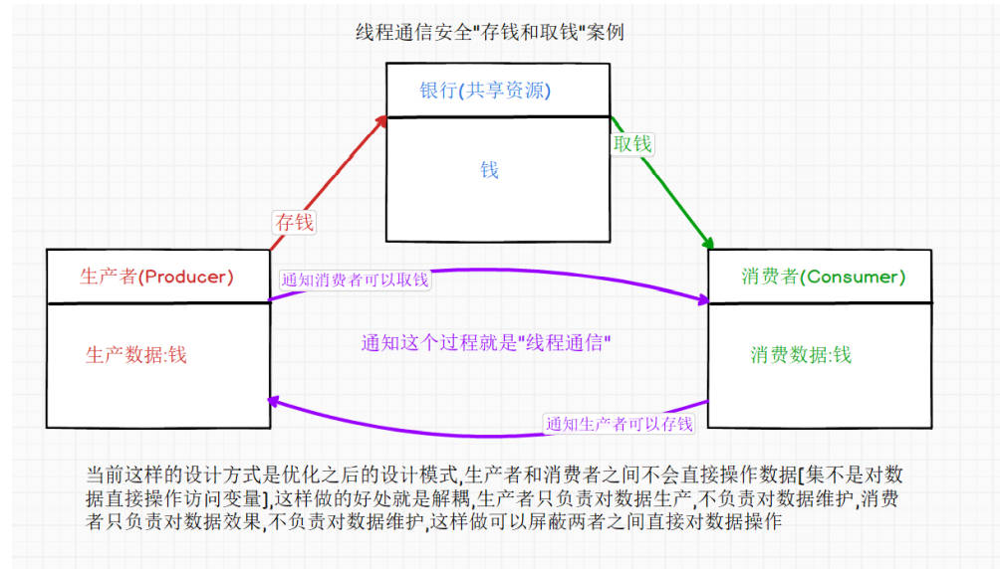
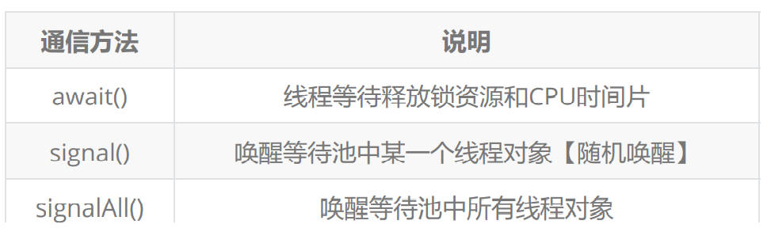
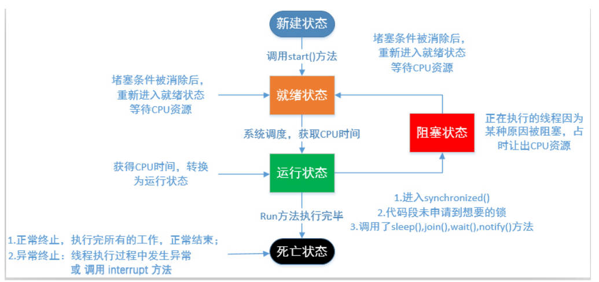

# 线程通信

> 到现目前位置线程与线程之间依旧是彼此独立，就算使用同步代码块，也是让线程执行有一定顺序，但是还是没有进行通信操作，如果需要遇到某个线程执行完毕之后需要通知另外一个线程继续执行，此时就需要使用到线程通信，可以在一个进程中开发多个线程，每个线程之间可以进行通信操作，从而协调性的完成某个进程中需要执行逻辑
> **线程通信有一个标准的通信模型【生产者与消费者模式】**
> 

## 生产者和消费者模型

[高级线程参考文件](%E7%BA%BF%E7%A8%8B%E9%AB%98%E7%BA%A7.pdf)

> 使用了同步代码块+sleep方法，虽然让程序执行有序了也保证线程中操作临界资源过程也安全了，但是还是无法保证线程可以做到交替执行的效果【即生产者生产完数据之后通知消费者可以进行消费，消费者消费完数据之后通知生产者可以生产】，所以如何完成这个通信操作呢？
> 此时就需要使用Java中Object类中提供三个方法了
>
> wait()
> 执行该方法的线程对象会释放【同步锁资源】，JVM会把当前线程放到等待池中，等待其他线程唤醒操作
> notify()
> 执行该方法的线程对象会在等待池【随机唤醒】一个等待的线程，把线程转移到锁池中等待，再次获取资源
> notifyAll()
> 执行该方法的线程对象会在等地池中【唤醒所有的线程】，把线程转移到锁池中等待，再次获取资源
>
> 就可以利用这三个方法进行线程通信操作了，特别注意调用通信方法必须是锁资源对象，否则会出现异常提示信息【在哪里调用等待方法就在位置被唤醒】
>
> 线程通信执行流程：
> 假设A线程和B线程共同操作一个X锁对象，A、B线程可以通过X锁对象调用wait和notify方法进行如下线程通信操作：

1. 当A线程执行到X锁对象时，A线程持有X锁对象，B线程是没有执行机会的，B线程在X对象的等待锁池中2
2. A线程在同步代码块种执行到X.wait方法时，A线程会释放X对象所资源，A线程会进入到X对象的等待锁池中
3. B线程就会在等待锁池中得到A线程释放的X资源锁对象，B线程就开始执行操作
4. B线程在同步代码块中执行到X.notify方法时，JVM把A线程从X对象等待池中，移动到等待X对象锁资源中得到锁资源
5. B线程执行完毕之后释放锁资源，A线程就有机会获取到锁，继续执行同步方法

## 多对多通信模型

> 提供线程对象创建操作， 这里从原有一对一的模式，变成多对多的模式，原来的一个生产者对应一个消费者，修改为了多个生产者对应多个消费者
>
> 当将线程对象增多之后，执行多线程同时操作就出现两个问题“负数问题和死等待问题”
> **负数问题**
> 为了保证线程通信可以正常执行，建议在开发的时候，不要书写if作为状态判断操作，建议使用while循环语句替代if分支，while循环语句只有条件为false，才不执行，否者就继续执行，这样就可以让等待位置线程在次被唤醒之后可以再次判断状态操作，以防出现错误数据
> **死等待问题**（所有线程都进入到等待池中无人唤醒）
> 之所以会出现死等待原因就因为使用了notify的操作，它是随机唤醒，等待池中两个消费，外界两个生产【生产完毕，状态修改，无法唤醒】，或等待池中两个生产，外界两个消费【消费完毕，状态修改，无法唤醒】，建议使用notifyAll 替换 notfiy，进行全部唤醒，然后再进行条件判断执行操作，决定好是否存储与消费
>
> **总结**：如果在日后的开发中出现线程通信操作，建议判断状态标签的位置使用while关键字而不是if，进行唤醒操作建议使用notfiyAll而不是notify

## 扩展：Lock接口【显示锁】

> Lock接口是Java5中新加入与Synchronized比较操作，它属于显示定义，结构更加灵活，提供了一个更加便捷的操作，相对比synchronized更加简洁易用
> PS：这个锁资源Lock虽然语法更加简洁易用，但是它不能定义锁对象，Lock使用锁对象是【this】，使用Lock时就需要保证this的唯一性了
> Lock锁如何操作？
> Lock是一个接口所以需要使用到他实现类进行锁的操作ReentrantLock提供两常用操作

> 因为Lock是一个显示锁对象，所有不能调用Object类中提供wait、notify、notifyAll方法进行线程通信，所以系统就提供了一个和Lock锁一起使用线程通信接口Condititon
> 
> 使用Lock锁替代Synchronized同步代码块进行数据操作

```java
//提供锁资源对象
private final Lock lock = new ReentrantLock();
//提供线程通信资源对象【它是接口不能new，使用lock对象调用
newCondition创建】
private Condition condition = lock.newCondition();

//synchronized ("") {//替换成lock锁资源对象
lock.lock();

// "".wait();
condition.await();//使用通信资源创建对象

//"".notifyAll();
condition.signalAll();//使用通信资源创建对
象

lock.unlock(); //锁资源释放
```

## 线程的生命周期



> 线程声明周期分为两条线:
> 基础线程声明周期： 新建 ---》 准备就绪 ---》 运行状态 ---》 死亡状态
>
> 对线程添加了一些操作造成线程阻塞现象的产生【sleep、join、wait、synchronized等等】
> 新建 ---》 准备就绪 ---》 运行状态 ---》【 阻塞状态 ---》 准备就绪 ---》 运行状态】 ---》 死亡状态
>
> PS：在阻塞状态没有消失之前
> 准备就绪 ---》 运行状态 ---》阻塞状态 ---》 准备就绪 ---》 运行状态 ..... 【会一直重复执行】

1. 新建状态(new):使用new创建一个线程对象,仅仅在堆中分配内存空间,在调用start方法之前.
    新建状态下,线程压根就没有启动,仅仅只是存在一个线程对象而已.
    Thread t = new Thread();//此时t就属于新建状态,当新建状态下的线程对象调用了start方法,此时从新建状态进入可运行状态.
    线程对象的start方法只能调用一次,否则报错:IllegalThreadStateException.
2. 可运行状态(runnable):分成两种状态，ready和running。分别表示就绪状态和运行状态。
   就绪状态:线程对象调用start方法之后,等待JVM的调度(此时该线程并没有运行).
   运行状态:线程对象获得JVM调度,如果存在多个CPU,那么允许多个线程并行运行.
3. 阻塞状态(blocked):正在运行的线程因为某些原因放弃CPU,暂时停止运行,就会进入阻塞状态.
   此时JVM不会给线程分配CPU,直到线程重新进入就绪状态,才有机会转到运行状态.
   阻塞状态只能先进入就绪状态,不能直接进入运行状态.
   阻塞状态的两种情况:
        当A线程处于运行过程时,试图获取同步锁时,却被B线程获取.此时JVM把当前A线程存到对象的锁池中,A线程进入阻塞状态.
        当线程处于运行过程时,发出了IO请求时,此时进入阻塞状态.
4. 等待状态(waiting)(等待状态只能被其他线程唤醒):此时使用的无参数的wait方法,
   当线程处于运行过程时,调用了wait()方法,此时JVM把当前线程存在对象等待池中
5. 计时等待状态(timed waiting)(使用了带参数的wait方法或者sleep方法)
    当线程处于运行过程时,调用了wait(long time)方法,此时JVM把当前线程存在对象等待池中.
    当前线程执行了sleep(long time)方法
6. 终止状态(terminated):通常称为死亡状态，表示线程终止.
    1):正常执行完run方法而退出(正常死亡).
    2):遇到异常而退出(出现异常之后,程序就会中断)(意外死亡).
    线程一旦终止,就不能再重启启动,否则报错(IllegalThreadStateException).
在Thread类中过时的方法(因为存在线程安全问题,所以弃用了【真心好用，绝对不能用】):
void suspend() :暂停当前线程
void resume() :恢复当前线程
void stop() :结束当前线程
