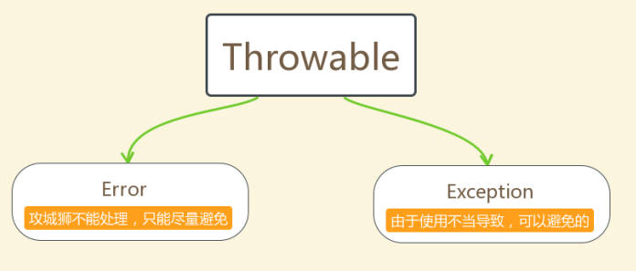
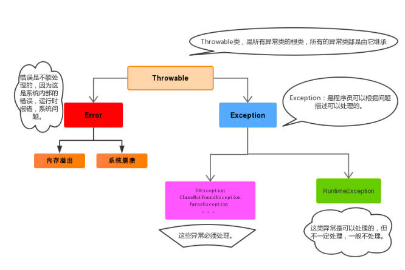

# 异常

## 异常介绍

>异常，就是不正常的意思，在生活中，如果医生说，你的身体某部位有异常，就证明该部位和正常相比是有点不同的，该部位的功能将受影响，在程序中的意思就是：
    >异常：指的是程序在运行过程中，出现了非正常的情况，最终倒置JVM的非正常停止
> 在Java等面向对象的编程语言中，异常本身是一个类，产生异常就是创建异常对象并抛出一个异常对象，Java处理异常的方式是中断处理【终止程序的运行】，还有异常指的并不是语法错误，语法错了，编译时不会通过，不会产生字节码文件，根本不能运行.

异常体系
异常机制其实是帮我们找到程序中的问题，异常的根类是java.lang.Throwable
其下有两个子类：
    java.lang.Error
    java.lang.Exception
平时我们说的异常就是Exception

>Error:严重的错误，无法通过处理的错误，只能事先避免【这就好比现实生活中“绝症”】
>Exception:表示异常，异常产生后程序员是可以通过代码的方式进行纠正，使程序继续执行，是必要的处理。【这就好比现实生活中“感冒”】

## 分类

> 编译时异常：
> checked异常，在编译时期，就会进行检查，如果没有处理异常，则编译失败，造成程序是无法正确运行的【比如：日期格式化类中解析方法】运行时异常：
> runtime异常，在运行时期，检查异常，在编译时期，运行时异常不会编译器所检测（提示错误信息），只有当程序运行起来之后才会出现异常【比如：数组下标越界异常】



* 异常

```java
//错误Error --》 死递归（访问无限调用自身，不能停止）【栈溢出错误】
//java.lang.StackOverflowError ---》 栈溢出错误
//show();
//异常Exception --》
// 运行时异常 ---> 数组下标越界异常 ---> ArrayIndexOutOfBoundsException
// int[] arr = new int[2];
// System.out.println(arr[3]);
/*
编译时异常 ---> 时间格式化解析方法 Unhandled exception: XXXXX ---> 提示是一个编
译时异常需要处理
java: 未报告的异常错误java.text.ParseException; 必须对其进行捕获或声明以便抛
出
编译时异常发现时，必须进行处理，否则无法正确执行代码
*/
        SimpleDateFormat sdf = new SimpleDateFormat("yyyy-MM-dd");
        sdf.parse("1990-01-01");
    }

    public static void show() {
        show();
```

## Throw关键字 抛出异常

在一定程度上相当于rutern，只不过这个返回直接讲信息返回给控制台

> 在Java中，提供了一个throw关键字，它的作用可以抛出一个指定异常对象，throw关键字主要使用在方法的内部，用来抛出一个异常对象，将这个异常对象传递给方法的调用者，并结束方法的执行
> PS：因为throw关键字在刚刚描述中说道了“结束方法执行”，所以throw可以当做一次return操作
> 使用，return关键字作用“结束方法执行”，只不过throw返回是异常对象，return返回的是数据，在实际开发中，如果return已将将所有条件结果都进行了返回，但是方法依旧提示缺少一个return，此时就可以在最终的位置提供一个throw抛出一个异常.

实现

```java
throw new 异常类名(异常信息);
PS：异常名可以使用系统定义好的异常名，也可以使用自定义异常，异常信息是一个String字符串即
异常是因为什么原因出现的
例如：
throw new NullPointerException("因为数组arr引用为null，所以出现异常");
或者 --》在使用throw 抛出异常信息时最常用异常类型
throw new RuntimeException("程序运行时出错，某些数据没有初始化");
```

## Throws 标识异常

> throws关键字的作用声明处理异常：使用throws关键字将异常信息标识出来，表示**当前方法不处理异常，而是提醒给调用方法者，让调用方法这来处理这个异常**如果调用方法这也不处理这异常，可以继续使用throws向上声明标识异常，直到遇到main方法还不处理，最终这个异常会被JVM虚拟所捕获处理，JVM处理方式就是停止JVM虚拟机，打印异常栈信息.
> 因此最好不在main方法中使用throws。

语法格式

```java
访问权限修饰符 [其他修饰符] 返回值类型 方法名(参数列表)throws 异常类名1,异常类名2...{
方法体
return 或 throw 关键字
}
PS：throws 关键字后面的异常可以有多个，每个异常之间使用[,]分隔
```

```java
public class ParseExceptionDemo {
//此时异常声明标识是在main方法上，如果一旦触发异常必然是JVM虚拟停止并打印异常信息
public static void main(String[] args) throws ParseException, IOException {
SimpleDateFormat sdf = new SimpleDateFormat("yyyy-MM-dd");
String time = "1990-01-01";
Date parse = sdf.parse(time);
//因为在show方法上声明标识了一个编译时异常IOException，所以只要调用show方法就需要
处理这个异常
show();
}
public static void show()throws IOException{
//Unhandled exception: java.io.IOException-->因为IOException是编译异常
//需要外界调用按方法时，知晓这个内部会出现异常问题
throw new IOException();
}
}
```

>总结:之所以会有异常产生是因为，方法体的内部使用throw关键字创建一个异常对象，抛出给调用者所以会产生异常，产生了异常之后可以使用throws关键字将这个异常声明标识，谁调用谁处理这个异常，这种方式也是开发中经常使用一种方式
>PS：尽量不要在main方法中声明标识异常，因为这样处理化就是JVM虚拟机，处理方式就是停止JVM虚拟机，打印异常信息所以我们尽量不要这样操作【虽然在开中都是这样做的】

## 捕获异常try...catch尝试...接住（异常）

>捕获处理异常:对异常进行捕获处理，处理完成完成之后可以正常向下执行

语法格式

```java
try{
编写代码，这里的代码是可能出现异常代码
}catch(异常类型 e){
提供当前处理异常代码
例如"【记录日志、打印异常信息、继续抛出异常等等】"
}
执行步骤：
1. 首先会先执行try代码块中代码，如果try代码块中代码出现了异常，那么就执行catch代码块中代码，执行完毕之后，程序继续向下执行
2. 如果try代码块中代码没有出现异常，那么就不会执行catch代码块中代码，而是代码继续向后执行
```

> 注意：
> 1.try和catch都不能单独使用，必须连用
> 2.catch后面提供小括号内，是当前要捕获的异常类型即try代码块中可能会出现异常类型
> 使用e即形成(异常类型 e)声明形式，相当于是创建了一个异常类型的对象e，e这个对象就代表这个异常类型，可以在catch代码块中使用：
> 1.try代码块中出现了异常，那么出现异常位置后面的代码都不会在执行了，而是转而执行catch代码块
2.catch代码块是可以根据try中可能出现异常进行添加的，根据出现异常追加catch代码块，但是有一个原则，父类异常一定要放置到最后一个catch中，之前都应该是子类异常，如果将父类异常放置到第一个catch中，后续catch代码块都无法进行正常捕获操作【即父类异常将所有异常都接收了就会造成子类无法接收异常】

```java
package com.qf.day05;

import java.text.ParseException;
import java.text.SimpleDateFormat;
import java.util.Date;
public class TryCatchDemo {
    public static void main(String[] args) {
//提供出现异常代码
/*
int[] arr = new int[1];
System.out.println(arr[2]);//arr[2]出现了下标越界异常，没回造成当前后续代码无法
执行
System.out.println("我要是出现，证明程序执行到这行代码....");
*/
//提供try...catch代码块进行一个捕获处理 -->快捷键 ctrl+atl+t
/* try {
int[] arr = new int[1];
System.out.println(arr[2]);//arr[2]出现了下标越界异常，没回造成当前后续代码
无法执行
} catch (ArrayIndexOutOfBoundsException e) { //catch后面小括号内提供异常类
型，尽量是要对应捕获的异常类型
//提供除以异常方式
*//*
catch中确实可以做异常信息的提示，保证代码可以继续向后执行，但是只要出现以异常信
息
说明比代码出现了问题，虽然catch提供错误信息让代码继续执行，但并没有修改错误异常
代码
当我们发现出现异常信息时，需要及时的处理当前try中产生产生异常代码，否则虽然保证
代码正常执行，但是效果是错误的
*//*
//System.out.println("下标越界了，无法访问");
*//*
Throwable类中还提供一些方法可以方便不我们在catch代码块中进行错误信息的提示
getMessage() --> 打印异常信息【这个信息是系统提供（可能会很笼统）】
*//*
//System.out.println(e.getMessage());
*//*
开发阶段可以使用这个方法，但是项目上线之后就建议修改掉这个操作
方法printStackTrace() --> 打印异常栈信息包含了：【异常类型、异常原因、异常出
现位置】
*//*
e.printStackTrace();
}
System.out.println("我要是出现，证明程序执行到这行代码....");*/
        try {
            int[] arr = new int[1];
            System.out.println(arr[0]);//try代码块中如果代码出现异常，后续代码都无法执行【try中】
            SimpleDateFormat sdf = new SimpleDateFormat("yyyy-MM-dd");
            Date parse = sdf.parse("1990-10-10");
            System.out.println(parse);
        } catch (ParseException e) {
            e.printStackTrace();
        } catch (ArrayIndexOutOfBoundsException e){//try多个异常是，添加多个catch代码块进行异常追加捕获操作
            e.printStackTrace();
        }
//提供多个catch的时候父类异常一定要在最后一个catch中，不要放置到之前否则无法正常捕获异常【异常子类】
        System.out.println("我被执行了");
//ps: 在开发中如何处理多个catch的问题？因为代码中如果异常过多，那么会造成代码中catch语句非常多
// 代码的简洁基本上就没有，所以面临这种多个异常需要处理是，就是直接提供父类异常抓取
        try {
            int[] arr = new int[1];
            System.out.println(arr[2]);//try代码块中如果代码出现异常，后续代码都无法执行【try中】
            SimpleDateFormat sdf = new SimpleDateFormat("yyyy-MM-dd");
            Date parse = sdf.parse("1990-10-10");
            System.out.println(parse);
        } catch (Exception e) { //这个父类Exception的原则就是谁出现异常就抓取谁吗，而且都可以匹配
            e.printStackTrace();
        }
//提供多个catch的时候父类异常一定要在最后一个catch中，不要放置到之前否则无法正常捕获异常【异常子类】
        System.out.println("我被执行了");
    }
}
```

总结
>捕获异常处理，如果程序出现了异常，保证程序可以继续向后执行
>声明标识异常，如果程序出现了异常，程序就不会继续向后执行了
>Java中异常机制的目的是为了提示开发人员，出现异常是代码出现问题需要进行修改，所以建议在编码阶段可以使用throws进行处理，在程序上线之后建议将出现异常位置使用try...catch方式进行处理这样可以保证对用户友好提示。
>try...catch捕获异常之后，是对异常可以进行二次处理信息提示，但是只是提示了异常问题，不会对异常继续修改，所以开发时看到异常信息一定要修改代码才可以，才能保证保证正确执行

finally语句代码块

>放在try{}catch(){}后，除不写和停止虚拟机外，一定会被执行。
> 不可单独拿出来。

>finally语句代码块是配合try...catch语句代码块执行，finally语句代码块有一个特点，特点是无论是否发生异常，finally语句代码块【必然执行】，所以利用finally语句代码块的特点可以进行一些资源释放的操作【TCP/UDP网络连接、IO流文件的处理、JDBC进行数据库连接操作等等】

```java
try{
编写代码，这里的代码是可能出现异常代码
}catch(异常类型 e){
提供当前处理异常代码
例如"【记录日志、打印异常信息、继续抛出异常等等】"
}finally{
无论发生异常与否，这里都会执行
}
执行步骤：
1. 首先会先执行try代码块中代码，如果try代码块中代码出现了异常，那么就执行catch代码
块中代码执行完毕之后，而是执行finally语句代码块中代码，然后程序继续向下执行
2. 如果try代码块中代码没有出现异常，那么就不会执行catch代码块中代码，但是会执行
finally语句代码块中代码，然后程序继续向下执行
"ps: finally语句代码块不能单独使用"
```

### 面试题

> Java中final、finally和finalize相似点和区别是什么？
> 相似点：除了长得像没有任何相似
> 区别点： final是一个修饰主要用于修饰类、方法、常量，表示最终的无法修改的,
> finally是捕获异常是所处理代码块，主要作用是无论异常是否发生都会执行代码块，可以用于保证长连接资源释放.
> finalize是Object类中所提供一个方法，这个方法无需程序调用，调用这个方法是GC，当GC回收资源对象时会默认调用finalize进行收尾操作

## 自定义异常

> Java中是提供了很多异常类类型，共开发者在程序中进行异常类型使用，但是Java中所定义的异常类型在某些时候，还是无法满足开发需求，根据自身开发业务逻辑自行定义异常，此时自定义异常就出现了
> 例如： 注册信息异常 ---> RegisterException 胖了异常 ---> PangExcetption
> 如果来定义自定义异常：
PS：在提供自定义异常时，你要明确原则是你要提供异常来使用【编译时异常还是运行时异常】
如果提供是自定义编译时异常: 只需要将自定义异常类继承与java.lang.Exception即可
如果提供是自定义运行时异常:只需要将自定义异常类继承与java.lang.RuntimeException即可,类中无需提供任何其他操作，只要仿照父类生成构造就可以了

示例:自定义异常，用来检测是否重名

```java
package com.qf.day05;

import org.junit.Test;

import java.util.Scanner;

//自定义的注册异常
public class RegisterException extends RuntimeException {
    //精简化只提供无参和一个参数为String message的有参构造方法即可
//其他都可以提供
    public RegisterException() {
    }

    public RegisterException(String message) {
        super(message);
    }

    public RegisterException(String message, Throwable cause) {
        super(message, cause);
    }

    public RegisterException(Throwable cause) {
        super(cause);
    }

    public RegisterException(String message, Throwable cause, boolean
            enableSuppression, boolean writableStackTrace) {
        super(message, cause, enableSuppression, writableStackTrace);
    }
}

class Test3 {
    //在当前类中提供一个账号名数组
    private static String[] usernames = {"zhangsan", "lisi", "wangwu"};

    public static void main(String[] args) {
        Scanner input = new Scanner(System.in);
        System.out.println("请输入用户名：");
        String username = input.next();
        try {
            if (checkUserName(username)) {
                System.out.println("注册成功");
            }
        } catch (Exception e) {
            System.out.println(e.getMessage());
        }
    }

    public static boolean checkUserName(String username) {
        for (String name : usernames) {
            if (name.equalsIgnoreCase(username)) {
                throw new RegisterException("不好意思：" + username + "已经存在无法注 册");
            }
        }
        return true;
    }
}
```
