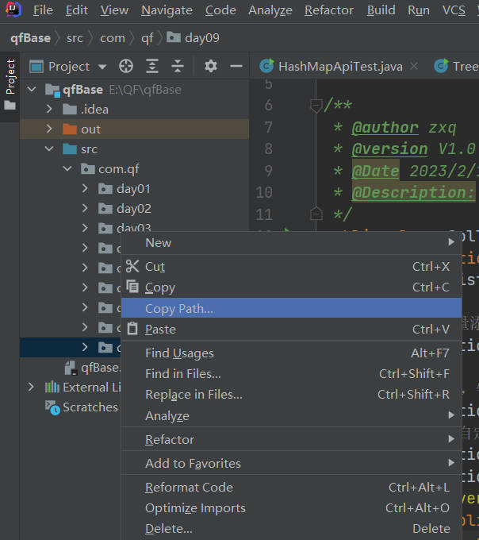
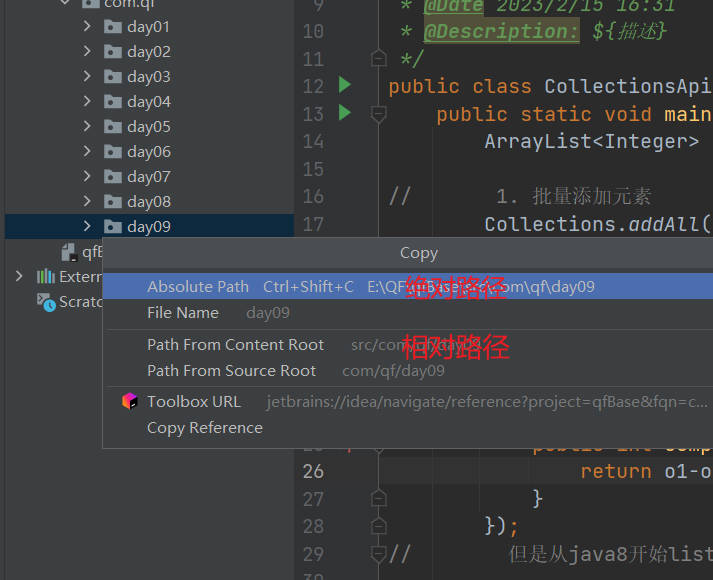

# file类

介绍
> File类是Java中专门提供给代码进行对文件系统【操作系统】文件夹或文件进行操作的类，这个File类中提供**【创建、删除、重命名、判断文件状态、检查文件的属性】**等等功能，就可以通过File对象将系统中文件或文件夹以，面向对象的方式进行操作，File类只能对文件进行管理操作，对于文件内容存储数据File类是无法进行操作
> File类就是Java中表示系统文件或系统文件夹的一个抽象，可以提供一个【路径】将路径所描述文件或文件夹具体化，并且提供File类中给提供方法对文件或文件进行操作
> PS：建议尽量不在C盘判断进行操作，极少部分电脑对C盘操作是需要权限【管理员权限】

文件和文件夹路径和问题？
> 操作系统中文件或文件夹的路径分为两种"绝对路径"和”相对路径“
>
> 1.这里以windows系统为例：
**绝对路径： 是从系统盘符开始路径是绝对路径【在开发尽量少用】**
> windows系统中对绝对路径的路径分隔符号是【\】
> C:\File类\笔记 --》绝对路径
> 这里问题在于，在Java代码中【\】是转义字符，针对\后的字母进行转义操作，所以为了避免提供绝路径出现歧义在编写代码的时候如果提供绝对路径，路径分隔符要写成【\\】
> C:\\File类\\笔记 --》这样代码才可以读取这个绝对路径
> Java为了减少程序猿书写路径麻烦，Java会仿照Unix或Linux系统中提供路径分隔符进行路径分隔操作，提供是【/】 --> 得到路径是 --》/Users/jkmaster，即将绝对路径修改为
> C:/File类/笔记 --》这样代码才可以读取这个绝对路径此时【/】 等价于 【\\】
>
> PS：windows系统是可以兼容使用Unix或Liunx路径分隔符号，但是
Unix或Liunx是不兼容windows的路径分隔符号
> /Users/jkmaster/app/File类/笔记 ---》 Linux路径但是不可以这样写
> \\Users\\jkmaster\\app\\File类\\笔记 --->错误无法读取
**相对路径：主要针对的服务器或IDEA编译工具的路径作为参考路径，从而形成路径就是相对路径**
> pS: 相对路径是不区分操作系统
> 
> 
>
> 2.以工程中类文件作为参考进行文件路径拷贝操作
> 绝对路径-->
> C:\IdeaProjects\File\src\com\qfedu\FileAPI\FileAPIDemo.java
> 相对路径：
> src/com/qfedu/FileAPI/FileAPIDemo.java以工程中类文件作为参数进行文件路径的拷贝操作
>
> 相对路径的提供必须有一个路径参考存在，不能随意提供相对路径，相对路径参考必须是一个真实存在路径，相对路径是在有绝对路径前提下提供，所以必须提供一个参考，**在IDEA编译器工程中提供相对路径参考就是IDEA工程**
>
> 不可以在代码中这样提供相对路径提供一个绝对的路径：
> String path = "C:\\abc\123\\456";
> String path2 = "file.txt"; file.txt参考是path路径，这样完全错误
相对路径在什么位置提供针对的就是谁在进行参考
> PS：项目中是可以读取绝对路径，但是针对网络中读取本地的【视频或音频文件或图片】

```java
package com.qf.day09;

import javafx.scene.control.Separator;

import java.io.File;
import java.io.IOException;
import java.util.Date;

/**
 * @author zxq
 * @version V1.0
 * @Date 2023/2/15 19:47
 * @Description: ${描述}
 */
public class FileApiTest {
    public static void main(String[] args) {
//        输出斜杠，这两个是一样的，区别就是一个String，一个是char。应用这两个静态常量的原因是因为可以根据不同的操作系统变换不同的斜杠。
//        除了数据类型一样之外，剩下完全相同根据不同操作系统动态变化分隔符号
        System.out.println(File.separator);
        System.out.println(File.separatorChar);

        File file = new File("src/com/qf/day09/fileTest//1.txt");
//        查看路径
        System.out.println(file.getPath());

//        判断file路径中的那个文件存不存在？
        System.out.println(file.exists());

//        判断路径最后是不是文件夹
        System.out.println(file.isDirectory());

//        创建一整个路径的文件夹->根据file中的路径
        file.mkdirs();

//        获取文件夹下的所有文件以及文件夹的路径[string类型]
        String[] strings = file.list();
//        获取文件夹下的所有文件以及文件夹的路径[file类型]
        File[] files = file.listFiles();
//        提供系统所有的盘符
        File[] listRoots = file.listRoots();

    }

    private static void operationFile() throws IOException {
//        file其他创建方式
        File file = new File("src/com/qf/day09/fileTest/2", "3.txt");
//        参数1->父路径，参数2->子路径的文件或文件夹；可为String或file对象

//        1.判断file对象是否是文件 true是文件 false是文件夹
        System.out.println(file.isFile());//boolean

//        2.判断file对象中的文件或文件夹是否存在
        System.out.println(file.exists());

//        3.创建文件夹
        System.out.println(file.createNewFile());

//      4.删除文件
        file.delete();

//        5.集【移动复制剪切粘贴重命名】与一身的方法
//        需要将文件或文件夹到什么位置路径【移动路径中可以修改文件名字】
        file.renameTo(new File("路径"));

    }

    private static void checkFileState(){//check file state 控制（审查）文件状态
        File file = new File("src/com/qf/day09/fileTest/2", "3.txt");

        //1.文件是否可读\可写\可执行
        file.canRead();file.canWrite();file.canExecute();

        System.out.println("判断文件是否是隐藏文 件："+file.isHidden());
        System.out.println("获取文件最后修改时间："+new Date(file.lastModified()));
        //文件大小是根据存储内容大小决定
        System.out.println("文件的大小："+file.length()+"字节");
    }

    private static void showPath(){
        File file = new File("src/com/qf/day09/fileTest/2", "3.txt");

        System.out.println(file);//重写toString方法打印的是存储路径

//        获取文件绝对路径【返回值类型，file】
        file.getAbsoluteFile();

//        获取文件的绝对路径【String】
        file.getAbsolutePath();

//        获取当前路径的上一路径【String】
        file.getParent();

//        获取路径的上一级路径【File】
        file.getParentFile();

//        获取文件路径
        file.getPath();

//        获取文件名字
        file.getName();

    }

}

```

## 递归

> 递归是方法一种【自身调用自身的一种方式】
>
> 递归调用时是一种特殊的调用形式，是方法自己调用自己即一个方法内部调用方法本身，这种方式被称之为递归，方法递归包含了一个隐式循环，它会重复执行某段代码，但是这个重复执行操作需要加以控制，否则就会出现"栈溢出错误"
>
> 递归的本身执行效率极高【在同时间内容所有资源都被递归所调用执行操作】，在开发中提供递归操作是需要特别注意
>
> 如何理解递归操作？
>
> 通俗：从前有座山，山里有座庙，庙里有一个老和尚和小和尚，老和尚在给小和尚讲故事，从前有座山，山里有座庙.....【小和尚睡着（递归的停止条件）】
> 递归的必要原则：一定要提供一个递归的停止点，如何让递归正确停止下来

```java
public class MethodDemo {
    public static void main(String[] args) {
        //必须注意正确停止递归，不要出现StackOverflowError错误停止递归【JVM虚拟机停止了】
        show();
    }
    public static void show(){
        show(); //这就是递归【在show方法的内容调用自身show方法】
    }
}
```

需求： 使用递归的方式计算1~5之间所有数据之和

```java
public class MethodDmo2 {
    public static void main(String[] args) {
//正常解题
        int sum = 0;
        for (int i = 1; i <= 5; i++) {
            sum += i;
        }
        System.out.println(sum);
//既然可以这样计算，也可以提供循环
        int sum1 = 0;
        for (int i = 5; i >= 1; i--) {
            sum1 += i;
        }
        System.out.println(sum1);
        int i = ToSum(5);
        System.out.println(i);
    }
//当我们需要计算1~某个数字之间所有数据之和的时候1是确定值，也就是计算的最后一个位置也是开始的位置
/*
提供一个方法，方法可以帮组累加计算 参数num就是需要累加到数据位置
*/
    public static int ToSum(int num){
        if (num == 1){
            return 1;// 计算到最后一个值
        }else {
            return num + ToSum(num - 1);
/*
第一次调用ToSum方法时 ，参数是 5 执行 num == 1 不等于 执行 num+ToSum(num-1);即 5+ ToSum(5-1) 再次触发 ToSum调用
第二次调用ToSum方法时 ，参数是(5-1) 执行 num == 1不等于 执行 num+ToSum(num-1)
即 4+ToSum(4-1) 再次触发 ToSum调用第三次调用ToSum方法时 ，参数是(4-1) 执行 num == 1
不等于 执行 num+ToSum(num-1)即 3+ToSum(3-1) 再次触发 ToSum调用
第四次调用ToSum方法时 ，参数是(3-1) 执行 num == 1
不等于 执行 num+ToSum(num-1)
即 2+ToSum(2-1) 再次触发 ToSum调用
第五次调用ToSum方法时 ，参数是(2-1) 执行 num == 1
等于 方法执行return 1
就会返回给第四次调用 2+ToSum(2-1) 作为ToSum方法的返
回值获取 即 2+1 = 3
3这个结果值就会返回第三调用3+ToSum(3-1)作为ToSum方法
的返回值获取 即3+3 = 6
6这个结果值就会返回第二调用4+ToSum(4-1)作为ToSum方法
的返回值获取 即4+6 = 10
10这个结果值就会返回第一次调用5+ToSum(5-1)作为ToSum
方法的返回值获取 即 5+10 = 15
*/
        }
    }
}
```

> 总结
> "1. 写递归必须要有结束点【递归的停止】，否则会出现StackOverflowError栈溢出错误【终止递归】"
> "2. 明确这个方法的重复做什么事情，是否有重复做事情的条件，是否可以重复做到事情"
> "3. 简单递归都是使用【循环解决】，但是深层次的递归是无法使用循环替代的"
> "4. 一般项目中书写递归一定要慎重，一般递归出现在于无法使用循环解决操作或是进行执行效率优化时"

## 进阶案例演示：遍历操作系统中某个盘符，获取判断中所有文件夹和文件夹信息，打印层级

```java
public class ViewFilePath {
    public static void main(String[] args) {
        File file = new File("src/com/qf/day09");

        show(file,0);
    }

private static void show(File file,int level){
//    创建列表结构
    StringBuffer buffer = new StringBuffer("|--");

//    循环，每递归一次就在“|--”前方加一个“|”表示层级
    for (int i = 0; i < level; i++) {
        buffer.insert(0,"|");
    }

    //创建这个文件路径的【file】类型的数组
    File[] files = file.listFiles();
//    判断这一级的列表中是不是空的，是空的就没必要再递归了
//    一般情况下都要判断一下会不会有空文件夹，不然的话在调用迭代时机会空指针异常
    if (Objects.isNull(files)){
    return;
    }

    for (File f : files) {
//        向控制台打印buffer中的符号+上file中的名字
        System.out.println(buffer.toString().concat(f.getName()));

        if (f.isDirectory()){
//            这里是+1不能是++
            show(f,level+1);
        }
    }
}
}


```