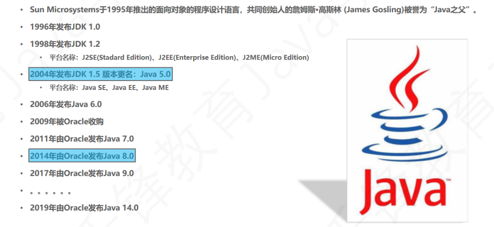

# 概述
## 1.引言
程序是为了模拟现实世界，解决现实问题，而使用计算机语言编写的一系列有序的指令集合。

## 2.java历史


JavaSE(java Platfrom Standard Edition)java 平台标准版

JavaEE(java Platfrom Enterprise Edition)java平台企业版 企业级开发

JavaME（java Platfrom Micro Edition）java平台微缩版

    C/S架构：客户端+服务端
    B/S架构：浏览器+服务端

## 3.java语言的特点
* 面向对象
* 简单性
    java虚拟机，内置垃圾回收机制GC，自动完成空间管理，避免一些问题的产生，进而更加安全有保障。
* 跨平台（操作系统、服务器）
## 4.计算机执行的机制
### 1.编译
  * 将源文件编译成平台相关的机器码文件，一次编译多次执行。
  * 执行效率高，不可跨平台。
1. 编译执行：在具体的环境中（window）执行一次翻译（源文件->机器码）执行机器码文件
   
    特点：执行效率高，不可跨平台。

    【源文件】----编译---->【不同的字节码文件】----运行---->【对应的的操作系统】

2. 解释执行：在具体环境中，逐行进行编译
    
    特点：执行效率低，可以跨平台

3. java的执行机制
   先编译，再解释：
   
    【Java源文件（.java）】----编译---->【.class】----解释---->【字节码文件.exe】

    特点：执行效率高 跨平台
## 5.java的运行环境
* JVM (java Virtual Machine) 虚拟机：
    * 使用软件在不同操作系统中，模拟相同的环境。
* JRE （Java Runtime Environment）运行环境：
    * 包含jvm和解释器，完整的java运行环境 
* JDK（java Development Kit）开发环境
    * 白喊Jre+库类+开发工具包（编译器+调试工具）。
## 6.配置环境变量
[CSDN配置环境变量](https://blog.csdn.net/weixin_45730522/article/details/125286996)
## 7.第一个java程序
### 运行
> 在管理员窗口下    
>   javac 文件名.java ->编译获得-> .class文件    
>   java 文件名       ->输出结果
### 注意：
* 当文件内的代码是**public class 类名**时，则类名需与文件名严格一致，否则编译不通过。（一个类只有一个public class）
```java
public class Demo{}
```
* 当文件内的代码是**class 类名**时，则不对文件名进行严格要求。只需编译与运行时的文件名一致即可。
```java
class Demo{}
```
## 8.Package(包)
* 作用：类似于文件夹，用于管理字节码文件(.class)。
* 语法：Package 包名;
* **位置 必须放在文件的第一行。**
* 带包编译：
    > javac -d . 源文件名.java(自动生成目录结构)“空格别忘了”

    如果没有包的话，编译的时候会自动创建包。
* 带包运行：
    > java 包名.类名(包名+类名又称全限定名)

* 采用域名倒置规则。
# 编码规范
## 代码
1. 层级之间缩进一个制表位
2. 一行只写一句话
## 注释
* 单行注释
```java
// 单行注释
```
* 多行注释
```java
/* 多行注释 */
```
* 文档注释
```java
/** 文档注释 */
```
## 标识符命名规范
* 语法规定
    * 可以由 **字母、数字、_、$** 组成
    * 不可与关键字，保留字重名。
* 约定俗称
    * 见名知意。
    * 类名的每个首字母大写（大驼峰命名法）。
    * 方法名 变量名 的每个首字母小写，其他单词首字母大写（小驼峰命名法）。
    * 包名全小写，可以使用“.”，但不能一“.”开头或结尾。
    * 常量名全大写，多个单词用“_”拼接。 