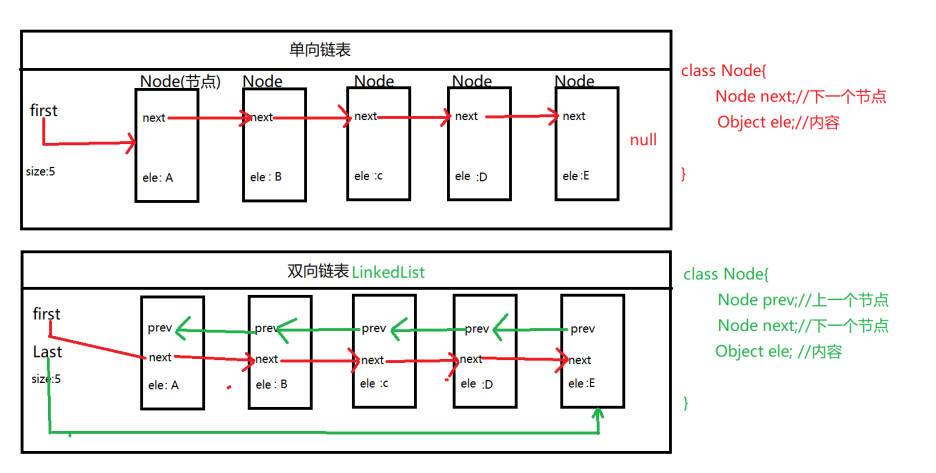

# LinkedList

## 介绍

> LinkedList集合也是List集合接口中主要实现类，这个LinkedList的主要实现结构有【链表】，除了链表结构之外LinkeList还使用栈、 队列、数组，LinkedList是允许存重复数据化并且可以快速插入数据
> **链表：**链表属于一个线性表，线性表中包含了存储链接位置和数据的位置，利用链接位置进行相连接，使数据之间呈现一种链接状态，链表可以理解为：老鹰抓小鸡

[数据结构](LinedList%E7%AC%94%E8%AE%B0.pdf)



> 链表和队列差不多，链表也分为单向和双向链表，类似于现实生活中的【火车】通过链接方式就可以获取得到链表中数据了
> 单向链表和双向链表是有本质上区别的，单向链表包含两个区域【存储链接位置和数据存储位置】，通过【存储链接位置】让每一个单独链接节点进行相连，形成一个单向链表，即单向链表只能向一个方法进行遍历操作，双向链表包含是三个区域【2个存储链接位置和1个数据存储位置】 ，利用双向链表中两个存储链接的位置进行前后节点的链接，此时链表就形成了一个双向通道，即可以从头到尾，也可以从到头，允许直接在头尾两端进行操作。

## LinkedList的执行效率

> 主要实现方式是【双向链表】，所以使用LinkedList效果
> 1.保存数据 ：只要执行一次即可【API中也提供 addFirst 和addLast】
> 2.删除操作： 只要执行一次即可【API中也提供 removeFirst 和removeLast】，就选中间节点(1+N)/2
> 3.查询操作和修改操作：平均值(N+1)/2
> 结论：LinkedList增删执行效率是高的，但是查询和修改执行效率是低的

## LinkedListAPI

Arraylist有的LinkedList都有

LinkedList 独有的API

```java
//1.1 创建一个空的LinkedList集合对象
LinkedList linkedList = new LinkedList();

//1.2使用参数中Collection集合对象中存储数据初始化LinkedList集合对象
LinkedList linkedList1 = newLinkedList(linkedList);

//1.向集合开头的位置添加元素
linkedList.addFirst(1);
//2.向集合结尾的位置添加元素
linkedList.addLast(2);

//3.获取集合第一个元素的数据【但是不删除集合数据】
Object element = linkedList.element();
//4.获取集合中第一个数据和最后一个数据【但是不删除集合数据】
Object first = linkedList.getFirst();
Object last = linkedList.getLast();
//使用下标的形式获取
Object o = linkedList.get(0);
//5.添加元素到集合的末尾
//添加到第一个位置offerFirst和最后一个位置offerLast
linkedList.offer(3);

//6.获取集合集合第一个元素但是【不删除集合数据】，有元素就返
回，没有就是null
Object peek = linkedList.peek();
Object o1 = linkedList.peekFirst();
//获取最后一个元素的值，有元素就返回，没有就是null

//7.poll系列也是也可以获取集合中第一个和最后一个元素的【删除中数据】
// Object poll = linkedList.poll();
// Object o3 = linkedList.pollFirst();
// Object o4 = linkedList.pollLast();

//8. 弹出集合中第一个数据
Object pop = linkedList.pop();
//向集合中添加数据
linkedList.push(4);

//9.删除集合中第一个或最后一个元素值
linkedList.removeFirst();
linkedList.removeLast();

//10.List集合特点就是允许存储重复数据，下面两个方法的作用就
是遍历集合
//First的方法从前之后 Last的方法从后向前
//遇到第一个相同数据删除
linkedList.removeFirstOccurrence(1);
linkedList.removeLastOccurrence(1);
//LinkedList有一个独有的迭代器，允许逆向的遍历迭代器中数据
值
//但是它的操作方式和iterator是一样
Iterator iterator = linkedList.descendingIterator();
//它的方式只有三个 hasNext next 和 remove
while(iterator.hasNext()){
System.out.println(iterator.next());
}
//不同点在于：它的光标最先开始是放置在迭代器最后一个元素的位置，你hasNext是向前判断
```
