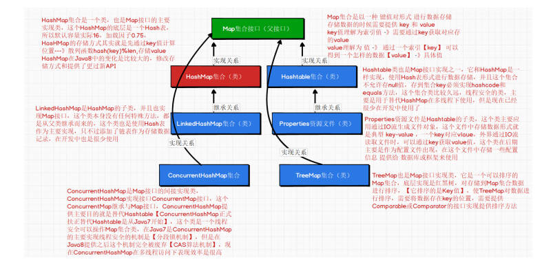

# HashMap


介绍：
> Map集合是两大集合之一和Collection之间是并存关系，Map不是Collection的子类，Map一般会和List和Set这两个集合并称三大集合【List、Set和Map】，因为Map和Collection并没有什么关系，所以Map集合和Iterable接口也没有任何关系，所以Map集合是不提供迭代器操作.
> Map集合在Java提供一种存储数据方式，这种方式称之为“映射【key-value键值对】，通过映射这种关系将将两个数据进行相连形成数据存储形式就是key-value键值对
> PS：key和value值不要过分纠结，只要提供Map存储数据数据类型就可以决定key值存储什么value值存储什么，他们在底层存储形式是以一种键值对相连的【情侣】
> 映射的说明: 在数学中假设A，B两个非空集合，如果存在一个法则F，使用A集合中每一个元素按照法则F在B集合中有一个唯一对应，则成F为A到B集合映射关系
> 在做映射关系时：
> 提供key值要求是唯一的 ，A集合中相当于存储Key而**Key是唯一的**，所以可以想象存储key的集合其实就是Set集合
> 提供vlaue值是可以不唯一的，B集合相当于存储Value而**value是不唯一的**，所以可以想象存储value的集合其实就是List集合提供一个链接法则【链接原则】 让A集合key可以和B集合中value进行一个链接形成一个键值对，Map提供存储方式就是这个方法
> Entry(key-value),Map中存储大量Entry实体存储就是相当与键值对存储了

## Map的主要实现类

HashMap与Map接口之间关系

```java
public class HashMap<K,V> extends AbstractMap<K,V>implements Map<K,V>, Cloneable, Serializable
```

> HashMap的主要实现接就是Map，HashMap也是Map接口的最主要实现类
> HashMap在官方文档中说明：基于哈希表的 Map 接口的实现。此实现提供所有可选的映射操作，并允许使用 null 值和 null 键。（除了非同步和允许使用 null 之外，HashMap 类与 Hashtable 大致相同。）此类不保证映射的顺序，特别是它不保证该顺序恒久不变。
> 说明：HashMap的主要实现使用Hash表，但是在Java7之前使用的是原始Hash表的形式即【数组+链表】形式存储数据，但是从Java8开始HashMap集合提供Hash表实现从【数组+链表】转换为【数组+链表或红黑树】，当前向HashMap中某个“桶节点【即存储位置】”，添加的数据达到8个时，就会将链表结构转换红黑树，8这个数字在链表中的查询效果是可以控制，因为链表的查询方式是线性查询【从前之后】，所以最快效率是1，最慢效率N，平均值(1+N)/2,随着N值不断变大，这个查询效率会逐渐降低，所以在8节点时将链表转换为红黑树，就是为提高查询效率而是用，红黑树是平衡树，而且树的查询效率【2倍效率】
> HashMap集合是线程不安全集合，在多线程前提现可以使用Hashtable【之前做法】，现在开发不在使用Hashtable
> 如何解决线程不安全问题？

```java
Collections.synchronizedMap(new HashMap()); ---> 得到一个线程安全集合
或者
使用线程安全Map集合---》ConcurrentHashMap集合
```

> HashMap是存储key-value键值对形式集合，所以创建HashMap对象时需要提供Key和Value的泛型的数据类型。
> HashMap毕竟底层是Hash表所以在Java中初始容量16,加载因子0.75，扩容方式是原有容量2倍，并且会重新计算所有存储在HashMap中数据存储位置即从新计算key的存储位置
> HashMap在Java8之前和Java8之后API有很大的变化，将Java8之前API看做是基础API，将Java8提供API看做增强操作API即可

## Api（old）

创建HashMap集合
> 1.提供HashMap的对象创建方式
> 1.1创建一个空HashMap集合对象【默认初始容量16，加载因子0.75】 ---> 常用
> HashMap<String,Integer> map = new HashMap<>();
> 1.2创建一个提供初始容量大小的HashMap集合对象【加载因子0.75】
> HashMap<String,Integer> map2 = new HashMap<>(32);
> 1.3创建一个提供初始容量大小和加载因子的HashMap对象---》提供的容量是16的倍数，加载因子不易过小
> HashMap<Character,Double> map3 = new HashMap<>(32,0.5f);
> 1.4将参数Map集合对象中存储数据赋值给当前HashMap集合对象进行存储 ---> 偶尔
> HashMap<String, Integer> map4 = new HashMap<>(map);
>
> 添加 hashmap.put(key,value);
> 修改 hashmap.put(oldKey,value);
> 整个集合赋值 hashMap1.putAll(hashMap);
> 删除整个集合的数据 hashMap1.clear();
> 判断集合是不是空的 hashMap.isEmpty();
> 判断集合key是否存在 hashMap.containsKey("key2");
> 判断集合value是否存在 hashMap.containsValue(10);
> 将key值转换到set集合中： Set< String > keySet = hashMap.keySet();
> 将value存在到collection集合中：
> Collection< Integer > values = hashMap.values();
> Map提供了一种遍历方式entrySet方法 -->返回值是一个Set集合
> Set< Map.Entry< String, Integer>> entrySet = hashMap.entrySet();
>forEach同样可以使用

```java
hashMap.forEach(new BiConsumer<String, Integer>() {
    //这个可以进行操作但是只是打印的结果，不会影响最终map集合中的结果
            @Override
            public void accept(String s, Integer integer) {
                System.out.println("key="+s+"---value="+integer);
            }
        });
```

```java
//1.提供HashMap的对象创建方式
//1.1创建一个空HashMap集合对象【默认初始容量16，加载因子0.75】 ---> 常用
            HashMap<String,Integer> map = new HashMap<>();
//1.2创建一个提供初始容量大小的HashMap集合对象【加载因子0.75】
            HashMap<String,Integer> map2 = new HashMap<>(32);
//1.3创建一个提供初始容量大小和加载因子的HashMap对象---》提供的容量是16的倍数，加载因子不易过小
            HashMap<Character,Double> map3 = new HashMap<>
                    (32,0.5f);
//1.4将参数Map集合对象中存储数据赋值给当前HashMap集合对象进行存储 ---> 偶尔
            HashMap<String, Integer> map4 = new HashMap<>(map);
//提供常用API;
//1.向HashMap集合对象中添加数据 [第一个参数是存储的key值，第二个参数参数存储是value值]
            map.put("1",1);
            System.out.println(map);//HashMap已经重写toString方法所以直接打印集合对象查看结果
//PS：在使用put方法向map集合对象中添加 "1",2 键值对
/*
1.向Map集合添加Key-value键值对时 key值必须是唯一的，又
使用key = "1" 那么系统并没有
提示任何语法错误信息和异常信息，是否会出现运行时异常呢？ -
--》不会出现异常
2.put方法的第二个作用：修改指定key对应value值
当使用put方法提供一个已经在map集合对象中存在key时，将put
操作认为是覆盖原有已经存在map集合中key-value
*/
            map.put("1",2);
            System.out.println(map);
//putAll(Map集合对象) --> 将参数Map集合对象中存储的数据赋值给Map集合
// clear() ---> 将Map集合中存储数据清空，map对象的引用是保留
// isEmpty() --->判断Map集合中是否有存储数据 存储数据返回false 没有存储返回true
//判断Map集合中是否存在指定key值 --> 存储返回true 不存在返回false
            System.out.println(map.containsKey("1"));
//判断Map集合中是否存在指定value值 -->存储返回true 不存在返回false
            System.out.println(map.containsValue(2));
//获取存储在Map集合value值时 ---》key存在会得到对应value，key不存在会得到null值
            Integer integer = map.get("2");
            if(Objects.nonNull(integer)) { //建议添加非null判断
                integer.intValue();
            }
//将存储在Map集合中key-value键值对删除，条件是一个key值
            map.remove("1");
            System.out.println("获取Map集合中存储元素的个 数："+map.size());
// Map集合遍历方式比较麻烦，没有迭代器，不支持普通for循环遍历，不支持增强for
//获取map集合中所有key的值存储在一个Set集合中
                    Set<String> strings = map.keySet(); //通过这种方式获取到所有key
//获取map集合中所有value的值存储在一个Collection集合中
            Collection<Integer> values = map.values(); //通过这种方式获取到所有value值
/*
Map提供了一种遍历方式entrySet方法 -->返回值是一个Set集合
Set集合存在一个泛型类型 Map.Entry ---》Set集合中存储的
数据类型
Map.Entry<String,Integer> --> 相当Map.Entry类型中存
储数据是 String类型key 和 Integer类型value
通过entrySet这个方法，返回一个Set集合这个集合存储这个
Entry的类型，Entry类型的内部存储的是key-value键值对
*/
            HashMap<String,Integer> map5 = new HashMap<>();
            map5.put("key1",1);
            map5.put("key2",2);
            map5.put("key3",3);
            map5.put("key4",4);
            map5.put("key5",5);
            Set<Map.Entry<String, Integer>> entries = map5.entrySet();
            System.out.println(entries);
//提供Set集合之增强for循环遍历
            for(Map.Entry<String, Integer> entry : entries){
//entry就得到了存储在Set集合中key-value键值对 即key1=1
                System.out.println("Key的值 是："+entry.getKey());
                        System.out.println("Value的值是："+entry.getValue());
            }
//在Java8中时提供一个foreach方法可以便捷遍历集合中key和value
            map5.forEach(new BiConsumer<String, Integer>() {
                /**
                 *
                 * @param s map集合中key值
                 * @param integer map集合汇总value
                 * 这个方法被出触发时可以获取map集合中每一对：key-value
                 */
                @Override
                public void accept(String s, Integer integer)
                {
//这个可以进行操作但是只是打印的结果，不会影响最终map集合中的结果
                    System.out.println(s);
                    System.out.println(integer);
                }
            });
            map5.forEach((k,v)-> System.out.println(k+"="+v));
        }
```

## HashMap常用API【Java8之后】

> 向map集合中添加数据->key存在则不添加，不存在则添加
> hashMap.putIfAbsent("key4",10);
>
> 判断key存不存在
> key存在，则将value放入lambde表达式中运算后存入集合。
> key不存在，则将key放入后边的lambda表达式中得到value的值后存入集合。
> hashMap.compute("0",(k,v)->v==null?1:2);
>
> 判断key值存不存在
> 存在直接跳过
> 不存在则新建key-value
> hashMap.computeIfAbsent("6",Key->new Integer("60"));
>
> 判断key的值
> key存在，按照lambda修改value的值
> key不存在，不反应。
> hashMap.computeIfPresent("6",(k,v)->v+1);
>
> 有就返回key对应的value值，没有就返回null
> hashMap.getOrDefault("6", Integer.MAX_VALUE)
>
> merge(合并) ->法含义 对存在在map集合中kv键值对进行更新操作【更新value值】
> 参数1：要修改的键值对的key
> 参数2：提供一个需要的value
> 参数3：lambda表达式：其中的参一是参数1中键值对提供的key所对应的value值，参二就是参数2；后面就是对应的修改法则
> hashMap.merge(1, "12", (oldVal, newVal) -> newVal+1)
>
> 根据对应的key或key与value值进行删除，有boolean的返回值。
> hashMap.remove(1);
>
> Java8中提供一个操作，官方文档意思在于使用这个方法替代put方法修改操作
> 根据key值替换存储对应value值，如果key存在则替换，不存在则替换
>跟put的区别是，如果没找到key值则不会做修改，而put方法则会新添加一个键值对
> hashMap.replace(6,"22");
> 多参版本hashMap.replace(key,oldValue，newValue);
>
> 匿名方法：满足重写方法的条件则都会被修改->批处理
> replaceAll()
>
> forEach遍历同样满足。
>
> HashMap有一个子类LinkedHashMap这个集合 操作方式和HashMap是一样，只不过就是存储结构有所变化多了一个链表存储，Hashtable已经不在使用了，所以这个API执行查看和HashMap操作一样的
