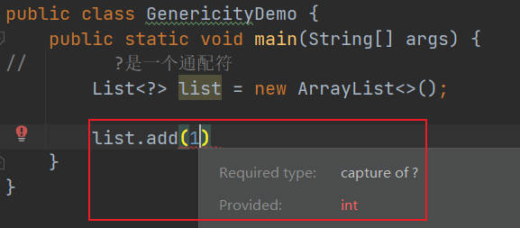

# 泛型

## 泛型的介绍

> 当我们使用list时，因为集合可以储存任何数据的特性，因此我们可能获得任何类型的数据，这就造成了在我们使用这些数据时，我们甚至都不知道它的具体数据类型，需要进行判断和转型，这无疑增加了我们的代码量，因此，有什么方法可以对存储进来的数据类型进行约束的吗？
> 泛型 ArrayList< Integer > list1 = new ArrayList<>();

```java
//        在学习集合之前，是没有使用泛型，所以集合中默认类型就是 Object
//        我们面临的问题就是取出数据时，需要进行向下转型操作才可以
        ArrayList list = new ArrayList();
        list.add(1);
        list.add(2);
        list.add(3);
        list.add(4);
//对集合存储的数据进行计算求和
        int sum = 0;
        for (Object obj : list) {
            sum += ((Integer) obj);
        }
//因为不使用泛型默认类型时Object类型所以和这个集合中就可以存储任何数据类型只要是Object子类
        list.add('9');
        list.add("7");
        list.add(new Student());
        list.add(true);
//如果你在不清楚集合中存储在什么样数据类型数据时，如果进行转换操作？代码就无形中增加开发成本
/*
所以在这种情况下，集合建议使用泛型，来约束集合中存储数据一旦集合使用泛型就要可以约束集合只能 存储泛型中提供的数据类型对应数据，从而减少转换操作
此时list1这个集合中只能存储Integer类型数据，使用泛型作为约
束
*/
        ArrayList<Integer> list1 = new ArrayList<>();
        list1.add(1);
//list1.add("1");
        int sum1 = 0;
        for (Integer i : list1) {
            sum1 += i;
        }

```

## 定义泛型

> 泛型中会出现一个【占位符】的概念，这个占位符本身是没有任何意义，就是一个占位，对泛型进行赋值时，占位符才会有具体的意义
> 语法：
> **集合数据类型<存储数据的数据类型> 集合对象名 = new 集合数据类型<>();**
> 此时就可以使用【存储数据的数据类型】约束集合中存储的数据了
>> <占位符>
>> PS：这种语法在Java中叫做"菱形语法"，这样语法与占位符组合就是成为"泛型"这个语法可以使用在 "类、方法和接口"上
>> 占位符"一般是一个大写字母[A~Z]",不建议使用其他形式进行占位符定义
>> 习惯书写占位符是 "T" --> "Type(类型)" ---> <T> 泛型T
>> 占位符可以在一个语法存在多个需要使用","分隔，使用占位符的多少就相当于你定义多个泛型
>> 泛型语法:只能存在在编译时期，一旦程序运行泛型就会自动消失"称之为泛型擦除"
>> 定义的泛型在编译字节码文件中即[.class文件]看不到

## 泛型的使用-集合

```java
 public class a {} 
    // 集合的数据类型<泛型赋值数据类型> 集合对象名字 = new 集合的数据类型<>();
// 声明的就是带有泛型集合，泛型可以作为集合类型一部分，可以出现在方法参数位置和返回值类型的位置
    ArrayList<Integer> list1 = new ArrayList<>();
    list1.add(1);
//一旦集合使用泛型之后，集合只允许使用泛型定义数据类型，非泛型定义数据类型时无法存储到集合中
//list1.add("1");
        int sum1=0;
//集合使用泛型之后，确定了集合中存储数据的数据类型，在集合中的数据就无需向下转型操作
        for(Integer i:list1){
        sum1+=i;
        }
}
public static void showList(ArrayList<Integer> list){}
public static ArrayList<Integer> showList(){}

```

## 泛型的使用-类

> 在没有使用任何其他修饰符之前【final 或 abstract】,没有使用泛型语法之前 都是一个普通类
> public class CenericityClass {}
>
> 利用泛型语法 <占位符> 可以将当前类变成泛型类
>
> public class 类名<占位符> {
> 这个类就是泛型类
> 此时这个泛型是定义在类上，所以在类中成员变量和成员方法都可以使用这个泛型作为数据类型使用
> }

示例：

```java
public class CenericityClass<T> {
//使用泛型是 T 这个T现在是没有意义 只是一个占位符号
//此时这个T是没意义，为了保证语法不错误，占位使用
//泛型T只有被赋值之后【数据类型（必须是引用数据类型）】 T才会有意义
    private T x;
    public T y;

    public CenericityClass() {
    }

    public CenericityClass(T x, T y) {
        this.x = x;
        this.y = y;
    }

    public void show(T t) {
        System.out.println(t);
    }
```

> 泛型在动态决定数据类型时什么的时候，不存在继承关系"
> "不要这样写，这个语法是错误，对泛型进行赋值什么数据类型时，就决定这个数类型，所不允许赋值为其他类"
> CenericityClass< Object > cc = new
> CenericityClass< Integer >();

## 泛型使用-方法

> 泛型方法的定义主要是为了摆脱使用泛型类上或泛型接口上的泛型约束问题，就相当于方法向使用自己定义泛型作为类型操作，就可以定义为泛型方法
> 泛型类和泛型接口上定义泛型，不能在静态方法上使用，所以只能定义泛型方法对方法进行泛型使用修饰
> **语法:**
**public static < E > void showInfos(E e) {
//E a;// 方法上泛型主要是为了 返回值类型和参数类型而提供的，在内部就不在使用
System.out.println(e);
}**

```java
public class GenericityMethod<T> {
    // 使用泛型是 T 这个T现在 是没有意义 只是一个占位符号
    //提供一个成员方法 泛型类上定义泛型就可以在方法中使用
    public void show(T t) {
        System.out.println(t);
    }

    //泛型类上定义泛型是不能在静态方法上使用
//public static void showInfos(T t){ }
//给方法添加泛型
/*
泛型静态方法：
访问权限修饰符 static<占位符> 返回值类型 方法名(参数列表){
此时这个占位符可以使用在返回值类型上 和 参数列表定义中
}
*/
    public static <E> void showInfos(E e) {
//E a;// 方法上泛型主要是为了 返回值类型和参数类型而提供的，在内部就不在使用
        System.out.println(e);
    }

    /*
    泛型成员方法：
    访问权限修饰符<占位符> 返回值类型 方法名(参数列表){
    此时这个占位符可以使用在返回值类型上 和 参数列表定义中
    }
    此时不仅可以使用泛型方法上定义泛型，也可以使用类上或接口上定义泛
    型
    */
    public <F> void showInfoss(F f, T t) {
//F a;// 方法上泛型主要是为了 返回值类型和参数类型而提供的，在内部就不在使用
        System.out.println(f);
    }
//定义泛型方法泛型，不能单独使用在方法返回值类型位置，需要配合使用参数列表定义

    public static <O> O showInfosss(O o) { //静态方法可以这样操作，成员的不可以
//return o;
        return o;
    }
}

class Test1 {
    public static void main(String[] args) {
//如何给方法定义泛型进行赋值操作---》赋值数据类型
//在调用方法对泛型定义参数列表赋值时，可以决定方法的泛型是什么，定义泛型方法时
//一定要将泛型定义在参数列表中，以确定数据类型是什么
    }
}
```

练习

```java
    public static void main(String[] args) {
        int i=20;
        System.out.println(show(i));
    }
    public static <T> T show(T t){
        System.out.println("show run ...");
        return t;
    }
```

> 当调用这个方法时，以传进来的形参作为泛型的结果

## 泛型的使用-接口

> 接口泛型和泛型类差不多，在接口上定义泛型，这个泛型可以在接口的内部使用。

```java
/*
public interface 接口名<占位符>{}泛型接口
*/
public interface GenericityInterface<T> {
    //在接口上定义泛型可以在接口内部使用
    void run(T t);

    //支持抽象方法自定义泛型
    public abstract <E> void show(E e);
}
//1. 在使用类实现接口时可以对泛型接口的泛型进行赋值，决定泛型类型是什么

class Demo implements GenericityInterface<Integer> {
    //在接口中定义方法使用泛型位置都会变成数据类型
    @Override
    public void run(Integer integer) {
    }

    @Override
    public <E> void show(E e) {
    }
}

//2. 使用泛型类实现泛型接口，使用泛型类中泛型作为接口中新泛型
class Demo2<P> implements GenericityInterface<P> {
    //在创建泛型类对象时可以决定泛型类型
    @Override
    public void run(P p) {
    }

    @Override
    public <E> void show(E e) {
    }

    public static void main(String[] args) {
        GenericityInterface<Double> gi = new Demo2<>();
        gi.run(1.0);
        Demo2<String> demo2 = new Demo2<>();
        demo2.run("1");
//这种操作其实就是List集合中使用List集合创建对象的方式
        List<String> list = new ArrayList<>();
        ArrayList<Long> list2 = new ArrayList<>();
    }
}

//3.直接使用匿名内部类的形似进行泛型接口上泛型的赋值
class Demo3 {
    public static void main(String[] args) {
        new GenericityInterface<Integer>() {
            @Override
            public void run(Integer integer) {
            }

            @Override
            public <E> void show(E e) {
            }
        };
    }

}
```

## 泛型限定约束

> 泛型限定其实就是定义泛型可以赋值哪些数据类型，只有满足限定要求的数据类型才可以进行定义赋值操作
> 泛型通配符【?】
> 【？】代表未知，可以作为通配符使用，但是不能作为参数类型单独使用，通配符多用于在泛型限定上



> < ? extends 类> 这是使用途径
> 此时 ？ 就代表着可以接收extends关键字后的相同类型或子类
> < ? super 类> 这是使用途径
> 此时 ？ 就代表着可以接收super关键字后的相同类型或父类。

```java
    public class GenericityDemo {
        public static void main(String[] args) {
            //提供4个List集合对象
            List<Integer> list1 = new ArrayList<>();
            List<String> list2 = new ArrayList<>();
            List<Number> list3 = new ArrayList<>();
            List<Object> list4 = new ArrayList<>();

            //调用泛型的上限操作，即参数类型使用的是List<? extendsNumber>进行限制
        /*
        泛型限定必须是 Number类型或Number子类
        而list1是Integer类型即Number子类 list3是Number类型即
Number类型所以可以进行传递
        而list2和list4分别是String和Object，既不是Number类型也
不是Number子类，所以无法传递到方法中
         */
            doWork1(list1);
            //doWork1(list2);
            doWork1(list3);
            //doWork1(list4);


            //调用泛型下限操作，即参数类型使用的是List<? superNumber>进行限制
        /*
        泛型限定必须是Number类型或Number父类
        而list1和list2分别是Integer和String，既不是Number类型
也不是Number父类，所以无法传递到方法中
        list3和list4 分别是Number和Object  满足了必须是Number
类型或Number父类，所以传递到方法中
         */
            //doWork2(list1);
            //doWork2(list2);
            doWork2(list3);
            doWork2(list4);

        }

        //泛型的上限，此时的泛型中?(通配符) 必须是Number的类型或Number子类
        public static void doWork1(List<? extends Number>
                                           list) {

        }

        //泛型的下限，此时的泛型中?(通配符) 必须是Number的类型或Number父类
        public static void doWork2(List<? super Number> list) {
        }

    }
```