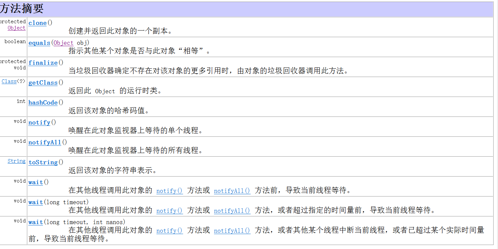
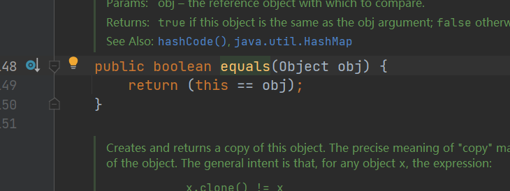

# 常用类

## 内部类

当一个事物的内部需要一个完整的结构，并且这个内部完整的结构只为外部提供支持，那么这个完整的内部结构，刚好使用内部类。

java允许讲一个类A声明在另一个类B中，则类A就是内部类，类B就是外部类。

### 分类

（跟变量很像）

* **成员内部类**（静态和非静态）
  * 一方面作作位外部类的成员：
    1. 调用外部类的属性和方法。
    2. 可以被static修饰。(外部类不可以被static修饰)
    3. 作为外部类的成员可以被四种不同的权限修饰符修饰。
  * 另一方面，作为一个类
    1. 类内可以定义属性，方法，构造器等。
    2. 可以被final、abstract修饰。
    3. 静态内部类不能调非静态内部类的属性和方法。因为静态类加载的早，调用不了还没加载的非静态类。
* **局部内部类**（方法内，代码块内，构造器内）
* **匿名内部类**（只new了一下，没有给对象类型的局部内部类）

```java
class Animal{

    //非静态成员内部类
    abstract class cat{

        string name;

        public void call(){
            System.out.println("喵喵喵...")
        }
        public void show(){
            eat();//调用外部类的方法
            Animal.this.eat();
        }
    }

    //静态成员内部类
    final static class Dog{
        String name ;

        public void call(){
            System.out.println("旺旺");
        }

    }

    //方法内的内部类
    public void method(){

        //局部内部类
        class AA{

        }
    }
}
```

### 实例化

初始化静态内部类

```java
   public class InnerClassTest {
    public static void main(String[] args) {

        //实例化静态内部类
        Animal.Dog dog = new Animal.Dog();
        dog.show();
    }

}
```

```java
static class Dog {
       public void show(){
           System.out.println("show run ...");
       }
   }
```

>show run ...

实例化非静态的内部类

```java
//实例化非静态内部类
Animal animal = new Animal();
Animal.Cat cat = animal.new Cat();
```

### 局部内部类与匿名内部类

开发中局部局部内部类的使用

```java
    //        返回一个实现了Comperable接口的类的对象

    // 方法一：
    public Comparable getComperable(){

//       创建一个实现了Comperable接口的局部内部类
        class MyCcomparbale implements Comparable{
            @Override
            public int compareTo(Object o) {
                return 0;
            }
        }

        //返回这个局部内部类偶创建的对象
        return new MyCcomparbale();
    }

    //方法二：方法二：创建一个匿名内部类作为comperable的实现类，并作为返回值直接返回。
    public Comparable getConperable(){
        return new Comparable(){
            @Override
            public int compareTo(Object o) {
                return 0;
            }
        };
    }
}

```

## object类

object类是所有java类的根父类。若果未在类的声明中使用entends的话，默认父类为java.lang.Object类。

```java
public class TestObject {
    public static void main(String[] args) {
        Order order = new Order();
        System.out.println(order.getClass().getSuperclass(););
    }
}
class Order{

}
```

> class java.lang.Object

### Object类中的功能(属性 方法)



### ==和equals()的区别

* == 运算符

1. 可以使用在基本数据类型变量和引用数据类型变量中
2. 比较
    如果比较的是基本数据类型变量，比较两个变量保存的数据是否相等。(不一定类型要相同)-自动类型提升。
    如果比较的是引用数据类型变量，比较两个对象的地址值是否相等。即两个引用是否指向同一个对象实体。

* equals()

1. 是一个方法，并非运算符（可以被.出来）
2. 只适用于引用数据类型。
3. Object类中equals()的定义：

    ```java
    public boolean equals(Object obj) {
        return (this == obj);
    }
    ```

    说明Objiect类中定义的equals()和==的作用是一样的，都是比较地址值是否相同。
4. 像String、Data、File、包装类等都重写了Object类中的equals()方法。重写以后，比较的将不再是引用地址是否相同，而是比较两个对象的**实体内容是否相同**。

```java
public class TestObject1 {
    public static void main(String[] args) {

        Person per1 = new Person("Tom", 22);
        Person per2 = new Person("Tom", 22);

        String str1 = "Tom";
        String str2 = "Tom";

        System.out.println(per1.equals(per2));//false
        System.out.println(str1.equals(str2));//true
    }
}
```

为什么两个不同的引用数据类型的equals方法后的值不同呢？
>因为Person类中并未重写equals方法，所以使用的是Objiect类下原始的equals方法；而String类在自己的类中已经重写过equals方法了，所以可以使用。
>原始的equals方法：

### 重写equals

[atguigu->重写equals](https://www.bilibili.com/video/BV1Kb411W75N?p=297&spm_id_from=pageDriver&vd_source=175cfd7fc5bec4825a991e2edbf2c90a)

1. 先判断引用地址是否相同
2. 后判断形参是否为空
3. 在判断是否为相同的引用数据类型。(是在去比较，不是就没必要了)
4. 如果是相同的引用数据类型就向下转型回本身的引用数据类型
5. 然后逐个比较其中的属性
   基本数据类型用"=="，引用数据类型用"equals"

```java
    // 重写equals方法--->快捷键：alt+Insert
    public boolean equals(Object o) {
//        1. 先判断引用地址是否相同
        if (this == o) {
            return true;
        }
//        2.后判断形参是否为空
//        3. 在判断是否为相同的引用数据类型。(是在去比较，不是就没必要了)
        if (o != null || this.getClass()!=o.getClass()){
            return false;
        }
//        4. 如果是相同的引用数据类型就向下转型回本身的引用数据类型
        Person person = (Person) o;
//        5. 然后逐个比较其中的属性
//           基本数据类型用"=="，引用数据类型用"equals"
        if(this.age==person.age&&this.name.equals(person.name)){
            return true;
        }
//        或
//        return this.age==person.age&&this.name.equals(person.name);
        return false;
    }
```

### toString方法

1. 当我们在输出一个对象的引用时，实际上就是调用当前对象的toString方法。
2. Object类中toString（）的定义：

   ```java
        public String toString() {
        return getClass().getName() + "@" + Integer.toHexString(hashCode());
    }
   ```

3. 像String、Data、File、包装类等都重写了Object类中的toString()方法。使得在调用toString()方法时，返回实体内容。
4. 自定义类也可以返回toString()方法，调用此方法，返回对象的实体内容。

## lambda

概念：与匿名内部类相似，属于一次性的表达式。对应接口中的抽像方法，所以将lambda表达式理解为**接口中抽象方法的实现**
语法说明：

```java
引用数据类型 变量名  = ()->{} 或 (参数)->{}

// ()对应接口中的()，{}则是方法体。
```

### 具体实现

```java
package com.qf.day03;

/**
 * @author zxq
 * @version V1.0
 * @Date 2023/2/6 13:59
 * @Description: ${描述}
 */
public class InterfaceATest {
    public static void main(String[] args) {

//            使用Lambda表达式实现一个接口[抽象方法是无参的]
        InterfaceA a = () -> {
            System.out.println("void InterfanceA.showA run..");
        };

//       使用Lambda表达式--【抽象方法是有参的】
//        ()内具有定义参数提供自动类型推断.自动定义参数的数据类型---》此时的i自动为int i；
        InterfaceB b = (i) -> {
            System.out.println("void InterfaceB.showB run ...");
        };
//        使用lanbda表达式--【带返回值的抽象方法】
//
        InterfaceC c = (ic)->{
            System.out.println("int Interface.showC run ...");
            return ic;
        };

        Object obja = a ;
        System.out.println(obja);
        System.out.println(b);
        System.out.println(c);
    }
}

```

1. 当Lambda表达式是一个参数的时候，可以省略数据类型和小括号。
2. 如果实现的方法体只有一句代码可以省略大括号。
   > InterfaceB b2 = j -> System.out.println("这是一个lambda表达式");
3. 如果实现的方法只有一条执行语句，此时的return关键字必须省略不写【必须有返回值才行】
    >InterfaceD d = (c,d) -> c+d;
    >如果需要lambda表达式实现多条代码语句，就需要书写return语句。

### lambda表达式的应用

提供一个接口InterfaceE，在接口中定义一个抽象方法 showE，并且有一个参数，带有返回，
提供一个执行类在执行类中定义一个静态方法，方法参数类型时InterfaceE，并在静态方法调用接口中
showE并执行效果

```java
package com.qf.day03;

/**
 * @author zxq
 * @version V1.0
 * @Date 2023/2/6 15:00
 * @Description: ${描述}
 */
public interface InterfaceE {
    boolean idOk(boolean b);
}

class InterfaceETest{
    public static void main(String[] args) {

//        普通匿名方法创建实现方法。
        boolean result1 = result(new InterfaceE() {
            @Override
            public boolean idOk(boolean b) {
                return b;
            }
        }, true);
//        使用lambda表达式实现resule方法。
        boolean result2 = result((b) -> b , false);


        System.out.println(result1 + "<-result1的返回值");
        System.out.println(result2 + "<-result2的返回值");
    }

    public static boolean result(InterfaceE e , boolean res){
        return e.idOk(res);
    }
}
```

### lambda表达式的弊端

lambda表达式实现的接口中，只能有一个抽象方法。否则就会报错。也就是说，lamdba表达式无法实现接口中带有多个抽象方法，这就是lambda表达式的弊端。
