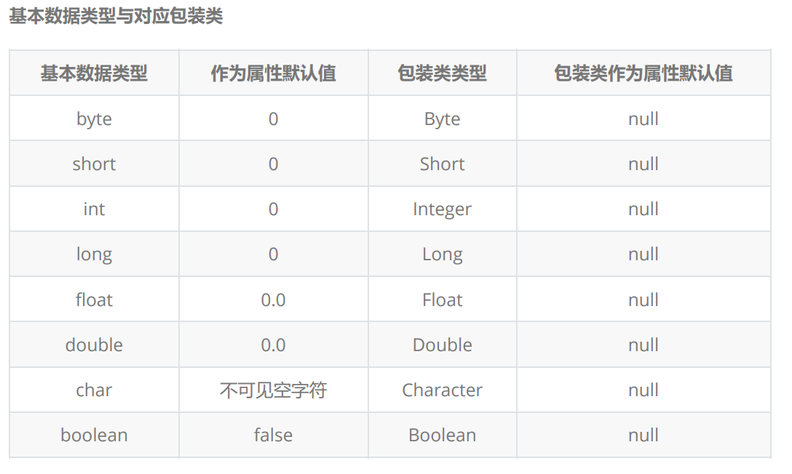

# 包装类

## 什么是包装类

* 包装类就是【基本数据类型对应的引用数据类型版本】，基本数据类型在网络数据传输时，效率是极低的，就是因为基本数据类型没有执行序列化接口，所以提供对应的引用数据类型进行替换操作，提高基本数据类型在网络中的传输效率
* 另一方面，集合中存储数据只能是引用类型，所以基本数据类型根本无法储存到集合中，所以就需要使用包装类即基本数据类型对应的引用数据类型版本。

> 包装类是类，即引用类型【但是需要注意是一个“特殊”的引用类型】

基本数据类型与对应包装类


> ps 除int与char外，包装类都是首字母大写，int->Integer char->Character

## 装箱与拆箱

* 装箱

以Integer为例讲解包装类 装箱与拆箱操作

什么是装箱？

装箱就是将基本数据类型转换为对应的引用数据类型的过程，这个过程我们称作【装箱操作】---->装箱分为【自动装箱】和【手动装箱】

手动装箱
> Integer integer = new Integer(int i);

手动装箱
> Integer integer = int i;

* 拆箱

拆箱就是将引用数据类型赋值给对应的基本数据类型，分为手动拆箱和自动拆箱

手动拆箱
> int i = integer1.intValue();

自动拆箱
> int i = integer2;

```java
//        手动装箱
        int i = 6;
        Integer integer1 = new Integer(i);

//        自动装箱
        Integer integer2 = i;

//        这两种方式创建的Integer对象的储存空间是不一样的，所以不要用“==”比较，用equals（）
        System.out.println(integer1 == integer2);
        System.out.println(integer1.equals(integer2));


//        手动拆箱
        int x = integer1.intValue();
        System.out.println("拆箱后的integer1" + x);
//        自动拆箱
        int y = integer2;
        System.out.println("拆箱后的integer2" + y);

//        现在的开发使用包装类在计算时会自动拆箱
//        求integer1和integer2的和
        System.out.println(integer1 + integer2);
```

## Integer 源码说明

思考：

```java
    @Test
    public void Test01(){
        Integer i1 = new Integer(123);
        Integer i2 = new Integer(123);
        System.out.println(i1 == i2); //false
        System.out.println(i1.equals(i2)); //true
        Integer i3 = 123;
        Integer i4 = 123;
        System.out.println(i3 == i4); //true 为什么这个true
        System.out.println(i3.equals(i4)); //true
        System.out.println("---------------------------------");
        Integer i1_1 = new Integer(300);
        Integer i2_1 = new Integer(300);
        System.out.println(i1_1 == i2_1); //false
        System.out.println(i1_1.equals(i2_1)); //true
        Integer i3_1 = 300;
        Integer i4_1 = 300;
        System.out.println(i3_1 == i4_1); //false 为什么这个false???
        System.out.println(i3_1.equals(i4_1)); //true

    }
```

>尽量使用vquals方法，少用“==”
>咱们通过手动装箱操作发现所有创建出来Integer对象通过 == 进行比较结果都是false【**引用类型如果使用new关键字来进行创建对象，对象必然存储的是堆中地址，每次使用new都会在堆中开辟空间，所以 == 比较new出来对象结果都是false**】，所以引用类型应该是使用equals进行相等比较，比较引用类型中存储的数据，当使用自动装箱进行数据存储时，发现如果存储数据123使用 == 进行比较得到结果是true值，如果存储数据300使用 == 进行比较得到结果false，这是为什么？

Integer 实例化

> 通过反编译获得的执行源码为

```java
public static void main(String args[]){
int age = 19;
Integer integer = new Integer(age);
int age2 = 19;
//在.java文件中执行自动装箱操作，通过反编译原码之后的结果是
//自动装箱其实就是用过Integer类调用valueOf方法
Integer integer1 = Integer.valueOf(age2);
System.out.println(integer == integer1);
System.out.println(integer.equals(integer1));
int i = integer.intValue();
System.out.println((new StringBuilder()).append("拆箱之后的int类型
数：").append(i).toString());
/*
在.java文件中执行自动拆箱，通过反编译原码之后得到结果是
自动拆箱其实就是通过 包装类的对象.XXXValue() 即 其实就是在执行手动拆箱
称这样编程效果叫做 ---》 Java语法糖
编写代码时就是Integer对象赋值给int类型变量，但是实际执行中调用XXXValue方法
*/
int i2 = integer1.intValue();
System.out.println((new StringBuilder()).append("拆箱之后的int类型
数：").append(i2).toString());
/*
代码中使用integer对象进行相加计算得到结算结果，但是实际在原码执行是将integer对象进行
手动拆箱然后再计算的
*/
System.out.println((new StringBuilder()).append("求存储在包装类对象integer和
integer1中年龄和:").append(integer.intValue() + integer1.intValue()).toString());
}
```

>则valueOf的源码为：

```java
//IntegerCache是Integer类中一个私有静态内部类
private static class IntegerCache {
static final int low = -128; //外界ValueOf方法中low这个变量的值是-128
static final int high; // high没有进行初始赋值
static final Integer cache[];
static { //触发了静态代码块
// high value may be configured by property
int h = 127; // 定义了一个局部变量 h = 127
String integerCacheHighPropValue =
sun.misc.VM.getSavedProperty("java.lang.Integer.IntegerCache.high");
if (integerCacheHighPropValue != null) {
try {
int i = parseInt(integerCacheHighPropValue);
i = Math.max(i, 127);
// Maximum array size is Integer.MAX_VALUE
h = Math.min(i, Integer.MAX_VALUE - (-low) -1);
} catch( NumberFormatException nfe) {
// If the property cannot be parsed into an int, ignore it.
}
}
high = h; //外界valueOf方法中hight这个变量值是127
cache = new Integer[(high - low) + 1];
int j = low;
for(int k = 0; k < cache.length; k++)
cache[k] = new Integer(j++);
// range [-128, 127] must be interned (JLS7 5.1.7)
//assert 断言 测试操作时使用 结果是true或false
assert IntegerCache.high >= 127;
}
private IntegerCache() {}
}
```

> Integer类内部实现的原则 ---》【享元原则】它是Java中设计的一种优化，外部使用自动装箱进行Integer创建时，设计了一个范围 【-128~127】只要是这个范围内创建出来Integer对象，他们都会得到堆中相同地址，相当于Integer中出现一个缓存数据 Integer cache[] = {-128，.... ,127} ,只要存储这个范围内的值就直接返回存储好地址，这样一来就说明了存储123时通过 == 比较得到结果是true ，存储300时 == 比较得到结果是false，因为300超出了Integer缓存范围，机会触发valueOf方法 new Integer，得到就是堆地址
> ==能比较引用类型但是情况太特殊，所以还是需要使用equals进行引用类型比较
> Byte、short、Long 都是存在缓存设计，Float和Double是没有的，所有无论手动还是自动装箱都是new出现，Boolean类型在进行new创建时的原则，只要不是true值，一律都是false，Character是【0~127】之间存在一个缓冲区域。

包装类作为方法参数类型

>包装类是一个特殊的引用类型，将包装类作为方法参数之后，在方法内部提供数据修改之后无法得到修改之后的结果，原因在于其内部存储

```java
//原码中Integer存储数据时做的操作
/**
value就是Integer类型存储数据时的成员“变量（常量）”
*/
private final int value;
/**
调用构造方法创建Integer对象提供存储数据都是存储在value这个成员“变量”
*/
public Integer(int value) {
this.value = value;
}
```

> 综上所属：包装类其实是一个特殊的引用类型，当在方法体进行操作时，相当于是“重新”创建了一个地址，所以的修改都不是在原有地址上执行，而是在这个新的地址执行，这样一来就造成了无法修改的问题，除此之外在原码中可以发现，存储数据是使用【 private final int value】，value是final修饰，所以每次对Integer赋值操作时，都是得到一个新的地址。

修改方案

> 第一种方式：对方法添加返回值类型，利用return关键字将修改之后地址，返回出来，并让外界原来对象，存储这个新的地址，间接的修改了。
> 第二种方式：使用自定义类，将Integer作为类的属性类型存在，修改Integer时，传递自定义类作为参数类型，在方法内部通过get和set进行修改，这样也可以改变。
> 第三种方式：存储到数据结构中 ---》数组或集合。

包装类与包装类之间的联系
>基本数据类型除了boolean类型之外，都可以参与到数据类型转换过程中。但是包装类彼此之间是互相独立，非要找一些关联化，数值类型【Byte、short、Integer、Long、Float和Double】他们有一个共同父类是Number，除此之外包装类是存在在java.lang包中。
