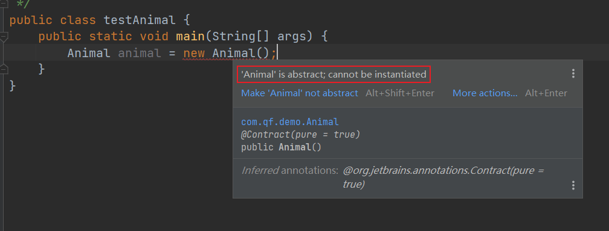
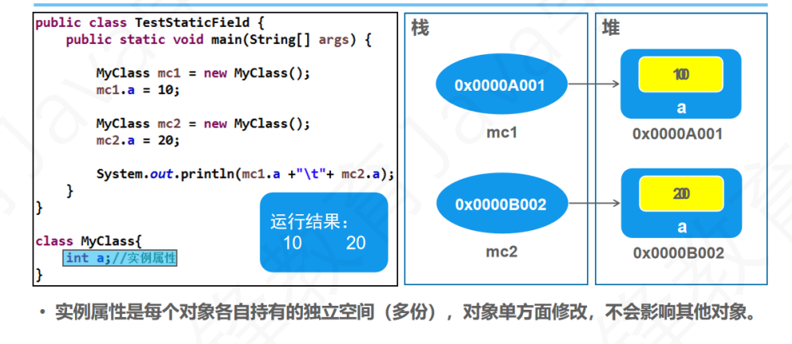
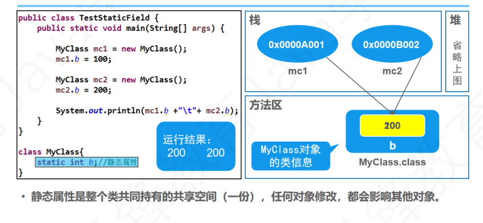
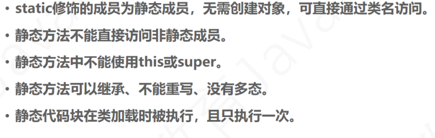
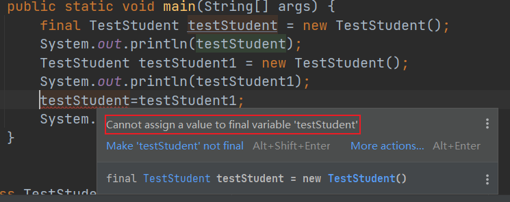
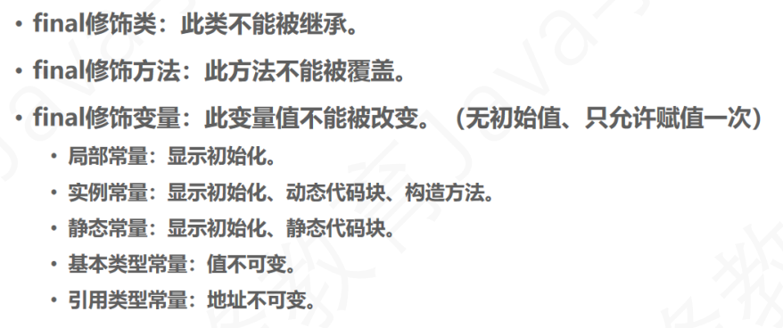

# abstract 
abstrsct 抽象的 纯理论的

## 抽象的理解
* 什么是抽象呢？

    似是而非的，像却又不是，具备某些特征但又不那么清晰。

* 猫猫 狗狗都是动物，但世界上真的存在动物这个具体的事物吗？

    并没有特指的事物被称为动物，它只是一个概念，一个统称。

* 而程序是用来模拟现实世界，解决现实问题的，换言之，这个世界充满了形形色色各式各样的“动物”的子类，而“动物”却未真实存在。因此：
**Animal这个类，不应该被独立创建为对象。**

## 抽象类
应用于抽象的事物。
> abstract修饰类，此类不可以创建对象（new 对象）。
```java
abstract class Animal {}
```


被abstract修饰的类，称作：**抽象类**

抽象类：即为不完整的类、不具体的了类。因此，抽象类是无法独立存在的，所以抽象类是不能实例化的，也就是不能new对象。

## 抽象类的作用
1. 可被子类继承，提供共性属性和方法。
2. 可声名为引用，更自然的使用多态。
```java
Animal dog = new Dog();
```
抽象父类，可作为子类的组成部分，依附于子类对象存在，由父类共性+子类独有组成完整的子类对象。
## 抽象方法
同理，父类很难满足每一个子类的需求，定义了的话，又会被每一个子类重写；不定义的话，又表示所有子类都失去了这个功能。
```java
    /**
     * 抽象方法 吃
     */
     public abstract void eat();
```
被abstract修饰的方法，被称为抽象方法，即，只有方法声明，没有方法实现（{内容}）的方法。**抽象方法一定在抽象类中，抽象类中不一定有抽象方法。**

注意：
    继承抽象父类的子类必须重写抽象父类中的所有抽象方法，否则，子类还是抽象类（不可实例化）。
## 总结

# static
static 静态的
## 实例属性

## 静态属性

## 静态
* 静态(static) 可以修饰属性和方法。
* 称为： 静态属性 和 静态方法
* 静态成员是全类所有成员共享的成员
* 在全类中只有一份，不因创建多个对象而产生多份
* 不必创建对象，直接使用类名.访问。
```java
/**
 * @author zxq
 * @version V1.0
 * @Date 2023/2/2 19:49
 * @Description: ${描述}
 * 计算创建类的次数
 */
public class CreateNum {
    public static void main(String[] args) {
        Taige taige = new Taige();
        Taige taige1 = new Taige();
        Taige taige2 = new Taige();
        Taige taige3 = new Taige();
        System.out.println(Taige.count);
    }
}

class Taige{
    /**
     * 记录构造器被使用数
     */
    static int count;

    public Taige(){
        count++;
    }
}
```
## 静态方法
```java
public class Demo {
    public static void main(String[] args) {
        TestDemo.method2();//在其他类中，通过“类名.静态方法名”调用

        TestDemo testDemo = new TestDemo();
        testDemo.method1();
    }
}

class TestDemo{
    public  void method1(){
        System.out.println("method1 run...");
        method2();//在本类中，通过“静态方法名”访问
    }

    public static void method2(){//static 修饰静态方法
        System.out.println("static method2 run...");
    }
}
```
## 静态的特点
* 静态方法允许直接访问静态成员
* 静态方法不能直接访问非静态成员
* 静态方法中不允许使用this或是super关键字
* 静态方法可以被继承，不能被重写、没有多态。
### 动态代码块
```java
class TestDemo{
    /**
     * 静态变量（类变量）
     */
    static String start ;

    /**
     * 非静态变量
     * 正常变量
     */
    int i;

    /**
     * 静态代码块
     * 类执行时执行，且仅执行一次。
     * 执行在静态变量后，构造方法前。
     * 仅可初始化静态修饰的变量
     */
    static {
        start="testdemo run...";
        System.out.println(start);
    }

    /**
     * 代码块
     * 每个对象被创建时都会被执行一次（跟构造方法一样），可以用来初始化实例变量
     * 若有静态代码块，先执行静态后在构造方法执行时，构造方法的主体之前的被执行，
     */
    {
        i=1;
        System.out.println("i="+i);
    }

    /**
    *构造方法
    */
    public TestDemo(){}
}
```
## 执行过程
```java
public class Fanthers {
    static {
        System.out.println("父类中的静态代码块");
    }

    {
        System.out.println("父类中的非静态代码块");
    }

    public Fanthers(){
        System.out.println("父类中的构造器");
    }

    public static void main(String[] args) {
        System.out.println("父类的main方法");
        new Sons();
    }
}

class Sons extends Fanthers{
    static {
        System.out.println("子类中的静态代码块");
    }

    {
        System.out.println("子类中的非静态代码块");
    }

    public Sons(){
        System.out.println("子类中的静态方法");
    }

    public static void main(String[] args) {
        System.out.println("子类的main方法");
        new Sons();
    }
}
```
```java
父类中的静态代码块
子类中的静态代码块
子类的mian方法
父类中的非静态代码块
父类中的构造器
子类中的非静态代码块
子类中的静态方法
```
## 总结


# final
final 最终的、不可修改的
## 概念
被此修饰符修饰的类、方法、变量，都为最终的。
* 修饰类时->最终类
    此类不可被继承
* 修饰方法时->最终方法
    此方法不可被重写
* 修饰变量时->最终变量
    此变量不可被修改，只可被赋值一次。
## final修饰变量时
### 实例常量
> final int i = 0;
>   final修饰的变量将不在提供默认值，必须手动赋予初始值。
>   创建变量时、非静态代码块内、构造方法内都可赋值（必须赋值），且当在构造方法内赋值时，要保证所有的构造方法赋值一致。
```java
class TestStudent{
    final int i ;//常量
    {
        i = 0;//非静态代码块赋值
    }
    
    public TestStudent(){
//        i = 0;构造方法赋值
    }
}
```
### 静态常量
> static final int x = 0;
> 同理，静态常量也不会提供默认值
> 创建常量时与静态代码块中都可以赋值。
```java
class TestStudent1{
    static final int x;//静态常量

    static {
        x = 0;//静态代码块中为常量赋值
    }
}
```
无法为最终变量赋值

### 对象常量
> final Student student = new Student();
> 实例常量是值不变，对象常量是对应的地址不变。

## 总结
