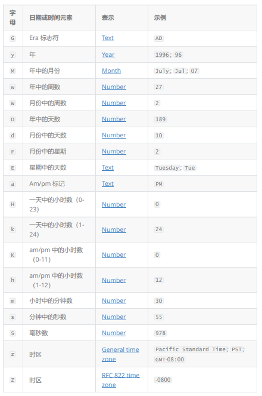

# 常用类

## 数据常用类

Math中提供的方法

> Math 类包含用于执行基本数学运算的方法，如初等指数、对数、平方根和三角函数。
> Math 类就是对数学逻辑的操作，提供日常开发中对数学操作一些常用方法

```java
 public static void showMath() {
    //Math在1.6API中就提供一些常用方法
        System.out.println("获取精确PI值：" + Math.PI);
    //多个重载abs方法【绝对值】
        System.out.println("求-1的绝对值：" + Math.abs(-1));
    //多个重载max方法【求最大值】 多个重载min方法【求最小值】
        System.out.println("求2和3谁最大:" + Math.max(2, 3));
        System.out.println("求2和3谁最小:" + Math.min(2, 3));
    //求某个数的次方值【幂】
        System.out.println("求2的31次方法-1的值：" + (Math.pow(2, 31) - 1));
    //求平方根
        System.out.println("求4的平方根是：" + Math.sqrt(4));
    //随机数--》随机数值是double类型，所以你要存储int类型时需要强转
    //原始数据区间是[0,1)左闭右开区间
        int random = (int) (Math.random() * 100);
        System.out.println("随机值：" + random);
    //支持四舍五入
        System.out.println("求小数对应的整数：" + Math.ceil(14.5));
```

1.8API中提供的新方法

>ArithmeticException: integer overflow 超出范围异常

```java
    //1.8API中提供新的方法
        int max = Integer.MAX_VALUE;//获取int类型最大值存储到max中
        int i = 1;
        System.out.println(max + i);//最大值进行+1之后的到溢出结果不会报错，这样可能影响计算结果
    //正确计算整数之间求和 ---》 一旦超过了最大值范围就会抛出异常提示 -->ArithmeticException: integer overflow
    //System.out.println(Math.addExact(max,i));
        System.out.println(max);
    //安全的递减操作 ---》让数值-1 ，如果超过最小值范围 抛出异常提示
        System.out.println(Math.decrementExact(max));
    //安全的递增操作 ---》 让数值+1，如果超过最大值范围 抛出异常提示
    // System.out.println(Math.incrementExact(max));
    //提供除法操作【都是安全】
        System.out.println(Math.floorDiv(6, 3));
    //提供取余操作【都是安全】
        System.out.println(Math.floorMod(6, 3));
    //提供一个安全乘法计算.如果超过范围 抛出异常提示
        System.out.println(Math.multiplyExact(10, 10));
    //提供一个安全相减操作.如果超过范围 抛出异常提示
        System.out.println(Math.subtractExact(10, 4));
```

BigDecimal精确计算结果

> Java中已经提供浮点（小数）数据类型 --》 float和double但是他们在日常计算中还是可以使用
> 但对于数据的精度有要求操作时float和double就不可以的【金融、电信、电力完全禁用float和double】
> Java提供了一个超精度的小数BigDecimal，可以适用于【金融、电信、电力】，日常也可以使用
> **官方建议：** 将数据通过包装类装换成String类型进行操作（Double.toString(double d)）。
> 这样可以精准的表达数据的值
> 利用BigDecimal进行计算时，用bigDecimal1.add(bigDecimal2)这样的方式进行计算
> add --> 求和 subtract --> 减法 multiply --> 乘法 divide -->除法

```java
    public static void showBigDecimal() {
    //为什么double 和float被称之为不精准计算
    /*
    计算出这个结果其实是一个“超精确的结果” 数学中提供一个悖论 1/3 = 0.33333333333
    数学中一个理论 0.333333*3 = 0.9999999 不等于1
    0.99999无限接近于1的所以 约等于
    */
        System.out.println("0.09+0.01=" + (0.09 + 0.01));//0.1
        System.out.println("1.0-0.33=" + (1.0 - 0.33));//0.67
        System.out.println("4.015*1000=" + (4.015 * 1000));//4015
        System.out.println("12.3/100=" + (12.3 / 100));//0.123
    //建议使用 BigDecimal进行 计算操作
    // BigDecimal bigDecimal1 = new BigDecimal(0.09);
    // BigDecimal bigDecimal2 = new BigDecimal(0.01);
    /*BigDecimal创建出来的是对象，所以不能使用算数运算符进行计算，不可能对象+对象BigDecimal提供一套计算方法使用BigDecimal计算之后数据得到0.1799999999999999933386618522490607574582099914550781250
    这个值比double计算更加离谱，这个不是离谱，这个叫做“超级精度”
    BigDecimal在计算时或精确计算小数点后128位置
    通过观察JavaAPI文件发现 ---》BigDecimal中调用参数double类型构造方法时，有一个明确的说明:此构造方法的结果有一定的不可预知性,如果向BigDecimal中存储0.1这个double类型的数据传入到构造方法的值不会正好等于 0.1（虽然表面上等于该值），原因在与Java中是无法精确表示0.1这个值,所以存储到BigDecimal中得到结果等于
    0.1000000000000000055511151231257827021181583404541015625
    所以计算时就会得到一个BigDecimal的精确计算，所以不能调用参数为double类型
    BigDecimal构造方法来创建BigDecimal对象

    建议在创建BigDecimal对象时，如果需要将数据存储到BigDecimal中建议使用，参数为String类型构造方法,因为"0.1"字符串它是一个常量，并且可以精准表示这个数据,写入 new BigDecimal("0.1") 将创建一个 BigDecimal，它正好 等于预期的 0.1

    开发中，官方的一个建议，优先使用包装类中Double.toString(double类型数据)，将数据转换为String类型
    然后调用BigDecimal中String类型参数构造方法创建对象
    */
        double d = 0.09;
        String string = Double.toString(d);
        BigDecimal bigDecimal1 = new BigDecimal(string);
        BigDecimal bigDecimal2 = new BigDecimal("0.01");
/*
add --> 求和 subtract --> 减法 multiply --> 乘法 divide -->除法
*/
        System.out.println(bigDecimal1.add(bigDecimal2));
    }
```

BigInteger 超大整数，存数据的。

> 主要应用场景在于当我们遇到long类型都无法存储整数数据时，可以使用这个类型来进行存储计算
> 三个一位对数据进行格式化

```java
//showBigInteger();
//对数据的格式化 ---》将数据按照特定形式进行切分【分隔】
        showNumberFormatAndDecimalFormat();
    }

    private static void showNumberFormatAndDecimalFormat() {
//1.NumberFormat
        NumberFormat f = NumberFormat.getInstance();
//精确范围是16位
        String format = f.format(12345678901234567890.0);
        System.out.println(format);
//2.DecimalFormat --> 构造方法允许自动格式数据方式
        DecimalFormat df = new DecimalFormat();
        String format1 = df.format(12345678901234567890.0);
        System.out.println(format1);
    
```

>12,345,678,901,234,567,890.0

## 系统和随机数常用类

### System

> System.in 获取字节输入流对象 System.out 获取打印字节流对象
> System.exit(1);
> System.gc();//只能是加快，但是不是立即
> System.arraycopy(src, 2, des, 5, 4);

### Runtime

> Runtime.getRuntime()  获取正在运行虚拟机对象
> runtime.availableProcessors()    JVM的核心数量
> (runtime.totalMemory() / 1024 / 1024)  JVM的总内存大小：
> (runtime.freeMemory() / 1024 / 1024)  "JVM的空闲内存大小："
> (runtime.maxMemory() / 1024 / 1024)  JVM的最大内存大小：
> runtime.gc(); //只能是加快，但是不是立即
> runtime.exit(1);

```java
package com.qf.day05;

import java.util.Arrays;

public class RuntimeAndSystemDemo {
    public static void main(String[] args) {
//showRuntime();
        showSystem();
    }

    /*
    System是Java系统提供一个类，这类中提供一些常用对系统操作
    System.in 获取字节输入流对象 System.out 获取打印字节流对象
    */
    private static void showSystem() {
        //System.err.println("你好"); //错误信息打印语句，提示错误信息--》写日志
        //err和out不能一起使用，打印顺序不可控
        // System.out.println(1);
        // System.out.println(2);
        // System.out.println(3);
        // System.err.println("我是错误打印信息");
        // System.out.println(4);
        // System.out.println(5);
        System.out.println("系统当前时间毫秒值：" + System.currentTimeMillis());
        System.out.println("系统当前时间纳秒值：" + System.nanoTime());
    //如果是负数就是异常终止 如果正数就是正常终止
    //System.exit(1);
        System.gc();//只能是加快，但是不是立即
        //数组复制
        int[] src = {1, 2, 3, 4, 5, 6, 7, 8, 9};
        int[] des = new int[20];
        /*
        第一个参数 是原数组即被要复制的数据
        第二个参数 从原数组中那个位置开始复制【下标】
        第三个参数 是目标数组即复制内容到那个数组中
        第四个参数 是目标数组的位置【下标】，从目标数组中什么位置开始写入数据
        第五个参数 被复制的长度
        */
        System.arraycopy(src, 2, des, 5, 4);
        System.out.println(Arrays.toString(des));
    }

    /*
    每个 Java 应用程序都有一个 Runtime 类实例，
    使应用程序能够与其运行的环境相连接。可以通过 getRuntime 方法获取当前运行时。
    Runtime这个实例就相当于是虚拟机
    */
    private static void showRuntime() {
    //1.获取正在运行虚拟机对象
        Runtime runtime = Runtime.getRuntime();
        System.out.println("JVM的核心数量：" + runtime.availableProcessors());
        System.out.println("JVM的总内存大小：" + (runtime.totalMemory() / 1024 / 1024));
        System.out.println("JVM的空闲内存大小：" + (runtime.freeMemory() / 1024 / 1024));
        System.out.println("JVM的最大内存大小：" + (runtime.maxMemory() / 1024 / 1024));
    //2.通过runtime这个对象加快GC的回收
        runtime.gc(); //只能是加快，但是不是立即
    //3.终止虚拟机 如果是负数就是异常终止 如果正数就是正常终止
    //这个效果只有虚拟机中有，外界无法查看
        runtime.exit(1);
        System.out.println("如果没有关闭我必然执行");
    }
}
```

### 随机数类Random

要实例化Random方法

```java
    /*
    Random是Java中提供随机数类，可以得到随机数
    但是这个随机数类是一个“伪随机数” --》Random如果使用相同“种子”创建对象，随机出来数据
    就是相同
    Random中一共两个构造方法 --》 无参 和 有参
    开发时多数使用无参--》使用系统随机种子
    有参可以运行出伪随机效果 ---》 参数是一个种子值，但是不是随机范围
    */
    //标准使用方式
        Random random = new Random();
    //他们可以随机正数 --> 参数是范围
        int i = random.nextInt(100);
        System.out.println(i);
        System.out.println("-------------------------------------------------");
    //伪随机效果
        Random r1 = new Random(10);
        System.out.println(r1.nextBoolean());
        System.out.println(r1.nextDouble());
        System.out.println(r1.nextInt());
        System.out.println(r1.nextInt(100));
        Random r2 = new Random(10);
        System.out.println(r2.nextBoolean());
        System.out.println(r2.nextDouble());
        System.out.println(r2.nextInt());
        System.out.println(r2.nextInt(100));
```

## 时间类【Date（日期类）和Calendar（日历）】

>PS：Java8中提供新时间类但是在实际开发中使用量较少
>Java8中专门提供一个包 java.time这个时间包在这个包下提供以下结果关键类：
>instant： 代表的是时间戳，可以理解为是一个瞬时时间【类似于Date】
>LocalDate：不包含具体的时间日期【不含时间】,存储日期使用【生日、周年纪念、入职日期等等】
>LocalTime：它代表的是不含日期的时间
>LocalDateTime：包含日期以及时间，不含偏移信息和时区说明
>ZonedDateTime：包含完整时区信息日期时间，提供偏移信息和时间基准

### Date

表示时间和日期精确到毫秒值
> 平时使用java.util包下的Date类，不会用java.sql下的Date类
> public Date():从运行程序的此时此刻到时间原点经历的毫秒值，转换为Date对象，即获取当前系统时间值转换为日期时间对象.
> public Date(long date):将指定的参数的时间毫秒值转换为Date时间对象

Date（）
Date.setTime()
Date.getTime()
Date.after()
Date.before()

```java
public class DateDemo {
    public static void main(String[] args) {
    //以当前系统时间毫秒值作为基准创建时间对象
        Date date = new Date();
        System.out.println(date);
    //指定一个时间毫秒值获得对应时间对象
        Date date1 = new Date(2000);
    //Thu Jan 01 08:00:02 IRKT 1970 ---> 1970-01-01 08:00:02
    //为什么是08?起始时间应该是00，因为中处于时区的东8区 东8区起始时间是从08:00开始
        System.out.println(date1);
//1.getTime() 获取当前时间的毫秒值
        System.out.println(date.getTime());
    //2.setTime(毫秒值) 设置时间毫秒值，得到对应时间日期
        date.setTime(1000);
        System.out.println(date);
    //after(date对象) 测试此日期是否在指定日期之后 得到结果【true和false】
        date1.setTime(3000);
        System.out.println(date.after(date1));
    //before(date对象) 测试此日期是否在指定日期之前 得到结果【true和false】
        System.out.println(date.before(date1));
    }
}
```

格式化 format 解析 parse

> SimpleDateFormat() extends DateFormat
> 对Date和String进行和格式化和解析
    >格式化：将Date对象转换为String对象。
    >解析： 将String对象转化为Date对象。


>提供对应字符中常用主要有【y（年）、M（月）、d（日）、H（小时）、m（分钟）、
s（秒）】
> public String format(Date date): 根据提供日期格式将Date对象格式化成String对象
> public Date parse(String source): 根据提供日期格式将String对象解析为Date对象
> public void applyPattern(String pattern): 可以通过参数String类型字符串设置日期格式

```java
package com.qf.day05;

import java.text.ParseException;
import java.text.SimpleDateFormat;
import java.util.Date;

public class SimpleDateFormatDemo {
    public static void main(String[] args) throws ParseException {
        SimpleDateFormat sdf = new SimpleDateFormat("yyyy年MM月dd日 HH时mm分ss 秒");
//进行格式化操作
        String format = sdf.format(new Date());
        System.out.println(format);
//如果是将已经格式化的String对象转换为Date对象，那么使用什么方式格式化就使用什么方式解析
//解析时候需要与格式化日期的格式完全一致才可以进行解析，要不然就会出现解析异常
        Date parse1 = sdf.parse(format);
        System.out.println(parse1);
        String time = "2048-12-19 23:59:50"; //提供是一个格式化的日期时间
        SimpleDateFormat sdf2 = new SimpleDateFormat("yyyy-MM-dd HH:mm:ss");
//Unhandled exception: java.text.ParseException --》提示有未处理的异常
//需要对这样异常进行处理操作 ---》 try...catch 或 throws
        Date parse = sdf2.parse(time);
        System.out.println(parse);
    }
}
```

## Calender类->日历

Calender类是有Java提供用来代替Date类使用的一个日历类【PS：但是设计者脑残了，这个类存在一个缺陷】，这类所存在的包时java.util中，它是一个抽象类，不能创建对象，所以需要使用到它的子类GregorianCalendar类来完成，这个子类无需直接创建对象，只需要使用Calender类中getInstance()静态方法获取到子类对象即可

```java
import java.util.Calendar;
import java.util.Date;
public class CalendarDemo {
public static void main(String[] args) {
//1.提供Calendar对象创建
Calendar c = Calendar.getInstance();
//不能像打印Date一样打印Calendar对象，因为Calendar对象中存储的是日历信息
System.out.println(c);
/*
java.util.GregorianCalendar[time=1637913526755,areFieldsSet=true,
areAllFieldsSet=true,lenient=true,
zone=sun.util.calendar.ZoneInfo[id="Asia/Irkutsk",
offset=28800000,dstSavings=0,useDaylight=false,
transitions=67,lastRule=null],firstDayOfWeek=1,
minimalDaysInFirstWeek=1,ERA=1,YEAR=2021,MONTH=10,
WEEK_OF_YEAR=48,WEEK_OF_MONTH=4,DAY_OF_MONTH=26,
DAY_OF_YEAR=330,DAY_OF_WEEK=6,DAY_OF_WEEK_IN_MONTH=4,
\AM_PM=1,HOUR=3,HOUR_OF_DAY=15,MINUTE=58,SECOND=46,
MILLISECOND=755,ZONE_OFFSET=28800000,DST_OFFSET=0]
*/
//这个日历类中操作时一定要注意月份问题，月份的基础范围【0~11】代表【1~12月】
/*
Calendar中打印存储的是日历信息，所以利用Calendar中提供一个方法
public int get(int Field) --》参数是Calendar类中字段---》通过参数传入的字段获取
当前日历类中数据
提供一些常用字段：
Calendar.YEAR : 年
Calendar.MONTH ：月
Calendar.DAY_OF_MONTH：月中的日期 --》还有一个字段可以获取 Calendar.DATE 月中的
日期
Calendar.HOUR：小时
Calendar.MINUTE：分钟
Calendar.SECOND：秒
Calendar.DAY_OF_WEEK：星期
*/
System.out.println(c.get(Calendar.YEAR)+"年"
+(c.get(Calendar.MONTH)+1)+"月"
+c.get(Calendar.DATE)+"日"
+" "+c.get(Calendar.HOUR)+"时"
+c.get(Calendar.MINUTE)+"分"
+c.get(Calendar.SECOND)+"秒"
);
//将Calendar对象转换为Date对象
Date time = c.getTime();
//可以通过Calendar中提供set方法进行指定的时间设置
Calendar c1 = Calendar.getInstance();
//可以通过这样方式进行时间设置，参数第一个是对应时间字段，第二个是对应的时间数据
// c1.set(Calendar.YEAR,2021);
//建议使用下面这个方法完成 ,上面执行操作太繁琐
//设置月份的时候一定要-1操作【范围是0~11】
c1.set(2021,10,26);
System.out.println("这是这一年的第："+c1.get(Calendar.DAY_OF_YEAR)+"天");
System.out.println("这是这一年的第："+c1.get(Calendar.WEEK_OF_YEAR)+"周");
System.out.println("这是这个月的第："+c1.get(Calendar.DAY_OF_MONTH)+"天");
}
}
```

>日历类中存在的一些小问题：
> 1.中国人的第一个天是星期一， 外国人第一天是星期日
> 2.日历类中的月份是从【0~11】结束
