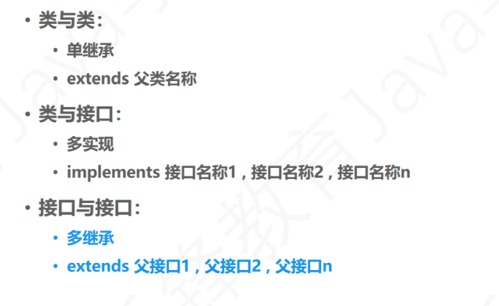
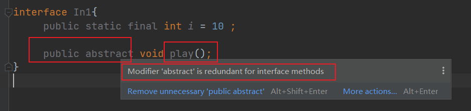
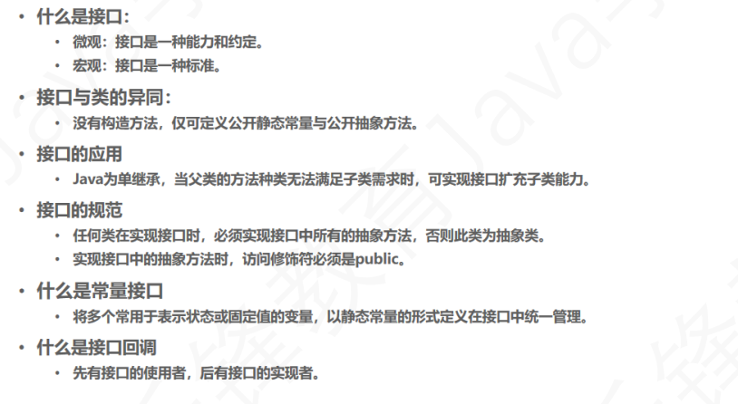

# 接口
>interface 接口 接口程序 界面
>implements
v.使生效;贯彻;执行;实施
n.工具;器具;(常指)简单的户外用具

概念：Java接口是一系列方法的声明，是一些方法特征的集合。**一个接口只有方法特征而没有方法的实现，因此这些方法可以再不同地方被不同的类实现，而这些实现可以具有不同的行为（功能）**

解释：接口可以理解为一种特殊的类，里面全部是由**全局常量**和**公共的抽象方法**所组成。接口是解决**Java无法使用多继承**的一种手段，但是接口在实际中更多的作用是**制定标准**的。或者我们可以直接把接口理解为**100%的抽象类**，既接口中的方法**必须全部**是抽象方法。（JDK1.8之前可以这样理解）
## 理解
* 指明了一个类必需要做什么和不能做什么，相当于类的蓝图。
* 一个接口就是描述了一种能力，比如“运动员”作为接口，并且任何实现“运动员”接口的类都要有能力实现<奔跑>这个能力。
>所以接口的作用就是告诉类，如果你要实现“我”，那你必须满足我的所代表的功能。只有你实现了我的全部功能，“我”才能承认你具备我的能力。
* 如果一个类实现了一个接口的全部方法，但是没有提供方法体只是具有方法标识，那么这个类一定是抽象类。
* **抽象方法只能存在于抽象类或者接口中，但抽象类中却能存在非抽象方法，即有方法体的方法。接口是百分之百的抽象类**
* java库的例子 Comparator接口
    代表具有“比较”这种能力，如果某一个类实现了这个功能，那么这个类就也具有了比较这种能力。
## 为什么要使用接口？
1. 接口被用来描述一种抽象。
2. 因为java不支持多继承，所以java可以通过实现接口来弥补这个局限。
3. 降低了代码的耦合度

## 接口与抽象类的区别
接口被用来实现抽象，而抽象类也被用来实现抽象，为什么一定要用接口呢？

原因是，抽象类中可能包含非final的变量，但是在接口中存在的变量一定是final，public，static的。


## 具体的实现
### 创建一个接口
我们用 **interface** 来创建一个接口。

规范：
1. 接口里只有常量和静态方法
2. 接口中的所有方法都必须只声明方法标识，不声明具体的方法体。因为具体的方法体是由实现这个接口的类去实现的。
3. 接口中的常量修饰符默认为 **public static final** ;方法的默认修饰符为：**pulic abstract** .一个类要实现这个接口，必须实现这个接口定义的所有抽象方法。
```java
interface In1 {
    // 静态变量 public static final
    int i = 10;
    // 静态方法 public abstract
    void play();
}
```
修饰符“ public static final”对于接口字段是多余的

对于接口方法，修饰符“ public abstract”是多余的

### 实现一个接口
我们使用**implements**关键词去实现接口
```java
public class TestIn1 implements In1{

    public static void main(String[] args) {
        TestIn1 testIn1 = new TestIn1();
        testIn1.play();
        System.out.println(i);
    }

    @Override
    public void play() {
        System.out.println("TestIn1 playing ...");
    }
}
```
> TestIn1 playing ...
> 10

## 接口引用
* 同父类一样，接口也可声明为引用，并指向实现类对象。

* 注意：
  * 仅可调用接口中所声明的方法，不可调用实现类中独有的方法
  * 可强转回实现类本身类型，进行独有的方法调用。
```java
public static void main(String[] args) {
    In1 testIn1 = new TestIn1();
    testIn1.play();
    System.out.println(i);
}
```
## 接口回调
接口的实现类创建的对象赋给该接口类型的变量，该变量调用被类实现的接口中的方法，这个调用可以理解为是接口回调。
> 接口Ln2的实例对象a调用cook（）这个方法就是接口回调。
```java
public class TestLn2 {
    public static void main(String[] args) {
        Ln2 a = new ReachA();
        a.cook();
    }
}

interface Ln2{
    /**
     * 抽象方法 烹饪
     */
    void cook();
}

class ReachA implements Ln2{
    @Override
    public void cook() {
        System.out.println("...做米饭");
    }
}
```
> ...做米饭
## 接口回调与多态的区别
**多态：** 顾名思义，多个状态。举个例子：接口中有一个**做饭的方法**，它的实现类在重写该方法时，重写内容可能是**做米饭**，也可能是**做面条**，做米饭和做面条就是两个不同的状态，所以接口回调做饭这个方法时，可能表现出做米饭的状态，也可能表现出做面条的状态，也就是说接口回调一个方法，可以表现出不同的状态，不同的状态就是多态。

**即对统一行为做出不同的响应。**

**接口回调和多态的关系：**
从上面的解释中，可以看出接口回调是多态的一种状态表现，即接口回调是多态的一种形式，他们并不等价。
## 总结
