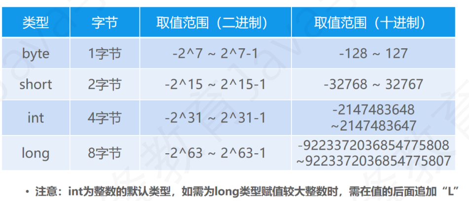
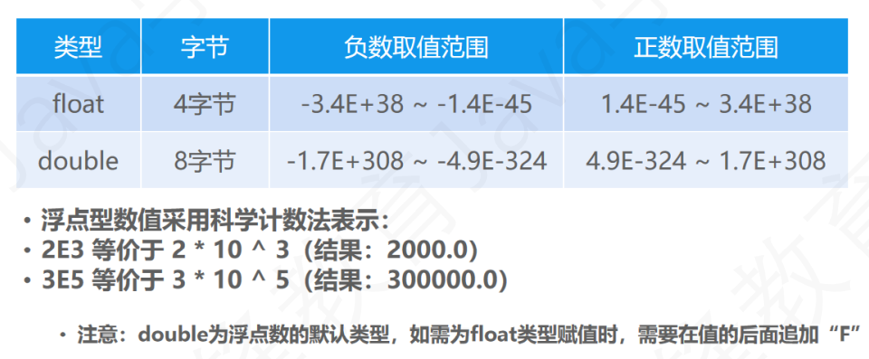

# 语言基础
## 变量
概念：计算机内的一块储存空间，是储存数据的基本单元。
> 数据类型 变量名 = 值;
## 变量的定义
* 声明 
>数据类型 变量名;
>int i;
* 赋值
>变量名 = 值;
>i = 0;
* 注意：java是强类型语言，**变量的类型**必须与**数据的类型**一致。
## 变量定义的3种方式
1. 先定义再赋值
```java
int i;
i = 0;
```
2. 定义的同时并赋值
```java
int i = 0;
```
3. 同类型、多变量同时定义、赋值。
```java
int i,j,x,y= 1,2,3,4;
```
## 数据类型
* java的变量有严格的数据类型区分。
* 任何一个值都会有对应的数据类型。
### 8种基本数据类型
>整数 byte short int long
>浮点 flort double
>布尔 boolean
>字符 char
### 引用数据类型
* 字符串 String
* 数组
* 对象
## 基本数据类型
### 1.整数型

### 2.浮点型

### 3.布尔型
| 类型    | 字节  | 范围       | 描述  |
| ------- | ----- | ---------- | ----- |
| boolean | 1字节 | trun/false | 真/假 |
* boolean不参与算数运算。
### 4.字符型
| 类型 | 字节  | 范围    | 描述          |
| ---- | ----- | ------- | ------------- |
| char | 2字节 | 0~65535 | unicode字符集 |
* unicode中每一个字符都对应着一二进制整数，可以使用多种方式赋值。
  ```java
  char c1 = 'A';
  char c2 = 65 ;
  char c3 = '\u0041';//16进制数对应的字符赋值
  ```
## 转义字符
| 转义字符 | 描述   |
| -------- | ------ |
| \n       | 换行符 |
| \t       | 制表符 |
| \\       | 反斜线 |
| \'       | 单引号 |
| \''      | 双引号 |
