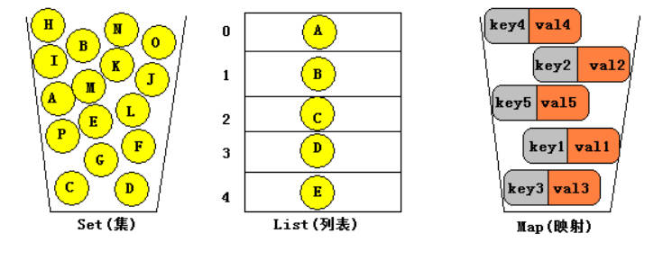
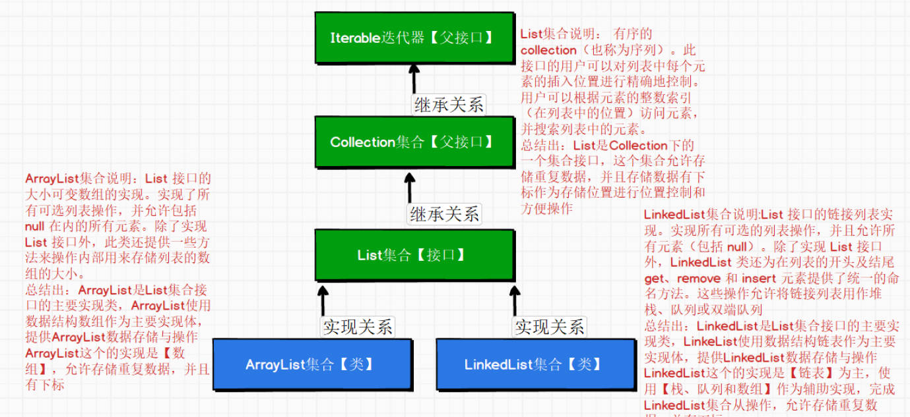
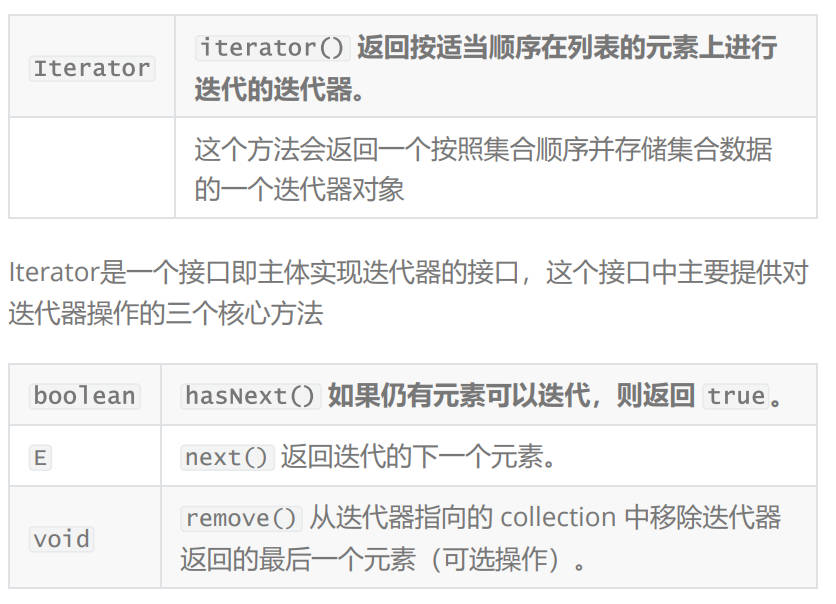
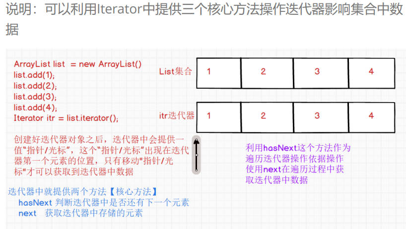
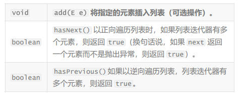
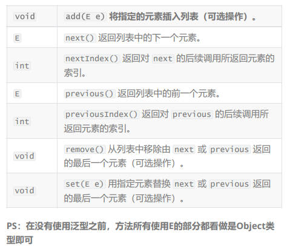

# Arraylist 集合

## 集合介绍

> 让我们使用自带增删改查方法的数组，这就是集合。
> **什么是集合框架？**
> Java中的集合框架其实就是对【**数据结构**】的封装，这个封装中提供了一些常用方法，可方便操作数据，无需程序猿自定定义操作，只需要调用封装方法就可以完成对存在集合中数据【增删改查】
> 集合其实就是对数据结构一种封装，所以之前sun公司就把集合放置到一个统一包中进行管理【java.util】包
> **什么数据结构？**
> 数据结构其实就是计算机，组织和存储数据形式
> 数据结构是指相互之间存在一种或多种特定关系的数据集合
> 通常情况下，精心选择数据结构可以带来更加高效运行和存储效率，数据结构往往高效的原因在于【检索算法】和【索引计数】.
> 常见数据结构：【数组、栈、链表(单向和双向)、哈希表、队列(单向和双向)、堆、树、图】.
> Java的集合框架其实就是对【数据结构实现】，我们需要掌握就是如何操作这个数据结构（即操作集合中方法），高效存储与处理数据
> PS：根据不同数据结构，操作数据性能是不同（有地查询块、有的插入快、有地允许重复、有的不允许重复等等），在开发中只要选择合理数据结构即集合对数据存储与操作即可.

## java中常见的集合框架

三大集合框架： list set map

> 实际上应该是两个框架，三个实现
> 框架：Collection和Map
> Collection实现了list和set集合框架，因此被称作三大集合框架

**集合与数组的区别：**

1. 集合中只存储引用数据类型
2. 集合中的容量是动态的，根据储存元素的个数进行删减【扩容和减容】
3. 数组是一个定长容器，容量是固定的。

> 常见的三大集合框架
> list【链表】：集合中储存对象是按照索引位置储存，允许储存重复的数据。
> Set【集】：集合中不是按照特定的方式进行储存，不允许出现重复的数据。
> Map【映射】：集合中每一个存储元素都是以一种【键值对key-value】方式进行存储的，以一种key和value的形式存储的，key这个对象是不允许重复【唯一性】，value是允许重复。


## List集合



## ArrayList集合

> ArrayList底层是将数组进行二次封装为实现，所以ArrayList允许使用重复数据和可以使用下标。
> 相对的，因为使用数组实现，到时在添加数据时检索以及数组满了以后的扩容问题导致ArrayList进行增加删除操作较慢；又因为可以使用数组下标，因此，在查询和修改操作效率较高
ArrayList的操作效率
> 因为ArrayList使用是数组实现所以可以得到如下以下特点：
> 1.保存操作：
> 把一个数据保存到ArrayList中，最快的操作只要操作一次即可，最慢的操作可能操作N次
> 平均执行效率(N+1)/2次 ---》扩容问题
> 2.删除操作:
> 删除ArrayList中某个数据，最快的只要操作一次即可， 最慢的操作可能操作N次
> 平均执行效率(N+1)/2次 ---》减容问题
> 3.修改操作: 操作一次即可
> 4.查询操作：根据索引一次即可。如果遍历查询使用【检索算法】做优化效率高度，如果遍历从到为【顺序查找】效率是低
> 因为ArrayList使用是数组的形式进行存储数据操作，所以基于这样数据结构做查询和修改效率是高，但是做增加和删除效率是低【动态扩容和减容】

## ArrayList的API

> 实例化ArrayList三种方式
> ArrayList list = new ArrayList();
  ArrayList list1 = new ArrayList(list);
  ArrayList list2 = new ArrayList(100);
  >
> .add() 添加
> .addAll(arrayList);//添加数据
> .clear() 清空数据引用还在
> .isEmpty()判断集合是否为空（null也算空）
> .contains(10)查看指定元素是否存在
> .containsAll(list2)查看指定集合是否存在
> list.get(0)集合中存储元素下标获取集合中元素
> .list.indexOf(5)通过下标获取集合中的元素（注意下标越界）
> .lastIndexOf(4)返回的都是下标，返回的数据一样。
> 5种删除
>  
> 1. list.remove(new Integer(10));根据数据删除
> 2. list.remove(6);根据索引删除
> 3. list.removeAll(arrayList)根据类一个集合删除
> 4. .retainAll(list2)删除除形参外的数据
> 5. list.removeIf(接口)实现接口删除(在借口中自己制定删除条件)
> .replaceAll(接口)实现接口替换(在接口中制定替换规则)
> list.set(0, 1) 不需要填写替换规则的替换
> list.size()集合长度
> list.toArray()集合转数组
> Arrays.asList(objects)数组转集合

```java
package com.qf.day06;

import java.util.ArrayList;
import java.util.Arrays;
import java.util.List;
import java.util.function.Predicate;
import java.util.function.UnaryOperator;

public class ArrayListAPIDemo {
    public static void main(String[] args) {
//提供ArrayList集合对象进行数据的存储操作
/*1.ArrayList集合提供一个无参构造方法可以创建一个空的集合
对象
-->空指定的是集合没有存储任何数据，但是集合引用是在的
在Java7，使用new ArrayList无参构造方法创建对象，一个元
素都不存储
依旧会在堆中开辟一个大小为10的数据空间，并且数组的默认存储
数据类型时Object
在Java8中，Java开发人员发现，如果在使用ArrayList集合之
前，如果使用无参构造方法
创建ArrayList集合对象会出现一个10大小的堆中数组空间，这样
会造成一定量的空间浪费
所以在Java8中提供一个全新优化，使用 new ArrayList无参
构造方法创建ArrayList对象时
并不会创建一个大小为10数组在堆中进行存储，而是创建创建一个
空的数组进行空间的开辟
private static final Object[]
DEFAULTCAPACITY_EMPTY_ELEMENTDATA = {};
当通过集合对象调用集合集合中提供add方法时，此时才会真正的初
始化数组空间
*/
        ArrayList list = new ArrayList();
//2.ArrayList集合使用其他的Collection集合对象中存储数据作为新的集合中存储数据进行初始化
//即将参数中Collection集合对象数据存储到新建ArrayList集合中
        ArrayList list2 = new ArrayList(list);
//3.自定义ArrayList集合的底层数组初始化容量 --》【使用较少】
        ArrayList list3 = new ArrayList(100);
//常用API
//1.向集合对象中添加元素【存储数据】 ---》 集合只能存储引用类型即对象
/*
集合中只能存储引用类型 --> 明显调用add时存储的是
1,2,3,4,5 int类型数据
可以存储的，因为向集合中存储基本数据类型时，完成自动转换操
作 --》将基本数据类型 转换为对应 包装类
*/
        list.add(1);
        list.add(2);
        list.add(3);
        list.add(4);
        list.add(5);
        list.add("6");
//集合在没有使用泛型之前是可以存储任何引用类型对象,因为方法参数类型时Object
//ArrayList集合重写toString，所以可以直接打印集合对象查看集合内容
        System.out.println(list);
//2.向集合中指定位置添加元素数据【第一个参数是下标位置，第二个参数是存储的元素】
        list.add(2, 100);
        System.out.println(list);
//3.向集合中添加参数集合中数据到合集中进行存储
//PS：参数是一个Collection集合，所以只要是List或Set集合实现类都是传递到这个参数中
        ArrayList list1_1 = new ArrayList();
        list1_1.add(1);
        list1_1.add(2);
        list.addAll(list1_1);
        System.out.println(list);
//addAll有一个重载在指定位置中添加添加参数集合数据addAll(下标, Collection集合对象);
/*
特别注意： add 和 addAll的区别
add这个方法是向集合中添加引用类型对象，即向集合集合添加地址
addAll这个方法是向集合中添加参数中集合数据
*/
        ArrayList arrayList1 = new ArrayList();
        ArrayList arrayList2 = new ArrayList();
        arrayList1.add(1);
        arrayList1.add(2);
        System.out.println(arrayList1);
        arrayList2.add(3);
        arrayList2.add(4);
        arrayList1.add(arrayList2);//相当于将arrayList2中引用存储到arrayList1这个集合中，存储是对象即地址
        System.out.println(arrayList1);
        arrayList1.addAll(arrayList2);//相当于将arrayList2中存储数据存储到arrayList1这个集合中，存储的是数据内容
        System.out.println(arrayList1);
//4.清空集合中存储的数据，但是集合引用不会消失，消失的是集合数据
        System.out.println("没有清空之前arrayList1中的数据是：" + arrayList1);
        arrayList1.clear();
        System.out.println("清空之后arrayList1中的数据是：" + arrayList1);
//5.判断集合否为空，即判断集合是都没有存储任何数据 [true空/false不空]
        System.out.println(arrayList1.isEmpty());
//6.判断集合中是否存在指定元素【判断集合中是否存储在这个对象】 --> true存在 false不存在
        System.out.println(list.contains(1));
//7.判断集合中是否存在参数集合中数据 ---》这方法不是ArrayList独有的而是List接口提供
        System.out.println(list.containsAll(list1_1));
//8.通过集合中存储元素下标获取集合中元素 ---》【下标不要越界范围（0~集合存储元素个数-1）】
        System.out.println(list.get(0));
//9.查询集合中是否存在指定元素并返回下标【只会返回第一次遇到元素的下标】
// 找到了就是下标 找不到就是负数
        System.out.println(list.indexOf(1));
//list.lastIndexOf(查找的数据) --》查询集合中是否存在指定元素并返回下标【从后向前寻找】
//10.集合是提供真正删除操作 ---> 进行减容操作
//10.1 根据数据删除集合中存在数据
        list.remove(new Integer(1));
        System.out.println(list);
//10.2 根据下标删除集合中数据
        list.remove(6);
        System.out.println(list);
//10.3 List集合接口提供方法 removeAll
        ArrayList list1_2 = new ArrayList();
        list1_2.add(2);
        list1_2.add(100);
        list1_2.add(3);
//根据参数集合提供数据在当前集合进行删除操作
        list.removeAll(list1_2);
        System.out.println(list);
//10.4 List集合接口提供方法 retainAll
        ArrayList list1_3 = new ArrayList();
        list1_3.add(5);
//根据参数集合提供数据保留当前集合中存储的数据，剩余的数据进行删除
        list.retainAll(list1_3);
        System.out.println(list);
//10.5 在java8中ArrayList提供一个新的处理集合删除方法removeIf
//这个方法参数支持 Lambda表达式 和 匿名内部类方式处理
        ArrayList list1_4 = new ArrayList();
        list1_4.add(1);
        list1_4.add(2);
        list1_4.add(3);
        list1_4.add(5);
        list1_4.add(6);
//匿名内部类
        list1_4.removeIf(new Predicate() {
            //需要在这个方法方法执行删除规则 结果true就会进行删除操作
//参数Object 中o会获取到集合每一个元素的值
            @Override
            public boolean test(Object o) {
                return ((Integer) o) % 2 == 0;
            }
        });
//lambda表达式
        list1_4.removeIf(o -> ((Integer) o) % 2 == 0);
        System.out.println(list1_4);
//11.Java8中提供一个全新的方法【支持lambda表达式和匿名内部类】
//根据指定规则进行元素的替换操作
        list1_4.replaceAll(new UnaryOperator() {
            //指定当前替换规则的方法，方法参数Object中o会获取到所有集合中数据
//需要在方法内部提供替换规则，返回的是替换之后需要存在集合中数据
            @Override
            public Object apply(Object o) {
                return o.equals(3) ? 30 : o;
            }
        });
        list1_4.replaceAll(o -> o.equals(3) ? 30 : o);
        System.out.println(list1_4);
//12. 修改【替换】集合中指定位置的数据 ---》第一个参数是下标，第二个参数修改数据
        list1_4.set(0, 10000);
        System.out.println(list1_4);
//13.获取集合中存储元素个数【集合长度】
        System.out.println(list1_4.size());
//14.将集合转换为数组
        Object[] objects = list1_4.toArray();
//PS：数组中也提供一个方法【Arrays】，将数组转换为List集合
        List objects1 = Arrays.asList(objects);
//15.【不太推荐】 截取指定范围内容集合数据得到一个新的集合
        ArrayList arrayList1_5 = new ArrayList();
        arrayList1_5.add(1);
        arrayList1_5.add(2);
        arrayList1_5.add(3);
        arrayList1_5.add(4);
        arrayList1_5.add(5);
        arrayList1_5.add(6);
        arrayList1_5.add(7);
        arrayList1_5.add(8);
//包括前不包括后 包括开始位置，不包括结束位置，参数都是下标
        List list1 = arrayList1_5.subList(2, 6);
        System.out.println(list1);
    }
}

```

## 遍历集合

1. for() 循环
2. iteraor 增强for循环
3. forEach 循环

> "增强for循环之所以不可以删除,原因就是在于增强for循环即foreach底层实现就是一个迭代器，迭代器中是不允许使用集合中删除方法进行数据删除的，如果删除ConcurrentModificationException就出现这个异常"
> foreach是Java8中提供一个新增的方法，主要是以一个方法形态可以遍历打印集合中数据，因为这个方式Java8中提供，所以这个方法支持lambda表达式和匿名内部类实现
> PS: 这个方法主要就是用于打印，其他方式较少。

```java
//        遍历集合
        ArrayList arrayList = new ArrayList();
        for (int i = 0; i < 10; i++) {
            arrayList.add(i);
        }

//        for循环遍历
        for (int i = 0; i < arrayList.size(); i++) {
            Object o = arrayList.get(i);
            System.out.print(o);
            Integer o1 = (Integer) o;
            System.out.print(o1.toString());
        }
        System.out.println();
//        iter遍历（迭代器遍历）
        for (Object o : arrayList) {
            System.out.print(o);
        }
        System.out.println();
//        foreach遍历
        arrayList.forEach(new Consumer() {
            @Override
            public void accept(Object o) {
                System.out.print(o);
            }
        });

        System.out.println();
        arrayList.forEach((o)->{
            System.out.print(o);
        });
    }
```

## 迭代器

> Java中专门针对Collection集合提供了一种遍历方式，这种遍历方式是根据Iterable接口来决定，只要是Collection的集合接口在子接口基本上都会具备Iterable这个接口，这个接口中主要提供一个方法




> PS： 迭代器中在没有使用泛型之前，next方法的返回值类型都是统一Object，所以将方法中返回E看做是Object即可，迭代器提供自身remove方法，所以在迭代器中删除数据时要调用迭代器提供remove，而不是集合。

### 增强迭代器

> 强化迭代器只有List集合具备，专门为List集合提供一个增强迭代器，因为原始迭代器中只有三个方法，不利于对集合数据的操作，增强迭代器就新增多个方法进行迭代器操作
> ListIterator是List集合在Iterator迭代器接口之上提供一个更多方法操作的迭代器，ListIterator在原始迭代器基础上增加，新增数据，修改数据，从后向前遍历【获取数据】的操作，还可以获取下标




```java
public static void main(String[] args) {
//基础迭代器
ArrayList arrayList = new ArrayList();
arrayList.add(1);
arrayList.add(2);
arrayList.add(3);
arrayList.add(4);
arrayList.add(5);
//需要使用ArrayList集合对象调用listiterator方法获取迭代
器对象
ListIterator iterator = arrayList.listIterator();
//如果你想调用逆向遍历操作时，需要现将光标向后移动才可以，光
标最先开始是在第一个元素位置上
while(iterator.hasNext()){
System.out.println(iterator.next());
}
//此时对迭代器进行逆向遍历【从后向前】
while(iterator.hasPrevious()){
System.out.println(iterator.previous());
}
}
}
"listIterator同样是遵守一个原则，不要再迭代器中使用后集合删除方法删
除数据，要使用迭代器提供方法进行删除
```