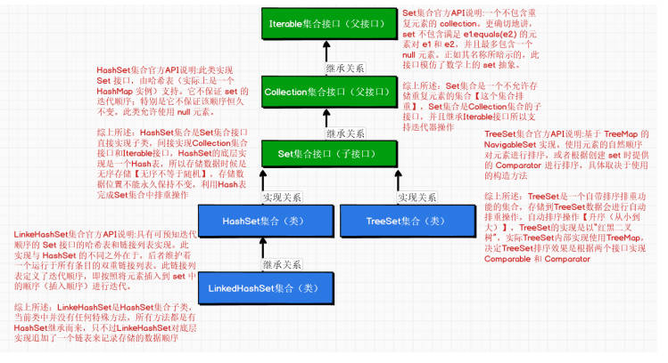
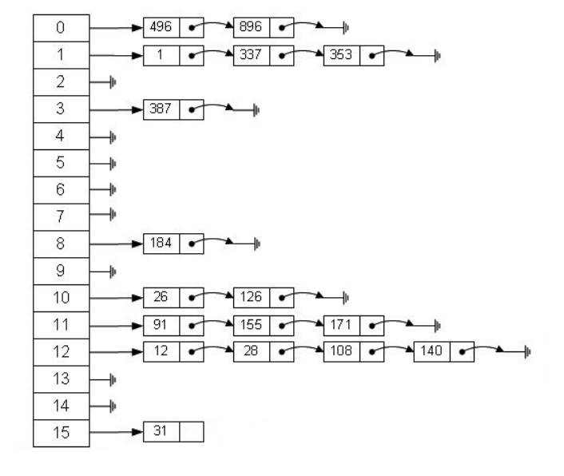
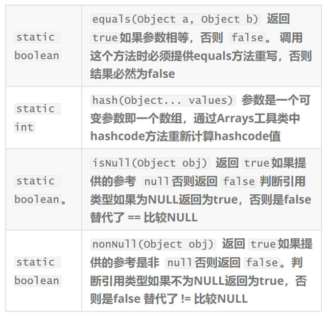

# HashSet集合

> **Set集合介绍**
> 
> Set集合是无序的
> 主要实现类有HashSet、LinkedhashSet、TreeSet。

## Set集合的实现类

> HashSet集合是Set集合的主要实现类，也是日常开发组常用的Set集合实现类
> public class HashSet<E> extends AbstractSet implements Set<E>,Cloneable,Serializable
> HashSet集合继承了Set集合的特点，xiangHAshSet中存储数据时，是不允许出现重复数据的，如果有重复的数据HashSet集合会进行自动排重操作，**HashSet集合的主要实现数据数据结构->"Hash表"**，储存数据的顺序是无序的，**通过观察API文档发现HashSet集合的所有方法都是Set集合接口提供的，本身没有任何特殊方法**。

## Hash表

> 什么是Hash表？
> Hash一般翻译为“散列”，也可以直接音译为“哈希”，他是基于【快速存储的角度而设计的一种存储结构】，是一个典型的【空间换时间】的做法，利用Hash表的原理进行数据存储操作。
> Hash表其实就是【“数组+链表”】的组合形式，在Hash表数组提供存储位置，在Hash表链表起的作用提供存储结构
> 
> 上图中是典型Hash表的结构，Hash表也别称之为【散列表(Hashtable)】，Hash表是根据键值对（Key-value）而直接进行访问的数据结构，也就是说【通过把key值映射到表中一个位置来记录访问位置】，以加快查找数据（这个操作就是确定数据在Hash表中存储的位置），这个操作也被称之为【散列函数】，通过散列函数计算出存储位置会后，会将存储数据以链表形似挂载在存储位置中，这种方式成为【桶】如果存储70个元素，但是存储70个元素时申请100个空间，70/100 = 0.7 ，这个0.7这个值就称之为“负载（加载）因子”，通过这个因子对hash表进行扩容操作。
> 因为Hash表是基于【快速存取】的操作，所以Hash表会尽量的平均将数据分配到Hash表中进行存储，但是在存储过程中就会触发，在同一个存储空间中出现重复数据问题，此时Hash就会启动自动排重操作，原则就是equals比较，只要equals比较结果为true，就不在这个空间存储相同数据
> **Hash表的存储机制**
> 示例存储18这个值
> 通过散列函数计算12需要存储的位置->hash（key）%len【散列函数】
> hash（key）->key是要存储的数据 hash（key）->计算key的hash值，即java中hashcode值
> len -> 是存储hash表中数组的长度，上图中个数组的长度为16所以散列函数的计算效果
> hash（18）% 16->2,所以18这个值会存储到对应hash数组2的位置里的hash链表中。
>
> **Hash表的扩容机制**
> Hash表示一个自动扩容机制，当达到【加载因子】参数要求时，Hash表就会进行自动扩容
> Java中使用Hash表默认大小给16，加载因子0.75 当16个存储位置发生了75%位置都存储了数据即16*0.75 = 12，也就说12个下标位置中都存储数据。
> Hash表就会发生自动扩容，扩容机制就以2的幂次进行扩容【16是2^4】，扩容之后2^5即hash表每次扩容之后都是原有容量一倍，就会从原有16扩容到32
> 在介绍HashSet时说过HashSet中存储数据不能保证存储位置永久不变，只要Hash表发生一次扩容，那么Hash表中存储的数据就要重新计算存储位置原始数据28 存储在大小为16的hash表中 计算位置 28%16 --》 余数12
> 一旦扩容大小从16变成32 此时原始数据28可就要重新计算存储位置在hash表 计算位置 28%32 ---》 余数 28
>
> 总结：Hash表数据存储和查找是非常优秀，但是一旦扩容就会降低Hash表的性能

## HashSet常用API

> HashSet是实现Set集合接口，查看API是可以发现HashSet中没有任何特殊方法，所以自己使用Set接口提供的方法就可以完成HsahSet集合的操作【HashSet集合中提供的方法和ArrayList集合中介绍的方法是一样的，只不过HsahSet带有排重效果，可以完全参考Arraylist集合中Api的使用在HAshSet中使用】

```java
package com.qf.day7;

import java.util.*;
import java.util.function.Predicate;

public class HashSetAPI {
    public static void main(String[] args) {
//1.创建HashSet集合对象
/*
表面上代码操作是在创建一个HashSet集合，但是实际底层操作过程
中是在创建HashMap集合
向HashSet集合存储的数据其实就是在想HashMap中key的位置存储
数据，为什么要这样会做
Hash表存储数据值是以【key-value】进行数据存储操作 --》
Java集合中可以以Key-value形式存储只有Map集合
*/
//1.提供一个空的HashSet集合对象【默认容量16,加载因子0.75】
        HashSet<Integer> hashSet = new HashSet<>();
//PS：HashSet是Set集合的实现类，也就相当于是Set集合"子类"
//利用Set集合接口使用多态形式创建Set集合对象
        Set<String> set = new HashSet<>();
//2.可以利用参数Collection集合对象中存储数据初始化HashSet集合对象
        HashSet<Integer> hashSet1 = new HashSet<>
                (hashSet);
//3.指定HashSet集合初始化容量大小【使用默认加载因子0.75】
//遵守大小原则是2次幂来定义的，但是不要小于16
        HashSet<Double> hashSet2 = new HashSet<>
                (((int) Math.pow(2, 5)));
//4.指定HashSet集合初始化容量大小和加载因子 第二参数加载因子是float类型
        HashSet<Character> hashSet3 = new HashSet<>
                (((int) Math.pow(2, 5)), 0.85f);
//常用API
//向集合中添加数据
        hashSet.add(1);
        hashSet.add(20);
        hashSet.add(4);
        hashSet.add(9);
        hashSet.add(7);
        hashSet.add(17);
//hashSet是可以对存储在集合数据提供排重操作的
        System.out.println(hashSet);
//addAll(Collection集合对象); 将参数集合对象中数据存储到当前HashSet中
//清空HashSet集合中数据
//hashSet.clear();
//isEmpty(); 判断HashSet集合是否为空【指没有任何数据，而不是当前hashset地址为null】
//判断HashSet集合中是否存在指定元素
        if (hashSet.contains(1)) {
            System.out.println("返回true证明存在");
        } else {
            System.out.println("返回false证明不存在");
        }
//containsAll(Collection集合对象) 判断Collection集合对象中个存储数据是否存在在Hashset集合对象中
//因为HashSet不存在下标的概念所以HashSet是不支持普通for循环的
//HashSet支持循环方式有
// 增强for循环
        for (Integer integer : hashSet) {
            System.out.println(integer);
//不要调用集合删除方法
        }
// foreach方法
        hashSet.forEach(System.out::println);
// 普通迭代器
        Iterator<Integer> iterator = hashSet.iterator();
        while (iterator.hasNext()) {
            System.out.println(iterator.next());
//删除数据就调用 迭代器中remove
        }
//删除集合中数据 参数是要删除的数据
        hashSet.remove(1);
//removeAll(Collection集合对象); 删除参数结合提供提供数据所在HashSet集合对象中数据
//retainAll(Collection集合对象); 保留参数集合对象中数据在HashSet集合中然后删除剩余HashSet集合中数据
        hashSet.removeIf(new Predicate<Integer>() {
            @Override
            public boolean test(Integer integer) {
                return integer % 2 == 0;
            }
        });
        hashSet.removeIf(integer -> integer % 2 == 0);
//获取集合中存储元素的个数
        System.out.println(hashSet.size());
//转换成数组
        Object[] objects = hashSet.toArray();
        Integer[] integers = hashSet.toArray(new
                Integer[hashSet.size()]);
    }
}
```

## HashSet的重写机制

> HashSet底层实现是什么？
> 使用Hash表实现的，Hash表示如何进行数据存储的？
> 使用Hash表提供散列函数，散列函数是什么？
> 这是散列函数 hash(key)%len， hash(key)得到结果什么？len得到结果什么？
> **hash(key)计算存储数据所在内存中hashcoded地址值**
> len是Hash表中容量的大小，默认是16
> 利用散列函数【 hash(key)%len】 求得存储在Hash表中位置以进行数据的存储
> **Hash表的排重机制是：通过散列函数计算出数据存储的位置进行数据存储，如果出现同一个数据计算出位置相同，此时也会向存储位置进行插入存储，但是要进行equals比较，如果equals 比较结果为false就整存储位置中，没有与之相同数据，以链表存储，如果equals比较结果为true，证明这个存储位置有与之相同数据，此时就会放弃新添加的数据存，从而不会进行存储数据操作，那么些就是HashSet即Hash表排重机制**

```java
public static void main(String[] args) {

            HashSet<Person> hashSet = new HashSet<>();

            Person p1 = new Person("张三", 18);
            Person p2 = new Person("张三", 18);

            hashSet.add(p1);
            hashSet.add(p2);

            System.out.println("p1对象的hashcode 值：" + p1.hashCode());
            System.out.println("p2对象的hashcode 值:" + p2.hashCode());

//利用HashSet中存储机制【Hash表】可以存储重复数据进行排重操作
            System.out.println(hashSet);

            HashSet<Integer> hashSet1 = new HashSet<>();

            hashSet1.add(1);
            hashSet1.add(1);
            
            System.out.println(hashSet1);
        }
```
> 为什么存储自定类的对象到HashSet集合没有进行排重？
> 就是因为自动以类并没对对象提供同一个hashcode的实现并且在Person类中也没有一共equals方法的实现，所以我们根本没有提供排重操作的原则，所以向HashSet中存储自定义类的对象是无法排重如果需要向HashSet集合存储自定义类的对象并提供排重机制，那么自定义类必须提供equals和hashcode方法的重写
> 从写hashcode的目的在于：
> 1.在Java中认为两个对象相等是通过equals方决定，决定原则在于类中提供属性完全或部分相等，认为两个对象相等，既然两个对象已经相等了，那么他们的地址也要相等，但是Java语言是无法直接操作真实内存地址的，但是我们可以获取到真实内存地址映射hashcode值，所以将equals比较相等对象的hashcode修改为相等就间接的满足【真实内存地址相等】
> 2.当向HashSet集合存储数据时候，HashSet集合底层实现是Hash表，而Hash表有需要通过hashcode计算存数据位置，只有在hash表存储位置相同才可能出现相同数据，这样一来就需要提供相同对象hashcode地址是相同的，通过这个方法将对象计算到同一个存储位置，在通过equals方法计算相等操作触发Hash表排重机制。

综上所述：进行对person的重写操作

```java
public class Person {
    private String name;
    private int age;

    public Person() {
    }

    public Person(String name, int age) {
        this.name = name;
        this.age = age;
    }

    public String getName() {
        return name;
    }

    public void setName(String name) {
        this.name = name;
    }

    public int getAge() {
        return age;
    }

    public void setAge(int age) {
        this.age = age;
    }

    @Override
    public String toString() {
        return "Person{" +
                "name='" + name + '\'' +
                ", age=" + age +
                '}';
    }

    /*
    IDEA编译器提供两个版本的equals和hashcode的重写
    这两个版本都是可以，只能二选一不能共存
    */
//这个版本IDEA默认版本
/*
生成equals和hashcode方法是最后选项中有一个non-null
这里不建议勾选这个选中给提供属性，因为引用类型还是进行非null判断
如果你勾选在那么系统就默认认为引用类型时为null值
就会使用这个引用类型方法，如果此时你引用类型属性被赋值null，必
出空指针异常
*/

//勾选之后 non-null选项之后提供 equals实现
/* @Override
public boolean equals(Object o) {
if (this == o) return true;
if (o == null || getClass() != o.getClass())
return false;
Person person = (Person) o;
if (age != person.age) return false;
return name.equals(person.name);
}*/

//没有勾选 non-null选项之后提供 equals实现
/* @Override
public boolean equals(Object o) {
//比较了地址，这个地址是真实地址，如果真实地址都相等 必然
是同一个对象
if (this == o) return true;
*/
/*
如果输入对象引用地址null那么 必然对象不同一个
getClass方法的作用是用过字节码文件[.class]文件进行对象获
取
只要是同一个类创建对象，他们字节码文件都是同一个【唯一】
两个对象字节码文件都不一样必然不是同一个对象
*/
/*
if (o == null || getClass() != o.getClass())
return false;
//多态向下转型操作
Person person = (Person) o;
*/
/*
如果当前对象age属性与传入对象的age属性不一致 返回false
如果相等就不做任何操作
*/
/*
if (age != person.age) return false;
*/
/*
提供引用类型非null判断
只要当前对象的name属性值不为null 就通过name调用String类
equals方法
与传入对象name进行比较 相等为true，不相等为false
如果对象的name属性为null 就判断传入对象的name属性是否为
null
如果也为null 结果就是true 否则就是false
*/
/*
return name != null ? name.equals(person.name) :
person.name == null;
}
@Override
public int hashCode() {
//获取引用类hashcode值作为新的hashcode值计算
int result = name != null ? name.hashCode() : 0;
//使用31这个值 乘以 引用类型hashcode值 然后加上 值类型属
性值 得到最终hashcode
//最大的限度保证hashcode不出现重复
result = 31 * result + age;
return result;
}*/
//这个版本IDEA使用Java7中提供Objects工具类
    @Override
    public boolean equals(Object o) {
        if (this == o) return true;
        if (o == null || getClass() != o.getClass())
            return false;
        Person person = (Person) o;
/*
变化现在使用:值类型比较融入到返回值比较结果中
调用了Objects工具类中equals方法进行 引用类型比较 --》原
码实现
扩展：Objects工具类
Java7这个版本开始提供一个工具类，这个工具类作用主要就是提供安
全的判断引用类型非NULL和NULL值判断和提供equals和hashcode重
写判断
public static boolean equals(Object a, Object b)
{
地址相等就是同一个对象
或者
判断 a 参数不为null 然后用a调用equals进行比较
return (a == b) || (a != null &&
a.equals(b));
}
*/
        return age == person.age &&
                Objects.equals(name, person.name);
    }

    @Override
    public int hashCode() {
/*
Objects工具类中提供 hash方法 这个方法可以计算新的
hashcode值
*/
        return Objects.hash(name, age);
    }
}
```

## 拓展Object工具箱

> Java7这个版本开始提供一个工具类，这个工具类作用主要就是提供安全的判断引用类型非NULL和NULL值判断和提供equals和hashcode重写判断
> 
