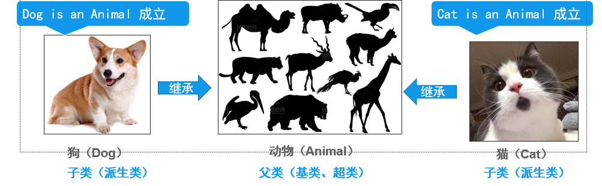

# 1.封装

## 什么是封装？
**概念：** 尽可能隐藏对象内部的实现细节，控制对象的修改及访问权限。
**好处：** 提高程序的安全性.
**访问修饰符：private**(将带有此修饰符的变量设为私有，仅本类可见，别的类感受不到).
```java
/**
 * 面向对象 三大特征 封装
 */
public class Demo01 {
    /*
    * 封装的步骤：
    * 1.使用private修饰符，设置私有
    * 2.创建getter（获取），setter（设置）方法
    * 3.在set方法中放置逻辑，对数据进行限制。
    * */
    public static void main(String[] args) {
        Student student = new Student();
        student.setName("张三得的");
        student.setAge(200);
        student.setSex("男");
        System.out.println(student.toString());

    }
}

class Student{
    private String name;
    private int age;
    private String sex;


    public String getName() {
        return name;
    }

    public void setName(String name) {
        if (name.length()>3){
            this.name="未命名";
        }else{
            this.name = name;
        }
    }

    public int getAge() {
        return age;
    }

    public void setAge(int age) {
        if (age>120){
            age=18;
        }else {
            this.age = age;
        }
    }

    public String getSex() {
        return sex;
    }

    public void setSex(String sex) {
        this.sex = sex;
    }

    @Override
    public String toString() {
        return "Student{" +
                "name='" + name + '\'' +
                ", age=" + age +
                ", sex='" + sex + '\'' +
                '}';
    }
}
```
```java
Student{name='未命名', age=0, sex='男'}
```
# 2.继承

## 什么是继承
**继承：** 一个类继承另一个类可以被继承的成员。
    继承的类被称为：子类、派生类。   
    被继承的类被称为：父类、基类或超类。

两个类的继承关系-> 必须要在逻辑上满足条件。

功能越精细，重合点越多，越接近直接父类。   
功能越粗略，重合点越少，越接近Object类。（万物皆对象的概念）

**关键字：**
    格式：   class 子类名 extends 父类名 {}
```java
package com.java.day11;

/**
 * @author zxq
 * @version V1.0
 * @Date 2023/1/12 15:14
 * @Description: ${描述}
 * 父类 ->动物类
 */
public class Animal {

//    属性
    /**
     * 名字
     */
    String name;
    /**
     * 品种
     */
    String breen;
    /**
     * 价格
     */
    double price;

//    方法

    /**
     * 吃
     */
    public void eat(){
        System.out.println("animal is eat...");
    }

    /**
     * 睡
     */
    public void sleep(){
        System.out.println("animal is sleep...");
    }

    /**
     * 显示
     */
    public void show() {
        System.out.println( "Animal{" +
                "name='" + name + '\'' +
                ", breen='" + breen + '\'' +
                ", price=" + price +
                '}');
    }
}
```
```java
package com.java.day11;

import org.junit.Test;

/**
 * @author zxq
 * @version V1.0
 * @Date 2023/1/12 15:21
 * @Description: ${描述}
 * 子类->猫猫狗狗类
 */
public class dogAndCat {
    @Test
    public void Test01(){
        Cat cat = new Cat();
        cat.name = "大头";
        cat.breen = "蓝猫";
        cat.price = 200;
        cat.eat();
        cat.sleep();
        cat.show();
        System.out.println("--------------------------");
        Dog dog = new Dog();
        dog.name = "旺财";
        dog.breen="土狗";
        dog.price = 0;
        dog.eat();
        dog.sleep();
        dog.show();

    }
}

/**
 * 猫猫类
 */
 class Cat extends Animal {

}

/**
 * 狗狗类
 */
class Dog extends Animal {

}
```


结果
```java
animal is eat...
animal is sleep...
Animal{name='大头', breen='蓝猫', price=200.0}
--------------------------
animal is eat...
animal is sleep...
Animal{name='旺财', breen='土狗', price=0.0}

Process finished with exit code 0
```

## 继承的特点
java 的类为单继承，即**一个类只能有一个直接父类**。但是可以多级继承，属性和方法逐级叠加。

## 什么从父类里无法继承过来？
1. 构造方法（构造器）
    泪中的构造方法，只负责创建本类对象，不可继承，但是子类可以调用。
2. **private** 修饰的属性和方法
    访问修饰符的一种，仅本类可见。（下面有修饰符的权限）

## 修饰符的权限（重要）
| 访问修饰符  | 本类 | 同包下 | 非同包子类 | 其他 |
| ----------- | ---- | ------ | ---------- | ---- |
| private     | √    |        |            |
| 【default】 | √    | √      |            |
| protected   | √    | √      | √          |
| public      | √    | √      | √          | √    |
* 类的属性一般是私有的，方法一般是公开的。
* 类的属性和方法，四个修饰符都可以使用。
* 类只能使用public和【default】内部类除外。

## 方法重写
### 为什么要重写

重写概念：当父类提供的方法无法满足子类的需求时，子类可以在一定条件下，在自己的类中对父类中的方法进行重写（Override）。
### 重写规则

1. 在子类中重写的方法的 **返回值类型 方法名 参数列表**必须与在父类中被重写的方法严格一致。
2. 访问修饰符可与父类相同或是比父类更加宽泛。
   
执行时：
    子类重写方法后，调用时优先调用子类重写的方法。


```java
/**
 * 猫猫类
 */
 class Cat extends Animal {
}

/**
 * 狗狗类
 */
class Dog extends Animal {

    @Override
    public void eat() {
        System.out.println("Dog is eat...");
    }

    @Override
    public void sleep() {
        System.out.println("dog is sleep...");
    }

    /**
     * 重写show
     */
    @Override
    public void show() {
        System.out.println( "Dog{" +
                "name='" + name + '\'' +
                ", breen='" + breen + '\'' +
                ", price=" + price +
                '}');
    }
}
```
```java
未重写的猫猫类
animal is eat...
animal is sleep...
Animal{name='大头', breen='蓝猫', price=200.0}
--------------------------
重写后的狗子类
Dog is eat...
dog is sleep...
Dog{name='旺财', breen='土狗', price=0.0}

Process finished with exit code 0
```
## super 关键字0
### super概念：

在子类中，可以直接继承和访问从父类继承到的方法，但如果子类继承的属性（继承）和方法（重写）与父类存在重名时，可以用super关键字区分。
### this与super的区别

* this是为了区分局部变量与成员变量的区别。
* super是为了区别父类与与子类的区别。

# 3.多态

## 基础使用
### 使用规则
* **概念：**同一个事物的同一种行为，具有不同的表现形式；因此，当我们用父类引用指向子类对象时，就可以因为子类的不同而产生多种形态。
* 声明格式：    父类 对象名 = new 子类();
    ```java
    Animal cat = new Cat();
    ```
* 当二者具有直接或间接继承关系的时候，父类引用就可以指向子类对象了。
* 当父类引用子类对象时：
    * 父类就可以使用自己声明的属性和方法，以及引用子类重写父类的方法，
    * 不可以调用子类自己独有的属性和方法。
### 代码实例
多态的实现
  1. 子类继承父类
  2. 子类重写父类中的方法 
```java
public class Test {
    public static void main(String[] args) {
        System.out.println("Cat未重写方法");
        Animal cat = new Cat("xiaohua","三花猫",1,"母");
        cat.eat();
        cat.play();
        System.out.println(cat.toString());
        System.out.println("Dog重写了方法");
        Animal dog = new Dog("xiaohei", "大黑狗", 1, "公");
        dog.eat();
        dog.play();
        System.out.println(dog.toString());
    }
}
```
```java
Cat未重写方法
animal is eat...
animal is play...
Animal{name='xiaohua', breed='三花猫', age=1, gender='母'}
Dog重写了方法
Dog is eat...
dog is play...
Dog{name='xiaohei', breed='大黑狗', age=1, gender='公'}

Process finished with exit code 0
```
都是由父类引用子类对象，由重写的方法体现了多态。
## 多态的应用0
1. 在子类编写方法时，将父类的对象类型作为形参传入方法，实际传入子类类型。增加方法参数的泛用性。
```java
public class testAnimal {
    @Test
    public void Test(){
        Animal animal = new Animal();
        /*实现多态*/
        Dog dog = new Dog("xiaohua", "小土狗", 1, "牙狗");
        animal.show(dog);
        Cat cat = new Cat();
        animal.show(cat);
    }
}
```
2. 使用父类作为返回值类型，实现多态，实际返回的是子类对象。使方法返回不同的子类对象。
```java
    /**
     * 多态--->实现的多态作用二
     * @param animal
     * @return
     */
Class Animal
    public Animal run( Animal animal){
        return animal;
    }
Class Cat
        @Override
    public Animal run(Animal animal) {
        Cat cat = new Cat();
        return cat;
    }
```

**多态的好处**
1. 减小了子类之间的差距
2. 提高程序的可扩展性和灵活性，降低耦合性。

## 类型转换
### 向上转型
概念：父类引用中保持真实的子类对象，称为子类的向上转型（多态的核心概念）。
```java
    Animal animal = new Dog();
    Animal animal = new Cat();
```
### 向下转型
概念：将父类引用中保存的子类对象，强转回子类本身类型---->称为子类的向下转型。
作用：只有转回了子类的真实类型，才可以调用子类独有的属性和方法。
```java
    Animal animal = new Dog();
    //向下转型
    Dog dog = (Dog)animal;
```
###类型转换异常
**java.lang.ClassCastException**
### instanceof关键字
用法：向下转型前，用来判断**关键字后的对象类型**是否是**关键字前的变量名**的子类（返回值为布尔类型）。
```java
    @Test
    public void Test02(){
        Animal dog = new Dog();
        //类型转换
        boolean b = dog instanceof Dog;
        System.out.println(b);

        boolean b1 = dog instanceof Cat;
        System.out.println(b1);
    }

结果：
        true
        false

        Process finished with exit code 0

```

