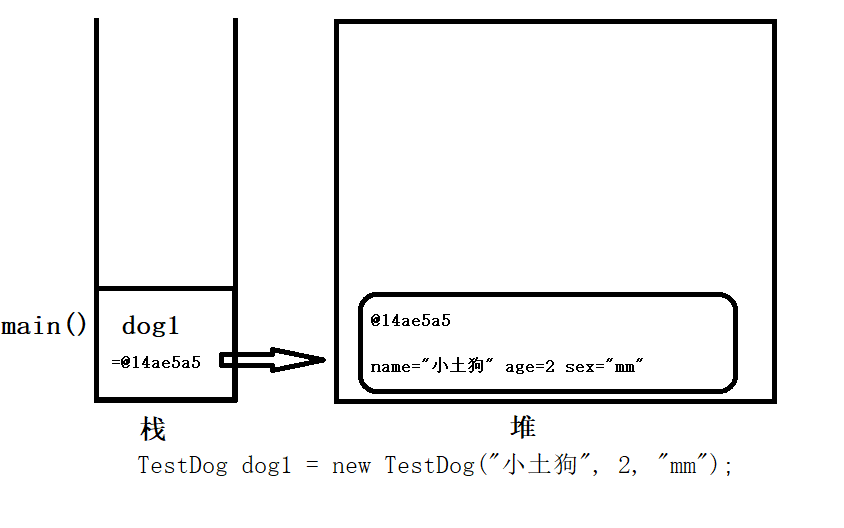

# 面向对象01基础
在程序员眼中一切事物皆对象

## 面向对象思想
1. 面向过程：
   就是分析出解决问题所需要的步骤，然后用函数（方法）把这些步骤一步一步实现，使用的时候一个一个依次调用就可以了。
2. 面向对象（Object Oriented）:
   * 先去找具有所需功能的对象来用。
   * 如果该对象不存在，那么创建一个具有所需功能的对象。
   * 简化开发并提高重用性。
   * 程序员从执行者转化成了指挥者。

## 什么是对象？
**对象：** 一切客观存在的事物都是对象，万物皆对象，每个对象都有自己的**特征（属性）**和**行为（方法）**。

## 什么是类？
**类：** 是具有相同属性（特征）和行为一类事物的描述，是**抽象**的、概念上的定义。
## 对象的初始化及使用
```java
public class demo01 {
    public static void main(String[] args) {
//        1.使用类创建变量或对象，并使用new初始化。    ，
        TestDog dog = new TestDog();

//        2.给对象赋值
        dog.name= "旺财";
        dog.age= 3;
        dog.sex="gg";

//        3.获取属性
        System.out.println("狗的名字="+dog.name+"狗的年龄="+dog.age+"狗的性别="+dog.sex);

//        4.调用方法
        dog.eat();
        dog.play();

    }
```
小狗类
```java
public class TestDog {
    String name;//姓名
    int age ;//年龄
    String sex ;//性别

    //方法吃
    public void eat(){
        System.out.println("吃东西");
    }
    // 方法玩
    public void play(){
        System.out.println("玩");
    }
}
```
## 类与对象的关系

**类：定义了对象应具有的特征和行为，类是对象的模板。**

**对象：拥有多个特征和行为的实体，对象是类的实例。**
## 成员变量与局部变量
||局部变量|成员变量|
|:---:|:---:|:---:|
|定义位置|方法内|类或方法外|
|默认值|无默认值|与数组相同|
|适用范围|定义的方法内|类中|
|命名冲突|只与定义时的方法内的名冲突|可与方法内冲突，不能与类中冲突，同名（就近原则）|
## 成员方法
成员方法：包含实例方法（非静态方法）和类方法（静态方法）。
```java
修饰符 返回值类型 方法名(形参列表){}
```
```java
public void eat(){
        System.out.println("吃东西");
    }
```
## 方法重载
重载（Overload）：一个类中定义多个相同名称的方法，参数列表不同。
* 规则:
   1. 方法名称相同，参数列表不同，个数、类型、循序不同
   2. 与方法的修饰符返回值无关。
```java
public void m(int a){}
public void m(double b){}
```
* 调用带有重载的方法时，需要根据传入的实参去找到与之匹配的方法。   
* 好处：灵活、方便、屏蔽使用差异。
## 构造方法（构造器）
### 基础
* 构造方法
    类中的特殊方法，主要用于**创建对象，初始化属性**。
* 特点
    名称与类名完全相同，没有返回值类型。
    创建对象时，自动触发构造方法的调用。
* 注意：如果没有在类中显示定义构造方法，则编译器默认提供**默认无参构造方法**。
```java
    //无参构造器(默认提供)
    public TestDog() {
    }
    //有参构造方法
    public TestDog(String name, int age, String sex) {
        this.name = name;
        this.age = age;
        this.sex = sex;
    }
```
使用  
```java
        TestDog dog = new TestDog();
        TestDog dog1 = new TestDog("小土狗", 2, "mm");
```
### 使用构造方法初始化对象
```java
    public TestDog() {
        name = "狗狗";
        age = 0;
        sex = "0.0";
    }
```
```java
        System.out.println(dog2.toString());
        //TestDog{姓名='狗狗', 年龄=0, 性别='0.0'}
```
### 构建方法重载(跟重载一个性质)
```java
    public TestDog() {
        name = "狗狗";
        age = 0;
        sex = "0.0";
    }

    public TestDog(String name, int age, String sex) {
        this.name = name;
        this.age = age;
        this.sex = sex;
    }
```
### 对象的内存分配
1. 内存中开辟对象空间属性赋予默认值
    new  
    dup
2. 执行构造方法中的代码
    invokeSpecial
3. 将对象的地址赋值给局部变量
    astore_1
```java
 TestDog dog = new TestDog();
```

## this关键字
1. this第一种用法：调用实例属性。如：**this.name、this.age**  
    当实例变量和局部变量重名时，优先访问局部变量；如需访问实例变量，需要增加this.前缀。
2. this第二种用法：调用实例方法。如：**this.sayHi()**   
    表示指向此实例的地址
3. this第三种用法：调用本类中的其他构造方法。如：**this()、this(实参)**   
    在构造方法中，调用本类的其他构造方法，即可复用构造方法中的逻辑代码。
    **注意：** 必须是构造方法的首行，并且只能有一个。
```java
public class demo04 {
    public static void main(String[] args) {
        Student student = new Student("张三",18);
        student.sayHi();
        System.out.println(student.toString());
    }

}
class Student {
    String name;
    int age;

//    构造器

    public Student(int age) {
        this.age = age;
    }

    public Student(String name) {
        this.name = name;
    }

    public Student() {
    }

    public Student(String name , int age){
        this(name);
        this.age=age;
    }

    public void sayHi(){
        System.out.println(this.name+"说你好");
        /*
        * this是类中的默认引用，代表当前对象(实例)，当这个类服务于某一个新new的对象时，那么这个this就指向这个示例dee的对象的地址。
        * */
    }

    @Override
    public String toString() {
        return "student{" +
                "name='" + name + '\'' +
                ", age=" + age +
                '}';
    }
}
```
